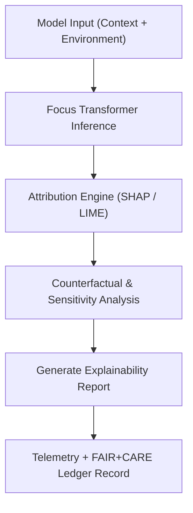

<div align="center">

# 🔍 **Kansas Frontier Matrix — AI Explainability & Transparency Guidelines**
`docs/guides/ai/explainability-guidelines.md`

**Purpose:**  
Establish clear, reproducible standards for **explainable AI (XAI)** within the Kansas Frontier Matrix (KFM).  
Defines **SHAP**, **LIME**, and **counterfactual analysis** pipelines, integrating FAIR+CARE governance to ensure ethical, interpretable, and auditable model behavior.

[](../../README.md)
[](../../../LICENSE)
[](../../../docs/standards/README.md)
[](../../../releases/)
</div>

---

## 📘 Overview

KFM’s explainability framework aligns with **MCP-DL v6.3**, **FAIR+CARE**, and **ISO/IEC 24029-1 (AI Trustworthiness)** standards.  
It defines how each Focus Transformer inference is **interpreted, verified, and published** through structured transparency reports and telemetry logging.

**Key Goals**
- Deliver human-readable reasoning for every AI decision  
- Ensure explainability parity across all Focus Mode and GAI tasks  
- Quantify interpretability confidence through SHAP and LIME metrics  
- Embed ethical validation and provenance in the governance ledger  

---

## 🗂️ Directory Layout

```plaintext
src/ai/explainability/
├── shap_analysis.py                    # SHAP value attribution engine
├── lime_analysis.py                    # Local interpretable model explanations
├── counterfactuals.py                  # Sensitivity & what-if analysis
├── visualization.py                    # Explainability charts (bar, force plots)
├── aggregation.py                      # Summarizes feature contributions
└── reports/                            # Generated JSON + visual explainability artifacts
```

---

## 🧩 Explainability Workflow



---

## ⚙️ Explainability Methods

| Method | Description | Output |
|---------|-------------|--------|
| **SHAP (SHapley Additive exPlanations)** | Quantifies each feature’s contribution to the model prediction; used for global + local importance analysis. | `reports/shap/*.json` |
| **LIME (Local Interpretable Model-agnostic Explanations)** | Builds local surrogate models around individual predictions; best for per-site analysis. | `reports/lime/*.json` |
| **Counterfactuals** | Tests “what-if” scenarios by adjusting variables to understand sensitivity. | `reports/counterfactuals/*.json` |

All outputs include version, hash, and timestamp fields to guarantee reproducibility.

---

## 🧮 Example Explainability Record (FAIR+CARE Schema)

```json
{
  "session_id": "focus-2025-11-09-0021",
  "model": "focus-transformer-v2",
  "task": "Lost Homestead Detection",
  "explainability_method": "SHAP",
  "top_features": ["soil_moisture", "plat_1870", "elevation"],
  "feature_contributions": {
    "soil_moisture": 0.32,
    "plat_1870": 0.27,
    "elevation": 0.15
  },
  "counterfactual_sensitivity": {
    "Δsoil_moisture +0.1": "+8% confidence",
    "Δelevation -5m": "-3% confidence"
  },
  "telemetry": {
    "energy_joules": 1.15,
    "runtime_sec": 2.6
  },
  "faircare_compliance": "Pass",
  "timestamp": "2025-11-09T12:00:00Z"
}
```

---

## 🧾 FAIR+CARE Integration

| Principle | Implementation | Validation Artifact |
|------------|----------------|--------------------|
| **Findable** | All XAI outputs cataloged under versioned directories | `reports/shap/`, `reports/lime/` |
| **Accessible** | Reports published in plain JSON + chart HTML | `releases/v*/explainability/` |
| **Interoperable** | JSON-LD context compatible with DCAT 3.0 | `schemas/telemetry/ai-explainability-v1.json` |
| **Reusable** | Each report contains model ID + dataset SHA | `sbom.spdx.json` |
| **Collective Benefit** | Enhances public understanding of AI reasoning | FAIR+CARE audit |
| **Authority to Control** | Council oversight on release of sensitive attributions | `faircare-validate.yml` |
| **Responsibility** | Explainability telemetry logged per inference | `focus-telemetry.json` |
| **Ethics** | Redacts or aggregates sensitive geospatial variables | `data-generalization/README.md` |

---

## 📊 Visualization Outputs

| Chart Type | Description | Generated File |
|-------------|-------------|----------------|
| **Bar Plot** | Global feature importance by SHAP value | `plots/global_feature_importance.png` |
| **Force Plot** | Local feature influence per prediction | `plots/force_plot_<id>.png` |
| **Summary Plot** | Aggregated feature impact distribution | `plots/summary_plot.png` |
| **Counterfactual Heatmap** | Displays model response to variable perturbations | `plots/counterfactuals_heatmap.png` |

Each visualization file is paired with a structured JSON descriptor for governance tracking.

---

## ⚖️ Governance & Audit Workflow

| Workflow | Function | Output |
|-----------|-----------|--------|
| `ai-explainability.yml` | Generates SHAP/LIME reports | `reports/ai/explainability/*.json` |
| `faircare-validate.yml` | Reviews outputs for ethical alignment | `reports/faircare/ai-audit.json` |
| `ledger-sync.yml` | Writes provenance hashes & FAIR+CARE ledger entries | `docs/standards/governance/LEDGER/ai-explainability.json` |

---

## 🧩 Bias Mitigation & Transparency Rules

- **Feature Transparency:** All non-sensitive features are listed in reports.  
- **Sensitive Masking:** Land ownership, tribal data, and archaeological features are generalized per CARE guidelines.  
- **Confidence Thresholds:** Predictions below 0.70 confidence require manual review before public release.  
- **Explainability Parity:** All Focus Mode outputs (human-facing and API) must include attached XAI context or provenance hash.

---

## 🧠 Counterfactual Testing Framework

```bash
python src/ai/explainability/counterfactuals.py \
  --input data/processed/entities/sites.json \
  --model focus-transformer-v2 \
  --output reports/ai/counterfactuals/sites_delta.json \
  --telemetry telemetry/focus-telemetry.json
```

Generates per-entity counterfactual results showing model sensitivity to specific variables (e.g., slope, flood distance, soil moisture).

---

## 🕰️ Version History

| Version | Date | Author | Summary |
|----------|------|--------|----------|
| v10.0.0 | 2025-11-09 | Core Team | Created unified explainability and transparency guide for SHAP/LIME/counterfactual integration |
| v9.7.0 | 2025-11-03 | A. Barta | Added explainability framework reference for Focus Transformer v2 |

---

<div align="center">

© 2025 Kansas Frontier Matrix Project  
Master Coder Protocol v6.3 · FAIR+CARE Certified · Diamond⁹ Ω / Crown∞Ω Ultimate Certified  

[Back to AI Guides](./README.md) · [Governance Charter](../../../docs/standards/governance/ROOT-GOVERNANCE.md)

</div>

