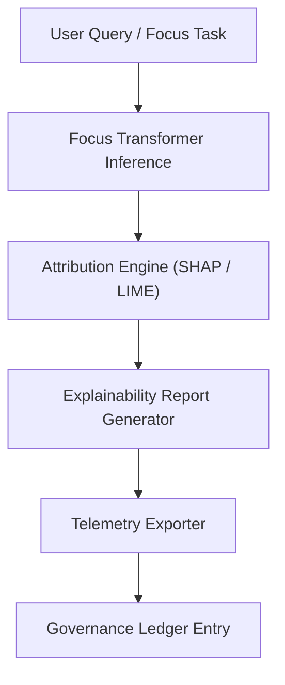

<div align="center">

# 🧩 **Kansas Frontier Matrix — Focus Transformer Governance & Explainability Framework**
`docs/guides/ai/focus-transformer-governance.md`

**Purpose:**  
Define the **governance, transparency, and explainability framework** for the Focus Transformer AI models (v1–v2) deployed within the Kansas Frontier Matrix (KFM).  
Ensures **ethical reproducibility**, **FAIR+CARE compliance**, and **AI decision auditability** under MCP-DL v6.3 standards.

[](../../README.md)
[](../../../LICENSE)
[](../../../docs/standards/README.md)
[](../../../releases/)
</div>

---

## 📘 Overview

The **Focus Transformer** is KFM’s flagship model architecture for contextual reasoning, used to interpret historical, environmental, and spatial data ethically and transparently.  
This governance framework establishes standards for:

- **Model explainability and provenance tracking**  
- **FAIR+CARE-aligned inference monitoring**  
- **Governance ledger entries for every AI session**  
- **Energy, bias, and performance telemetry recording**

It applies to both **Focus Transformer v1** and **v2**, supporting their deployment in research, Focus Mode reasoning, and automated data summarization.

---

## 🗂️ Directory Layout

```plaintext
src/ai/models/focus_transformer_v2/
├── README.md                          # Model overview
├── config/                            # Training and inference parameters
├── explainability/                    # SHAP, LIME, and attribution tools
├── governance/                        # Policy and metadata audit hooks
├── telemetry/                         # Performance, bias, and energy logs
└── checkpoints/                       # Model weights with SBOM and hashes
```

---

## 🧠 Model Governance Principles

| Governance Layer | Description | Compliance Artifact |
|------------------|-------------|---------------------|
| **Transparency** | All model weights and parameters documented with hashes | `sbom.spdx.json` |
| **Accountability** | AI inferences logged with provenance, timestamp, and SHA | `focus-telemetry.json` |
| **Responsibility** | Continuous energy and ethics telemetry reporting | `telemetry_schema` |
| **Authority to Control** | FAIR+CARE Council oversight for retraining or model change | `governance_ref` |
| **Collective Benefit** | AI outputs reviewed for public benefit and inclusivity | `faircare-validate.yml` |

---

## ⚙️ Core Parameters (v2 Default)

| Parameter | Description | Default |
|------------|-------------|----------|
| `model_name` | Identifier for deployed model | `focus-transformer-v2` |
| `embedding_dim` | Latent vector dimension | 1024 |
| `context_window` | Maximum token sequence | 4096 |
| `explainability` | SHAP / LIME / Counterfactual mode | `SHAP` |
| `energy_monitor` | Enables power-use telemetry | `true` |
| `governance_mode` | Writes results to FAIR+CARE ledger | `true` |

---

## 🧩 Explainability Pipeline



**Explainability Artifacts**
- **SHAP Value Matrices** — quantify feature contribution weights  
- **LIME Local Explanations** — provide interpretable local decisions  
- **Counterfactual Reports** — identify “what-if” scenarios for historical changes  
- **Narrative Attribution Summaries** — explain results for end-user UI panels  

---

## 🧮 FAIR+CARE Telemetry Schema (Simplified)

```json
{
  "session_id": "focus-2025-11-09-0004",
  "model": "focus-transformer-v2",
  "inputs": ["context_features", "environment_features"],
  "outputs": {
    "summary": "High soil fertility and proximity to water influenced settlement density.",
    "confidence": 0.94
  },
  "explainability": {
    "method": "SHAP",
    "top_features": ["soil_moisture", "flood_risk", "plat_1878_boundary"]
  },
  "energy_joules": 1.21,
  "carbon_gCO2e": 0.004,
  "faircare": "Pass",
  "timestamp": "2025-11-09T12:00:00Z"
}
```

---

## 🧾 Governance Ledger Entry

Every Focus Mode inference writes a **signed JSON ledger entry** referencing:
- Model version and SHA256 hash  
- Input data sources and licenses  
- Explainability artifact hashes  
- FAIR+CARE validation status  

**Example:**

```json
{
  "ledger_id": "focus-governance-v2-0001",
  "sha256_model": "1ac5e9a2d1c3e75f…",
  "model_version": "v2.0.0",
  "telemetry_hash": "2bc6f…7a0",
  "explainability_artifact": "reports/shap/focus_0001.json",
  "reviewed_by": ["FAIR+CARE Council"],
  "approval_status": "Certified",
  "timestamp": "2025-11-09T12:00:00Z"
}
```

---

## ⚖️ AI Governance & Ethical Oversight

| Aspect | Description | Enforced By |
|--------|--------------|-------------|
| **FAIR+CARE Certification** | Requires Council approval before deployment | `faircare-validate.yml` |
| **Data Sovereignty** | Sensitive data masked before inference | `data-generalization/README.md` |
| **Reproducibility** | SBOM + config hash stored with model | `sbom_ref` |
| **Accountability** | Model decision logs retained for 5 years | Governance Ledger |
| **Transparency** | Explainability reports public by default | FAIR+CARE Charter |
| **Bias Mitigation** | Counterfactual testing on diverse samples | `explainability/metrics/` |

---

## 🧩 CI/CD & Monitoring Workflows

| Workflow | Purpose | Output |
|-----------|----------|--------|
| `ai-model-validate.yml` | Check model hash integrity & parameter schema | `reports/ai/model-validate.json` |
| `ai-explainability.yml` | Generate SHAP/LIME explainability reports | `reports/ai/explainability/*.json` |
| `faircare-validate.yml` | Verify ethical compliance pre-release | `reports/faircare/ai-audit.json` |
| `ledger-sync.yml` | Append signed inference ledger entries | `docs/standards/governance/LEDGER/ai-ledger.json` |

---

## 🧾 Bias & Ethics Validation Report Structure

```json
{
  "model": "focus-transformer-v2",
  "date": "2025-11-09",
  "bias_metrics": {
    "historical_bias_score": 0.03,
    "regional_variance": 0.05
  },
  "ethical_findings": "No discriminatory bias detected.",
  "auditors": ["FAIR+CARE Council"],
  "recommendations": [
    "Continue monitoring of temporal bias during retraining.",
    "Include additional Indigenous data for 19th-century context."
  ]
}
```

---

## 🕰️ Version History

| Version | Date | Author | Summary |
|----------|------|--------|----------|
| v10.0.0 | 2025-11-09 | Core Team | Upgraded Focus Transformer governance model to v2 with explainability telemetry and FAIR+CARE oversight |
| v9.7.0 | 2025-10-31 | A. Barta | Introduced model-level explainability and energy telemetry tracking |

---

<div align="center">

© 2025 Kansas Frontier Matrix Project  
Master Coder Protocol v6.3 · FAIR+CARE Certified · Diamond⁹ Ω / Crown∞Ω Ultimate Certified  

[Back to AI Guides](./README.md) · [Governance Charter](../../../docs/standards/governance/ROOT-GOVERNANCE.md)

</div>

