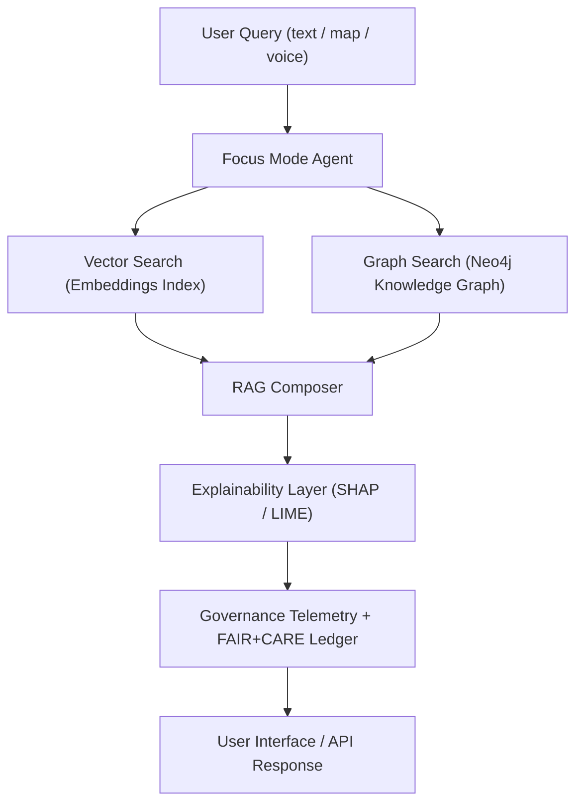

<div align="center">

# 🧠 **Kansas Frontier Matrix — Graph-Augmented Intelligence**  
`docs/guides/ai/graph-augmented-intelligence.md`

**Purpose:**  
Integrate **post-NODES 2025** Neo4j + AI innovations into the Kansas Frontier Matrix (KFM) to enable **semantic retrieval, explainable reasoning, and ethical contextualization** across the FAIR+CARE-certified Knowledge Graph and Focus Mode AI.  

[](../../../docs/README.md)
[](../../../LICENSE)
[](../../../docs/standards/faircare.md)
[](../../../releases/)
</div>

---

## 📘 Overview

Following **Neo4j NODES 2025**, KFM introduces **Graph-Augmented Intelligence (GAI)** — fusing symbolic graph reasoning, vector retrieval, and explainable AI.  
This hybrid architecture strengthens Focus Mode AI with contextual awareness, provenance tracing, and federated ethical oversight.

**Highlights**
- Neo4j embeddings link treaties, hydrology, and settlements.  
- **Retrieval-Augmented Generation (RAG)** over graph entities.  
- **Focus Agents** orchestrate semantic + ethical retrieval chains.  
- **Spatial & Voice queries** supported through AI service layer.  

---

## 🗂️ Directory Layout

```plaintext
KansasFrontierMatrix/
├── src/
│   ├── ai/
│   │   ├── focus/                     # Focus Mode agent orchestration
│   │   ├── explainability/            # SHAP, LIME, counterfactual analysis
│   │   └── embeddings/                # Graph + vector index builders
│   └── graph/
│       ├── schema/                    # Neo4j ontology & CIDOC-CRM mapping
│       ├── queries/                   # RAG and entity-centric Cypher queries
│       └── utils/                     # Cypher helpers & governance hooks
└── docs/guides/ai/graph-augmented-intelligence.md
```

---

## 🧩 Graph + AI Integration Flow



---

## ⚙️ Configuration Parameters

| Parameter | Description | Default |
|------------|--------------|----------|
| `embedding_model` | Transformer used for graph embeddings | `focus-transformer-v2` |
| `neo4j_rag_limit` | Max nodes retrieved for RAG context | `50` |
| `context_window` | Token window per agent session | `4096` |
| `explainability_mode` | SHAP or LIME toggle | `SHAP` |
| `telemetry_sink` | Telemetry artifact destination | `focus-telemetry.json` |
| `ledger_sync` | Governance ledger update toggle | `true` |

---

## 🧮 RAG + Graph Embeddings Pipeline

1. **Vector Embedding Stage**  
   - Documents → sentences → embeddings (OpenAI / Focus Transformer).  
   - Stored in Neo4j via `graph.embeddings` subgraph.  

2. **Hybrid Search Stage**  
   - Vector similarity retrieval (top-k) + Cypher entity filtering.  
   - Semantic join merges graph relationships with retrieved text chunks.  

3. **Reasoning & Generation**  
   - Context passed to Focus Mode LLM for multi-source synthesis.  
   - All facts tagged with `source_id` + SHA-256 provenance.  

4. **Explainability & Audit**  
   - SHAP/LIME scores trace contribution of each entity or text chunk.  
   - Artifacts stored in `releases/v*/focus-telemetry.json`.  

---

## 🧾 FAIR+CARE Alignment Matrix

| Principle | Implementation | Metric |
|------------|----------------|--------|
| **Findable (F1)** | Indexed Neo4j nodes + STAC/DCAT links | 100 % entity coverage |
| **Accessible (A2)** | REST / GraphQL endpoints with docs | `/api/search`, `/api/rag` |
| **Interoperable (I3)** | CIDOC-CRM + DCAT 3.0 schemas | Schema validation 100 % |
| **Reusable (R3)** | Embedding datasets with SPDX hashes | Checksum verified |

| CARE | Implementation | Validation Artifact |
|------|----------------|--------------------|
| **Collective Benefit** | Community query policies + open explanations | `FAIRCARE-COUNCIL.md` |
| **Authority to Control** | HITL approval for sensitive retrievals | Governance Ledger |
| **Responsibility** | Telemetry audits + bias tracking | `focus-telemetry.json` |
| **Ethics** | AI refusal for restricted content | Sanitizer Logs |

---

## ⚖️ Governance Integration

Every GAI session writes a **Governance Ledger Record** containing:  
- Model UUID and SHA-256 hash  
- Query vector IDs and retrieval chains  
- Explainability artifact references  
- FAIR+CARE ethics review flags  

Telemetry complies with `schemas/telemetry/ai-graph-intelligence-v1.json`.  
Validation reports and hashes are auditable through `reports/audit/graph-ai/`.

---

## 🧩 Example Governance Record (JSON)

```json
{
  "session_id": "gai-2025-11-09-0007",
  "model": "focus-transformer-v2",
  "retrieval_chain": ["E21_Person:JohnBrown", "E53_Place:Osawatomie"],
  "explainability": {
    "method": "SHAP",
    "artifact": "telemetry/shap/2025-11-09-0007.json"
  },
  "ledger_entry": "docs/standards/governance/LEDGER/graph-ai-2025-11-09.json",
  "ethics_review": "PASS",
  "timestamp": "2025-11-09T12:00:00Z"
}
```

---

## 🔐 Security and Prompt Defense Linkage

| Layer | Defense | Integration |
|-------|----------|-------------|
| Prompt Layer | Signed Prompt Envelope | `docs/security/prompt-injection-defense.md` |
| Query Layer | Schema whitelisting + Cypher linting | `src/graph/queries/validate_cypher.py` |
| Model Layer | Consensus inference & bias monitoring | Focus Transformer v2 chain |
| Telemetry | Realtime anomaly alerts to governance ledger | `src/pipelines/telemetry/` |

---

## 🧭 Future Extensions (v10+ Roadmap)

- **Federated Knowledge Graphs** (Cross-State Historical Interlinking).  
- **Temporal Vector Search** — embeddings weighted by era.  
- **Narrative Causal Graphs** — sequence inference for historical events.  
- **LLM Distillation for Offline Use** — smaller models with graph-aware context.  

---

## 🕰️ Version History

| Version | Date | Author | Summary |
|----------|------|--------|----------|
| v10.0.0 | 2025-11-09 | A. Barta / Core Team | Upgraded GAI pipeline with Focus Transformer v2 and ledger-synced RAG telemetry. |
| v9.7.0 | 2025-11-09 | A. Barta / ChatGPT-5 | Introduced Graph-Augmented Intelligence (post-NODES 2025). |
| v9.6.0 | 2025-10-20 | A. Barta | Integrated Focus Mode AI embeddings. |
| v9.5.0 | 2025-09-10 | A. Barta | Established Neo4j knowledge bridge. |

---

<div align="center">

© 2025 Kansas Frontier Matrix Project  
Master Coder Protocol v6.3 · FAIR+CARE Certified · Diamond⁹ Ω / Crown∞ Ω Ultimate Certified  

[Back to AI Guides](../README.md) · [Governance Charter](../../../docs/standards/governance/ROOT-GOVERNANCE.md)

</div>
