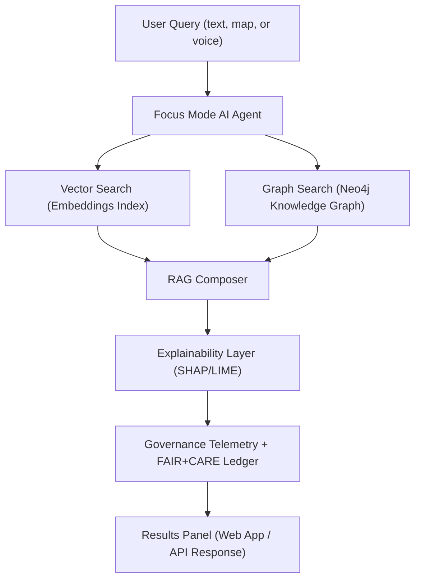

<div align="center">

# 🧠 **Kansas Frontier Matrix — Graph-Augmented Intelligence**
`docs/guides/ai/graph-augmented-intelligence.md`

**Purpose:**  
Integrates post-NODES 2025 graph-AI advancements into Kansas Frontier Matrix (KFM), enabling semantic retrieval, reasoning, and contextual focus pipelines across Neo4j, FAIR+CARE, and Focus Mode AI.

[](../../../docs/)
[](../../../LICENSE)
[](../../../docs/standards/FAIRCARE.md)
[](../../../.github/workflows/)
</div>

---

## 📘 Overview

Following insights from **Neo4j NODES 2025**, this guide enhances KFM’s AI layer by introducing **Graph-Augmented Intelligence (GAI)** — a fusion of graph reasoning, vector retrieval, and explainable AI.

**Core Concepts:**
- Graph embeddings for contextual linking between treaties, hydrology, and settlements  
- Retrieval-Augmented Generation (RAG) over Neo4j Knowledge Graphs  
- Focus Mode Agents orchestrating ethical retrieval pipelines  
- Voice and spatial query extensions for interactive exploration  

---

## 🗂️ Directory Layout
```
KansasFrontierMatrix/
├── src/
│   ├── ai/
│   │   ├── focus/                     # Focus Mode Agent logic
│   │   ├── explainability/            # SHAP, LIME, counterfactuals
│   │   └── embeddings/                # Graph + vector index builders
│   └── graph/
│       ├── schema/                    # Neo4j ontology & CIDOC CRM mapping
│       ├── queries/                   # RAG and entity-centric graph queries
│       └── utils/                     # Cypher helpers & governance hooks
└── docs/
    └── guides/ai/graph-augmented-intelligence.md
```

---

## 🧩 Graph + AI Integration Flow


---

## ⚙️ Configuration Parameters

| Parameter | Description | Default |
|------------|-------------|----------|
| `embedding_model` | Model used for vector representations | `focus-transformer-v1` |
| `neo4j_rag_limit` | Maximum nodes retrieved for RAG context | `50` |
| `explainability_mode` | SHAP or LIME interpretability toggle | `SHAP` |
| `telemetry_sink` | Output target for AI + governance events | `focus-telemetry.json` |

---

## 🧾 FAIR+CARE Alignment

| Principle | Implementation | Metric |
|------------|----------------|---------|
| **F1** — Findable | Neo4j index + STAC/DCAT linkages | 100% entity linkage |
| **A2** — Accessible | API endpoints with public docs | `/api/search`, `/api/rag` |
| **R3** — Reusable | Open embeddings + provenance hash | SPDX + SHA-256 trace |
| **C1** — Collective Benefit | Focus Mode ensures ethical retrieval | Audit via Governance Ledger |

---

## ⚖️ Governance Integration

This GAI system writes provenance records into the **Governance Ledger**, storing:
- Model UUIDs and SHAs  
- RAG retrieval chains  
- Explainability artifact hashes  
- Ethical impact scores  

Governance telemetry conforms to schema `telemetry/ai-graph-intelligence-v1.json`.

---

## 🕰️ Version History

| Version | Date | Author | Summary |
|----------|------|---------|----------|
| v9.7.0 | 2025-11-09 | A. Barta / ChatGPT-5 | Added Graph-Augmented Intelligence pipeline post-NODES 2025 |
| v9.6.0 | 2025-10-20 | A. Barta | Integrated Focus Mode AI embeddings |
| v9.5.0 | 2025-09-10 | A. Barta | Established initial Neo4j knowledge bridge |

---

<div align="center">

© 2025 Kansas Frontier Matrix · Master Coder Protocol v6.3 · FAIR+CARE Certified · Diamond⁹ Ω / Crown∞Ω Ultimate Certified  
[Back to AI Guides](../) · [Governance Charter](../../../docs/standards/governance/ROOT-GOVERNANCE.md)
</div>
