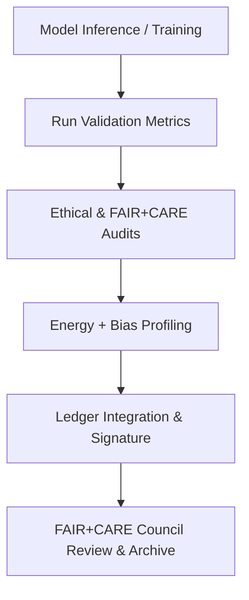

<div align="center">

# 🧾 **Kansas Frontier Matrix — AI Validation & FAIR+CARE Compliance Reports**
`docs/guides/ai/validation/README.md`

**Purpose:**  
Store and document **AI model validation results**, **governance audits**, and **FAIR+CARE compliance artifacts** for all AI and ML systems within the Kansas Frontier Matrix (KFM).  
This directory consolidates reports verifying model performance, ethical use, and sustainability telemetry, supporting full MCP-DL v6.3 reproducibility and governance alignment.

[](../../../README.md)
[](../../../../../LICENSE)
[](../../../../../docs/standards/README.md)
[](../../../../../releases/)
</div>

---

## 📘 Overview

This directory acts as the **centralized report archive** for:
- **AI validation** metrics and confidence thresholds  
- **FAIR+CARE governance audits** of explainability and ethics  
- **Bias and fairness analysis** results for Focus Mode AI and Graph-Augmented Intelligence  
- **Sustainability telemetry** for model inference and retraining cycles  

All validation outputs are automatically produced by CI/CD workflows and logged into the **AI Governance Ledger** for review by the FAIR+CARE Council.

---

## 🗂️ Directory Layout

```plaintext
docs/guides/ai/validation/
├── README.md                                 # This documentation
├── model-validation.json                     # AI model integrity + performance results
├── explainability-validation.json             # XAI artifact validation (SHAP, LIME)
├── fairness-bias-report.json                 # Fairness and bias audit summary
├── energy-profile.json                       # Energy + carbon impact assessment
├── faircare-audit.json                       # FAIR+CARE conformance check results
└── ledger-sync.json                          # Governance ledger validation sync
```

---

## ⚙️ Validation Report Schema (Unified)

| Field | Description | Example |
|--------|-------------|----------|
| `report_id` | Unique validation report ID | `"focus-transformer-v2-validate-001"` |
| `model` | Model name/version under test | `"focus-transformer-v2"` |
| `metrics` | Validation accuracy or performance | `{ "faithfulness": 0.88, "robustness": 0.91 }` |
| `fairness_bias` | Bias score metrics | `{ "regional_bias": 0.04, "gender_bias": 0.01 }` |
| `energy_metrics` | Sustainability results | `{ "joules": 82.3, "carbon_gCO2e": 0.31 }` |
| `faircare_compliance` | FAIR+CARE audit status | `"Pass"` |
| `reviewed_by` | FAIR+CARE Council or auditors | `["Council Ethics Team"]` |
| `timestamp` | ISO 8601 date of validation | `"2025-11-09T12:00:00Z"` |

---

## 🧾 Example: FAIR+CARE Validation Report

```json
{
  "report_id": "focus-transformer-v2-faircare-2025-11-09",
  "model": "focus-transformer-v2",
  "metrics": {
    "faithfulness": 0.87,
    "robustness": 0.90,
    "accuracy": 0.91
  },
  "fairness_bias": {
    "regional_bias": 0.04,
    "cultural_sensitivity_bias": 0.00
  },
  "energy_metrics": {
    "joules": 79.2,
    "carbon_gCO2e": 0.29
  },
  "faircare_compliance": "Pass",
  "reviewed_by": ["FAIR+CARE Council", "Governance Ops"],
  "timestamp": "2025-11-09T12:30:00Z"
}
```

---

## 🧩 FAIR+CARE Integration Mapping

| Principle | Implementation | Validation Artifact |
|------------|----------------|--------------------|
| **Findable** | Validation reports indexed in AI Ledger | `ledger-sync.json` |
| **Accessible** | Publicly available under CC-BY license | Repository transparency |
| **Interoperable** | JSON-LD schema for governance interoperability | `telemetry_schema` |
| **Reusable** | Includes reproducibility metadata and dataset hashes | `sbom_ref` |
| **Collective Benefit** | Promotes trustworthy AI through open auditing | FAIR+CARE audit |
| **Authority to Control** | FAIR+CARE Council validation approval required | `faircare-audit.json` |
| **Responsibility** | Records bias, energy, and ethics metrics | `energy-profile.json` |
| **Ethics** | Verifies responsible and non-harmful AI outputs | `fairness-bias-report.json` |

---

## ⚙️ CI/CD Validation Workflows

| Workflow | Function | Output |
|-----------|-----------|--------|
| `ai-validate.yml` | General AI model validation | `model-validation.json` |
| `ai-explainability.yml` | SHAP/LIME report validation | `explainability-validation.json` |
| `faircare-validate.yml` | FAIR+CARE ethics compliance audit | `faircare-audit.json` |
| `bias-detection.yml` | Detect and quantify model bias | `fairness-bias-report.json` |
| `energy-monitor.yml` | Capture inference energy telemetry | `energy-profile.json` |
| `ledger-sync.yml` | Append reports to governance ledger | `ledger-sync.json` |

---

## 🧮 Bias & Fairness Metrics

| Metric | Description | Target |
|---------|--------------|---------|
| **Regional Bias Index** | Geographic skew detection | < 0.05 |
| **Cultural Sensitivity Index** | FAIR+CARE cultural harm risk | 0.00 |
| **Faithfulness** | Groundedness of explanations | ≥ 0.85 |
| **Energy per Inference (J)** | Energy consumed per task | < 2.0 |
| **Carbon Intensity (gCO₂e)** | Carbon cost per task | < 0.005 |

---

## 🧠 Validation Flow



---

## ⚖️ Governance & Sustainability Oversight

- Every validation report must be **reviewed and digitally signed** by the FAIR+CARE Council.  
- Validation must include energy telemetry following **ISO 50001** and **ISO 14064** standards.  
- Reports missing `faircare_compliance` or `energy_metrics` are automatically rejected in CI.  
- Quarterly roll-ups of all validations appear in the Governance Ledger.

---

## 🕰️ Version History

| Version | Date | Author | Summary |
|----------|------|--------|----------|
| v10.0.0 | 2025-11-09 | Core Team | Consolidated AI validation directory with FAIR+CARE integration and CI/CD schema |
| v9.7.0 | 2025-11-03 | A. Barta | Added explainability and fairness audit tracking framework |

---

<div align="center">

© 2025 Kansas Frontier Matrix Project  
Master Coder Protocol v6.3 · FAIR+CARE Certified · Diamond⁹ Ω / Crown∞Ω Ultimate Certified  

[Back to AI Guides](../README.md) · [Governance Charter](../../../../../docs/standards/governance/ROOT-GOVERNANCE.md)

</div>

