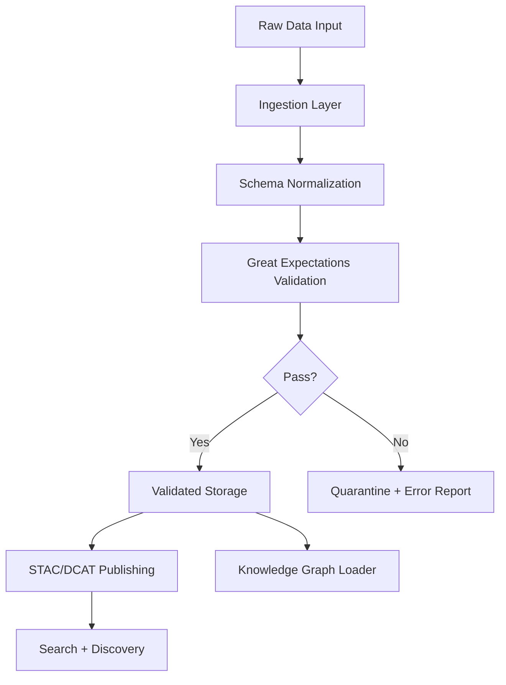

<div align="center">

# 🛡️ **Kansas Frontier Matrix — Data Validation Pipeline Guide**
`docs/guides/data-governance/validation-pipeline.md`

**Purpose:**  
Define the **standardized, auditable, FAIR+CARE-certified validation pipeline** used across **all KFM datasets** before they enter the canonical repository, STAC/DCAT catalogs, and Knowledge Graph.

</div>

---

# 📂 **Directory Layout**
```
KansasFrontierMatrix/
├── docs/
│   ├── guides/
│   │   ├── data-governance/
│   │   │   └── validation-pipeline.md   # This document
│   │   └── upgrade/
│   └── standards/
├── src/
│   ├── pipelines/
│   │   ├── ingest/                      # Sensors, scrapers, uploads
│   │   ├── validation/                  # Great Expectations suites
│   │   ├── normalization/               # Schema harmonization
│   │   └── publish/                     # STAC/DCAT emitters
├── data/
│   ├── raw/                             # Untouched source files
│   ├── work/
│   │   ├── staging/                     # Pre-validated transforms
│   │   └── tmp/                         # ETL temps & artifacts
│   └── validated/                       # Passed all GE checks
└── catalog/
    ├── stac/                            # STAC Item & Collection JSON
    └── dcat/                            # DCAT Data Catalog exports
```

---

# 🧭 **1. Overview**
The **KFM Data Validation Pipeline** ensures every dataset—historical, remote sensing, hydrology, climatology, treaty maps, landcover, hazards—is:

- **Traceable** (full provenance + metadata)
- **Ethical** (FAIR+CARE-compliant)
- **Reproducible** (pipeline versioned + deterministic)
- **Structured** (schema-aligned via KFM Field Definitions)
- **Validated** (Great Expectations)
- **Cataloged** (STAC/DCAT dual-indexing)
- **Linked** (ready for graph insertion)

This guide standardizes how every group within KFM contributes validated data.

---

# 🔄 **2. Pipeline Flow (High-Level)**

## **Mermaid Diagram**


---

# 🏗️ **3. Ingestion Layer**
The ingestion layer handles all source types:

### **Supported Input Types**
- 🛰️ Remote sensing (GeoTIFF, COG, IMG)
- 📜 Historic archives (PDF, TIFF, OCR text)
- 🌧️ Hydroclimate datasets (NetCDF, GRIB)
- 🪨 Geology & soils datasets (SHP, FGDB, GeoJSON)
- 📊 Tabular agency data (CSV, XLSX, JSON)
- 📐 Vector maps (Shapefiles, TopoJSON)
- 🗃️ Mixed-format archives (ZIP bundles)

### **Requirements**
- Must include **source metadata block**
- Must be placed in `data/raw/…`
- Must not overwrite prior raw versions (version-on-write enforced)

---

# 🧩 **4. Schema Normalization**
All data is harmonized to KFM’s **Field Definitions Standard**, stored in:

`docs/standards/metadata/field_definitions.md`

Normalizations include:

- Converting all timestamps to **UTC ISO-8601**
- Renaming fields to canonical KFM names
- Ensuring spatial metadata includes:
  - CRS
  - Extent
  - Resolution
  - Vector topology checks
- Ensuring tabular fields follow **datatype contracts**

Output goes to:

`/data/work/staging/<domain>/`

---

# 🧪 **5. Great Expectations Validation**
Every dataset must pass:

### **Validation Suites**
- **schema_conformance.yml**  
- **spatial_integrity.yml**  
- **temporal_integrity.yml**  
- **FAIR+CARE metadata.yml**  
- **duplicate_detection.yml**  
- **null_value_sensitivity.yml**  

### **Pass Criteria**
- 100% critical checks must pass  
- ≥95% non-critical checks must pass  
- Failure → quarantine area:  
  `data/work/tmp/validation_failures/<dataset>/`

---

# 📊 **6. Publishing Layer (STAC/DCAT)**
KFM dual-publishes metadata:

### **STAC**
Export to:
```
catalog/stac/collections/<domain>/
catalog/stac/items/<dataset>.json
```

### **DCAT**
Export to:
```
catalog/dcat/<dataset>.jsonld
```

### **Both must include**
- Provenance  
- License  
- Temporal extent  
- Spatial footprint  
- Version  
- FAIR+CARE ethics summary  

---

# 🧠 **7. Knowledge Graph Integration**
Validated + cataloged datasets enter:

`src/graph/ingest/`

Where they become graph entities:

- `kfm:Dataset`
- `kfm:FeatureLayer`
- `kfm:SpatialFeature`
- `kfm:TextFragment`
- `kfm:Event` (for historical)

Graph alignment uses:

- **CIDOC CRM**
- **GeoSPARQL**
- **OWL-Time**
- **KFM Ontology**

---

# 🧾 **8. Validation Reports**
Every dataset generates a GE HTML summary pushed to:

`docs/reports/validation/<dataset>/index.html`

And machine-readable logs go to:

`docs/reports/validation/<dataset>/validation.json`

---

# 🛠️ **9. Developer Workflow**
```
ingest → normalize → validate → publish → index → graph-load
```

### Command Example
```bash
make pipeline.validate DATASET=landcover_2023
```

---

# 🧿 **10. Telemetry & Governance**
All validation events generate Focus Mode telemetry:

- dataset_id  
- validator_version  
- GE_suite_version  
- duration  
- error types  
- FAIR+CARE score  

Governed by:

`docs/standards/governance/ROOT-GOVERNANCE.md`

---

# 🧩 **11. Appendix A — Error Classification**

| Error Class | Meaning | Action |
|------------|---------|--------|
| **CRIT-01** | Schema mismatch | Reject |
| **CRIT-02** | Missing spatial reference | Reject |
| **WARN-05** | Minor null drift | Allow w/ tag |
| **INFO-02** | Minor metadata enhancement | Auto-fix |

---

# 🧩 **12. Appendix B — FAIR+CARE Compliance**

KFM enforces:

- Findability (indexed STAC)
- Accessibility (open metadata)
- Interoperability (ISO/OGC standards)
- Reusability (full provenance)
- CARE: Collective Benefit, Authority, Responsibility, Ethics

---

# 📜 **Version History**
- **v10.2.2 — 2025-11-13**  
  Initial release under MCP-DL v6.3 alignment.

---
````
