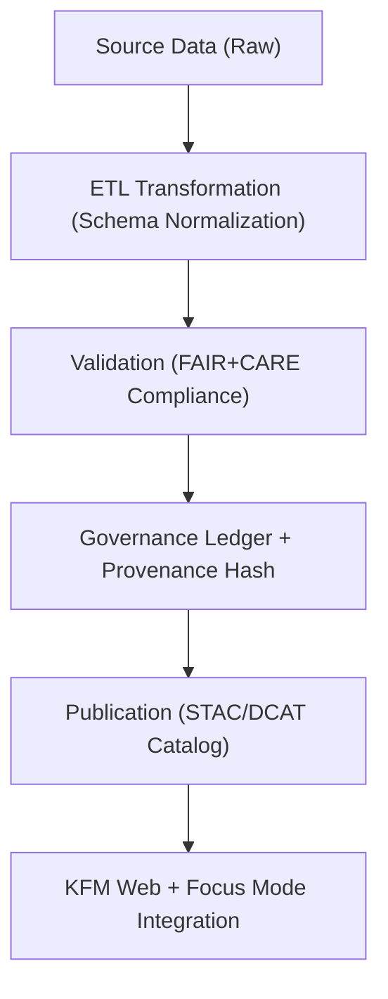

<div align="center">

# 🧾 **Kansas Frontier Matrix — Data Ingestion & FAIR+CARE Standards Overview**
`docs/guides/data/README.md`

**Purpose:**  
Provide an overview of **data ingestion, validation, and ethical governance practices** within the Kansas Frontier Matrix (KFM).  
This documentation defines FAIR+CARE-aligned data pipelines for tabular, raster, and vector sources, ensuring transparency, reproducibility, and respect for community data sovereignty.

[](../../README.md)
[](../../../LICENSE)
[](../../../docs/standards/README.md)
[](../../../releases/)
</div>

---

## 📘 Overview

The **Data Guides** section of KFM defines the **end-to-end lifecycle** of data — from ingestion and transformation to validation and ethical publication.  
All workflows follow the **Master Coder Protocol (MCP-DL v6.3)** and conform to **FAIR (Findable, Accessible, Interoperable, Reusable)** and **CARE (Collective Benefit, Authority to Control, Responsibility, Ethics)** principles.

Key goals:
- Standardize all datasets through schema-conformant ETL workflows  
- Ensure provenance and licensing transparency for each data artifact  
- Embed ethical review checkpoints and FAIR+CARE ledger tracking  

---

## 🗂️ Directory Layout

```plaintext
docs/guides/data/
├── README.md                              # This overview
├── ingestion-pipeline.md                  # Data ingestion & ETL configuration
├── validation-framework.md                # FAIR+CARE validation & schema audit
├── metadata-standards.md                  # STAC, DCAT, and CIDOC CRM mapping
├── sensitive-data-governance.md           # CARE-aligned masking for restricted datasets
└── reports/                               # Auto-generated validation outputs
```

---

## 🧩 Data Governance Flow



---

## ⚙️ Data Categories

| Data Type | Description | Example Formats | Location |
|------------|--------------|------------------|-----------|
| **Tabular** | Structured numeric or categorical data | CSV, Parquet | `data/work/tabular/` |
| **Raster** | Gridded geospatial data (imagery, DEM, climate) | GeoTIFF, COG | `data/processed/terrain/` |
| **Vector** | Feature geometries and boundaries | GeoJSON, GPKG | `data/processed/vectors/` |
| **Textual** | OCR’d documents and historical transcripts | TXT, JSON-LD | `data/processed/text/` |
| **Metadata** | Catalog and provenance descriptors | JSON, YAML | `data/stac/`, `data/dcat/` |

---

## 🧾 FAIR+CARE Implementation Matrix

| Principle | Implementation | Validation Source |
|------------|----------------|-------------------|
| **Findable** | STAC/DCAT metadata + persistent UUIDs | `stac-validate.yml` |
| **Accessible** | Publicly accessible datasets (with consent) | `releases/v*/manifest.zip` |
| **Interoperable** | Standard schemas (GeoJSON, Parquet, COG, JSON-LD) | `data-contract-v3.json` |
| **Reusable** | Clear licensing and lineage metadata | `sbom.spdx.json` |
| **Collective Benefit** | Open datasets serve historical & environmental research | FAIR+CARE ledger |
| **Authority to Control** | Tribal/community control over cultural data | `data-generalization/README.md` |
| **Responsibility** | Energy telemetry and consent tracking | `focus-telemetry.json` |
| **Ethics** | Review by FAIR+CARE Council before public release | `faircare-validate.yml` |

---

## 🧮 Data Provenance Schema

```json
{
  "dataset_id": "kfm-hydrology-2025-001",
  "source": "USGS Hydrology + NOAA LiDAR",
  "etl_pipeline": "src/pipelines/etl/hydrology/",
  "license": "CC-BY 4.0",
  "hash_sha256": "4f2d8cfe12345678...",
  "timestamp": "2025-11-09T12:00:00Z",
  "faircare_status": "Pass",
  "ledger_entry": "docs/standards/governance/LEDGER/data-hydrology.json"
}
```

> Each dataset entry is cryptographically signed and validated for compliance before integration into the KFM catalog.

---

## ⚙️ Validation Workflows

| Workflow | Purpose | Output |
|-----------|----------|--------|
| `data-ingest.yml` | Automates raw data ingestion to ETL staging | `reports/data/ingest-log.json` |
| `stac-validate.yml` | Validates metadata schemas (STAC/DCAT 3.0) | `reports/data/stac-validation.json` |
| `faircare-validate.yml` | Checks ethical & governance compliance | `reports/faircare/data-audit.json` |
| `ledger-sync.yml` | Records data provenance + FAIR+CARE ledger | `reports/ledger/data-ledger.json` |

---

## 🧩 Example Data Validation Report

```json
{
  "dataset_id": "kfm-climate-2025-010",
  "crs": "EPSG:4326",
  "validation_results": {
    "schema": "Pass",
    "nodata_handling": "Pass",
    "license_check": "Pass",
    "ethical_review": "Pass"
  },
  "energy_joules": 0.94,
  "faircare_status": "Pass",
  "timestamp": "2025-11-09T12:00:00Z"
}
```

---

## ⚖️ Governance Integration

- All datasets must include STAC/DCAT metadata and **FAIR+CARE validation hashes**.  
- Provenance entries must appear in the Governance Ledger before publication.  
- Sensitive datasets follow **CARE-controlled release** workflows for community review.  
- Annual audits compare all data releases against MCP-DL schema compliance.

---

## 🕰️ Version History

| Version | Date | Author | Summary |
|----------|------|--------|----------|
| v10.0.0 | 2025-11-09 | Core Team | Added unified data governance overview with FAIR+CARE schema and ledger integration |
| v9.7.0 | 2025-11-03 | A. Barta | Introduced modular ingestion and validation templates |

---

<div align="center">

© 2025 Kansas Frontier Matrix Project  
Master Coder Protocol v6.3 · FAIR+CARE Certified · Diamond⁹ Ω / Crown∞Ω Ultimate Certified  

[Back to Guides Index](../README.md) · [Governance Charter](../../../docs/standards/governance/ROOT-GOVERNANCE.md)

</div>

