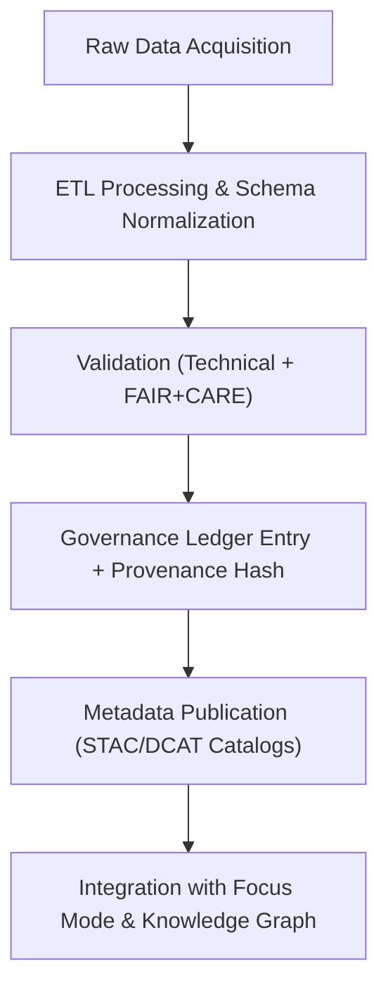
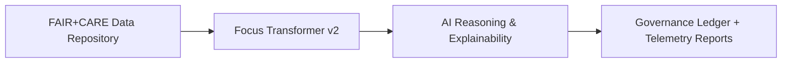

<div align="center">

# 🧾 **Kansas Frontier Matrix — Data Ingestion & FAIR+CARE Standards Overview**
`docs/guides/data/README.md`

**Purpose:**  
Provide a unified overview of **data ingestion, validation, metadata governance, and ethical publication** workflows across the Kansas Frontier Matrix (KFM).  
Defines reproducible **ETL pipelines**, **schema compliance**, and **FAIR+CARE-aligned governance processes** for all data modalities (tabular, raster, vector, textual).

[](../../README.md)
[](../../../LICENSE)
[](../../../docs/standards/README.md)
[](../../../releases/)
</div>

---

## 📘 Overview

The **Data Guides** directory governs the **full data lifecycle** in KFM — from raw acquisition to FAIR+CARE-certified publication.  
All workflows follow the **Master Coder Protocol (MCP-DL v6.3)** and align with:
- **FAIR** (Findable, Accessible, Interoperable, Reusable)
- **CARE** (Collective Benefit, Authority to Control, Responsibility, Ethics)

**Core Objectives**
- Enforce reproducible, schema-conformant ETL workflows.  
- Guarantee provenance traceability and open licensing.  
- Integrate ethical review and FAIR+CARE validation checkpoints.  
- Maintain governance ledger entries for all published datasets.  

---

## 🗂️ Directory Layout

```plaintext
docs/guides/data/
├── README.md                              # This overview
├── ingestion-pipeline.md                  # ETL pipeline and data normalization
├── validation-framework.md                # FAIR+CARE validation & schema audit
├── metadata-standards.md                  # STAC, DCAT, and CIDOC CRM metadata mapping
├── stac-dcat-bridge.md                    # STAC ↔ DCAT interoperability layer
├── schemas/                               # JSON & FAIR+CARE schema definitions
├── reports/                               # Auto-generated validation & ledger reports
└── sensitive-data-governance.md           # CARE-guided sensitive data masking
```

---

## 🧩 Data Lifecycle Flow



---

## ⚙️ Data Categories

| Category | Description | Common Formats | Repository Location |
|-----------|--------------|----------------|---------------------|
| **Tabular** | Statistical & structured records | CSV, Parquet | `data/work/tabular/` |
| **Raster** | Gridded or image-based datasets | GeoTIFF, COG | `data/processed/terrain/` |
| **Vector** | Geospatial features, parcels, or boundaries | GeoJSON, GPKG | `data/processed/vectors/` |
| **Textual** | OCR’d historical documents & transcripts | TXT, JSON-LD | `data/processed/text/` |
| **Metadata** | STAC/DCAT catalogs & provenance manifests | JSON, YAML | `data/stac/`, `data/dcat/` |

---

## 🧾 FAIR+CARE Implementation Matrix

| Principle | Implementation | Evidence Artifact |
|------------|----------------|-------------------|
| **Findable** | Persistent UUIDs in STAC/DCAT records | `stac-validate.yml` |
| **Accessible** | Public datasets with transparent licensing | `manifest_ref` |
| **Interoperable** | GeoJSON, Parquet, and COG standards | `data-contract-v3.json` |
| **Reusable** | Rich metadata and lineage documentation | `sbom.spdx.json` |
| **Collective Benefit** | Shared research datasets with open access | FAIR+CARE ledger |
| **Authority to Control** | Tribal or community-managed data release | `data-generalization/README.md` |
| **Responsibility** | Carbon + telemetry tracking for each ETL job | `focus-telemetry.json` |
| **Ethics** | FAIR+CARE Council review before publication | `faircare-validate.yml` |

---

## 🧮 Provenance Record Example

```json
{
  "dataset_id": "kfm-hydrology-2025-001",
  "source": "USGS Hydrology + NOAA LiDAR",
  "etl_pipeline": "src/pipelines/etl/hydrology/",
  "license": "CC-BY 4.0",
  "hash_sha256": "4f2d8cfe12345678...",
  "timestamp": "2025-11-09T12:00:00Z",
  "faircare_status": "Pass",
  "ledger_entry": "docs/standards/governance/LEDGER/data-hydrology.json"
}
```

> Each dataset entry is **cryptographically signed**, validated, and logged into the FAIR+CARE Governance Ledger.

---

## ⚙️ Validation Workflows

| Workflow | Function | Output |
|-----------|-----------|--------|
| `data-ingest.yml` | Automates ingestion into ETL staging | `reports/data/ingest-log.json` |
| `schema-validate.yml` | Enforces contract schema integrity | `reports/data/schema-validation.json` |
| `stac-validate.yml` | Validates STAC/DCAT catalog entries | `reports/data/stac-validation.json` |
| `faircare-validate.yml` | Checks ethical compliance & governance | `reports/faircare/data-audit.json` |
| `ledger-sync.yml` | Syncs provenance + FAIR+CARE ledger | `reports/ledger/data-ledger.json` |

---

## 🧩 Validation Example

```json
{
  "dataset_id": "kfm-climate-2025-010",
  "crs": "EPSG:4326",
  "validation_results": {
    "schema": "Pass",
    "nodata_handling": "Pass",
    "license_check": "Pass",
    "ethical_review": "Pass"
  },
  "energy_joules": 0.94,
  "faircare_status": "Pass",
  "timestamp": "2025-11-09T12:00:00Z"
}
```

---

## ⚖️ Governance & Oversight

- Every dataset must have **FAIR+CARE-certified metadata** and a **governance ledger hash**.  
- Sensitive or culturally significant data undergo **CARE consent-based review**.  
- Validation artifacts are preserved under versioned releases (`releases/v*/reports/`).  
- Quarterly Council reviews audit schema conformance, sustainability, and ethics.  

---

## 🧩 Integration with Focus Mode AI

Data validated through this framework feed directly into the **Focus Transformer v2** pipeline, where FAIR+CARE metadata ensures AI reasoning adheres to ethical and reproducible standards.



---

## 🕰️ Version History

| Version | Date | Author | Summary |
|----------|------|--------|----------|
| v10.0.0 | 2025-11-09 | Core Team | Expanded to include schemas, STAC/DCAT bridge, and Focus Mode integration |
| v9.7.0 | 2025-11-03 | A. Barta | Introduced modular ingestion and validation templates |

---

<div align="center">

© 2025 Kansas Frontier Matrix Project  
Master Coder Protocol v6.3 · FAIR+CARE Certified · Diamond⁹ Ω / Crown∞Ω Ultimate Certified  

[Back to Guides Index](../README.md) · [Governance Charter](../../../docs/standards/governance/ROOT-GOVERNANCE.md)

</div>
