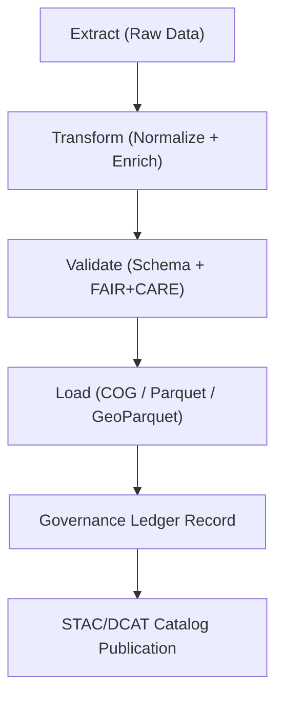

<div align="center">

# 📥 **Kansas Frontier Matrix — Data Ingestion Pipeline & ETL Framework**
`docs/guides/data/ingestion-pipeline.md`

**Purpose:**  
Define standardized, FAIR+CARE-compliant **data ingestion and transformation workflows** for integrating raw, historical, and environmental data into the Kansas Frontier Matrix (KFM).  
This framework ensures **reproducibility, provenance, and ethical data handling** across tabular, raster, and vector datasets.

[](../../README.md)
[](../../../LICENSE)
[](../../../docs/standards/README.md)
[](../../../releases/)
</div>

---

## 📘 Overview

The KFM **ETL pipeline** (Extract–Transform–Load) automates ingestion of diverse data sources—such as archives, maps, climate records, and census tables—into harmonized formats.  
All stages include **schema validation**, **license tracking**, and **FAIR+CARE governance hooks** for provenance, energy usage, and consent metadata.

**Core Features**
- Multi-source ingestion (local, API, FTP, archives)
- Schema-aware transformations with geospatial support
- Automated FAIR+CARE validation and ledger integration
- Version-controlled datasets with checksum verification

---

## 🗂️ Directory Layout

```plaintext
src/pipelines/etl/
├── extract/                       # Source ingestion scripts
│   ├── noaa_ingest.py             # NOAA climate data fetch
│   ├── usgs_ingest.py             # USGS topo & hydrology data
│   ├── dpla_ingest.py             # Historical document imports
│   └── census_ingest.py           # Demographic data import
├── transform/                     # Schema normalization
│   ├── normalize_tabular.py       # Clean and unify column structures
│   ├── reproject_vector.py        # CRS unification (EPSG:4326)
│   └── enrich_metadata.py         # Add lineage, license, and FAIR+CARE fields
├── load/                          # Storage and output steps
│   ├── to_parquet.py              # Save tabular data
│   ├── to_geoparquet.py           # Save vector data
│   └── to_cog.py                  # Convert rasters to COGs
└── governance/                    # Provenance + FAIR+CARE validation
    ├── validate_etl.py
    ├── ledger_writer.py
    └── ethics_review.py
```

---

## 🧩 ETL Process Overview



---

## ⚙️ Step-by-Step Workflow

### 1️⃣ Extract Raw Data
```bash
python src/pipelines/etl/extract/noaa_ingest.py --year 2024 --state KS
python src/pipelines/etl/extract/usgs_ingest.py --layers "hydrology,terrain"
```

Output:  
`data/raw/noaa/2024/temperature.csv`  
`data/raw/usgs/hydrology/rivers.geojson`

### 2️⃣ Transform & Normalize
```bash
python src/pipelines/etl/transform/normalize_tabular.py \
  --input data/raw/noaa/2024/temperature.csv \
  --output data/work/tabular/noaa_temperature_clean.csv \
  --schema docs/contracts/data-contract-v3.json
```

Output:  
`data/work/tabular/noaa_temperature_clean.csv`

### 3️⃣ Load to Processed Workspace
```bash
python src/pipelines/etl/load/to_parquet.py \
  --input data/work/tabular/noaa_temperature_clean.csv \
  --output data/processed/tabular/noaa_temperature.parquet
```

Output:  
`data/processed/tabular/noaa_temperature.parquet`

### 4️⃣ Validate and Record Provenance
```bash
python src/pipelines/etl/governance/validate_etl.py \
  --input data/processed/tabular/noaa_temperature.parquet \
  --output reports/data/etl-validation.json
```

---

## 🧾 Validation Metrics

| Category | Description | Target |
|-----------|--------------|--------|
| **Schema Conformance** | Columns, datatypes match contract | 100% |
| **License Compliance** | License field validated (SPDX/CC) | Pass |
| **Provenance Integrity** | SHA-256 recorded in ledger | Verified |
| **Ethical Review** | CARE review passed | Pass |
| **Energy Efficiency** | ETL job energy usage | < 1.5 kWh |

---

## 🧮 Example ETL Validation Record

```json
{
  "dataset_id": "kfm-noaa-temp-2024",
  "etl_stage": "load",
  "schema_compliance": "Pass",
  "provenance_sha256": "8f2cd0a3b1234...",
  "license": "CC-BY 4.0",
  "faircare_compliance": "Pass",
  "energy_metrics": { "joules": 4500, "carbon_gCO2e": 0.9 },
  "timestamp": "2025-11-09T12:00:00Z"
}
```

---

## ⚖️ FAIR+CARE Integration

| Principle | Implementation | Evidence |
|------------|----------------|-----------|
| **Findable** | STAC/DCAT records for all outputs | `data/stac/*.json` |
| **Accessible** | Conditionally public datasets under open licenses | `manifest_ref` |
| **Interoperable** | ISO/OGC schemas for spatial + tabular data | `data-contract-v3.json` |
| **Reusable** | Metadata, provenance, and lineage preserved | `sbom_ref` |
| **Collective Benefit** | Datasets aid historical, ecological, and cultural research | FAIR+CARE Council |
| **Authority to Control** | CARE-compliant sensitive data masking | `data-generalization/README.md` |
| **Responsibility** | ETL telemetry logged in FAIR+CARE reports | `focus-telemetry.json` |
| **Ethics** | Publication gated by FAIR+CARE review | `faircare-validate.yml` |

---

## 🧰 CI/CD Integration

| Workflow | Function | Output |
|-----------|-----------|--------|
| `data-ingest.yml` | Automate extraction and staging | `reports/data/ingest-log.json` |
| `etl-validate.yml` | Validate transformations | `reports/data/etl-validation.json` |
| `faircare-validate.yml` | Audit ethical and FAIR+CARE compliance | `reports/faircare/data-audit.json` |
| `ledger-sync.yml` | Append provenance to governance ledger | `docs/standards/governance/LEDGER/data-ledger.json` |

---

## 🧾 Governance Ledger Example

```json
{
  "ledger_id": "data-ledger-2025-11-09-001",
  "dataset": "noaa_temperature.parquet",
  "sha256": "3fe9c7a3a4b8...",
  "etl_pipeline": "src/pipelines/etl/transform/normalize_tabular.py",
  "faircare_status": "Pass",
  "auditors": ["FAIR+CARE Council"],
  "timestamp": "2025-11-09T12:00:00Z"
}
```

---

## 🕰️ Version History

| Version | Date | Author | Summary |
|----------|------|--------|----------|
| v10.0.0 | 2025-11-09 | Core Team | Comprehensive ETL guide with FAIR+CARE governance and telemetry integration |
| v9.7.0  | 2025-11-03 | A. Barta | Introduced initial multi-source ETL pipeline and validation schema |

---

<div align="center">

© 2025 Kansas Frontier Matrix Project  
Master Coder Protocol v6.3 · FAIR+CARE Certified · Diamond⁹ Ω / Crown∞Ω Ultimate Certified  

[Back to Data Guides](./README.md) · [Governance Charter](../../../docs/standards/governance/ROOT-GOVERNANCE.md)

</div>

