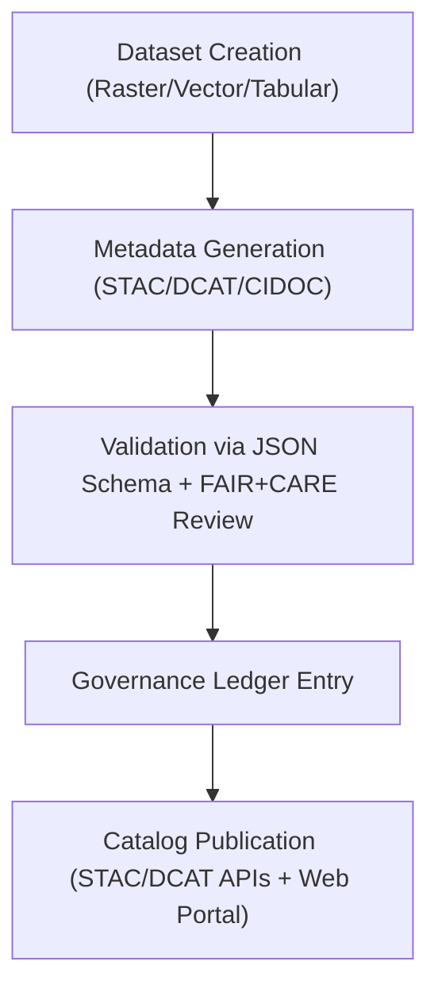

<div align="center">

# 🗃️ **Kansas Frontier Matrix — Metadata Standards & Catalog Integration (STAC · DCAT · CIDOC CRM)**
`docs/guides/data/metadata-standards.md`

**Purpose:**  
Define **metadata interoperability** and **cataloging standards** for all datasets within the Kansas Frontier Matrix (KFM), enabling seamless integration with external repositories through **STAC**, **DCAT 3.0**, and **CIDOC CRM** mappings under FAIR+CARE compliance.

[](../../README.md)
[](../../../LICENSE)
[](../../../docs/standards/README.md)
[](../../../releases/)
</div>

---

## 📘 Overview

The Kansas Frontier Matrix (KFM) enforces a **metadata governance framework** that ensures all datasets—raster, vector, tabular, and textual—adhere to open geospatial and heritage data standards.  
This guide explains how to create, validate, and publish metadata conforming to:
- **STAC (SpatioTemporal Asset Catalog 1.0.0)** for spatiotemporal assets  
- **DCAT 3.0** for open data catalog interoperability  
- **CIDOC CRM** for cultural heritage and provenance semantics  

All metadata outputs are integrated into the **Governance Ledger**, providing immutable provenance, licensing, and FAIR+CARE ethical alignment.

---

## 🗂️ Directory Layout

```plaintext
docs/guides/data/
├── metadata-standards.md               # This document
├── stac-dcat-bridge.md                 # STAC ↔ DCAT translation guide
├── reports/                            # Metadata validation reports
└── schemas/                            # JSON schema definitions
```

---

## 🧩 Metadata Schema Integration Flow



---

## ⚙️ STAC Metadata Template (Example)

```json
{
  "stac_version": "1.0.0",
  "type": "Feature",
  "id": "kfm-hydrology-2025-001",
  "properties": {
    "datetime": "2025-11-09T00:00:00Z",
    "license": "CC-BY 4.0",
    "provider": "Kansas Frontier Matrix",
    "themes": ["Hydrology", "Terrain", "Environmental Modeling"],
    "faircare": "Pass"
  },
  "bbox": [-102.05, 37.0, -94.6, 40.0],
  "assets": {
    "data": {
      "href": "https://data.kfm.org/tiles/hydrology.tif",
      "type": "image/tiff; application=geotiff",
      "roles": ["data"]
    }
  },
  "collection": "hydrology_v10"
}
```

---

## 📦 DCAT 3.0 Mapping Example

```json
{
  "@context": "https://www.w3.org/ns/dcat3.jsonld",
  "id": "kfm-hydrology-2025-001",
  "type": "Dataset",
  "title": "Hydrology Flow Accumulation (Kansas, 2025)",
  "description": "Raster dataset showing modeled flow accumulation and drainage network across Kansas.",
  "spatial": {
    "bbox": [-102.05, 37.0, -94.6, 40.0],
    "crs": "EPSG:4326"
  },
  "temporal": {
    "startDate": "2025-11-01T00:00:00Z",
    "endDate": "2025-11-09T00:00:00Z"
  },
  "distribution": [{
    "downloadURL": "https://data.kfm.org/tiles/hydrology.tif",
    "mediaType": "image/tiff; application=geotiff"
  }],
  "license": "CC-BY 4.0",
  "provenance": {
    "wasGeneratedBy": "src/pipelines/etl/hydrology/flow_accumulation.py",
    "sha256": "f9a3e7c5..."
  },
  "rights": "FAIR+CARE compliant; approved by Council"
}
```

---

## 🧠 CIDOC CRM Linkages (Cultural Heritage Metadata)

| CIDOC Class | KFM Entity | Example |
|--------------|-------------|----------|
| `E21_Person` | Historical Figure or Research Contributor | “John Brown (1825–1859)” |
| `E53_Place` | Geospatial Feature (location, fort, reservation) | “Fort Larned, KS” |
| `E5_Event` | Historical or Environmental Event | “1867 Medicine Lodge Treaty” |
| `E31_Document` | Archival or text record | “Land Survey Plat of 1872” |
| `E57_Material` | Environmental or cultural substance | “Limestone bedrock” |
| `E7_Activity` | Data acquisition process | “LiDAR Scan of Kansas Plains (NOAA 2024)” |

> Each CIDOC entity is linked to STAC or DCAT records using URIs in Neo4j, forming a semantically enriched knowledge graph.

---

## 🧾 FAIR+CARE Metadata Alignment

| Principle | Implementation | Validation Artifact |
|------------|----------------|--------------------|
| **Findable** | Persistent identifiers in STAC/DCAT catalogs | `stac-validation.json` |
| **Accessible** | Public metadata with license transparency | `manifest_ref` |
| **Interoperable** | STAC/DCAT/CIDOC schema mappings | `telemetry_schema` |
| **Reusable** | Machine-readable metadata + provenance hashes | `sbom_ref` |
| **Collective Benefit** | Shared open data fosters equitable research | FAIR+CARE audit |
| **Authority to Control** | CARE metadata fields define community permissions | `data-generalization/README.md` |
| **Responsibility** | Provenance and licensing tracked in governance ledger | `governance_ref` |
| **Ethics** | Metadata screened for sensitive cultural content | FAIR+CARE review |

---

## ⚙️ Validation Workflows

| Workflow | Function | Output |
|-----------|-----------|--------|
| `stac-validate.yml` | Validate STAC 1.0 schema compliance | `reports/stac-validation.json` |
| `dcat-validate.yml` | Validate DCAT 3.0 dataset compliance | `reports/dcat-validation.json` |
| `cidoc-map-validate.yml` | Verify CIDOC CRM entity linkages | `reports/cidoc-validation.json` |
| `faircare-validate.yml` | Confirm metadata ethics & consent review | `reports/faircare/metadata-audit.json` |

---

## 🧮 Governance Ledger Example

```json
{
  "ledger_id": "metadata-ledger-2025-11-09-001",
  "dataset": "hydrology_v10",
  "stac_hash": "d2ac7b91c54a...",
  "dcat_hash": "3af2e7b994b3...",
  "cidoc_entities": ["E53_Place","E7_Activity"],
  "faircare_status": "Pass",
  "auditor": "FAIR+CARE Council",
  "timestamp": "2025-11-09T12:00:00Z"
}
```

---

## ⚖️ Compliance Notes

- All metadata entries must include **license, provenance, and FAIR+CARE tags**.  
- Each release requires **cross-validation between STAC and DCAT catalogs**.  
- STAC/DCAT entries are linked to CIDOC CRM entities in the Neo4j graph.  
- **CARE permissions** override public visibility for culturally sensitive sites.  
- Metadata diffs are automatically tracked in `reports/metadata-deltas.json`.

---

## 🕰️ Version History

| Version | Date | Author | Summary |
|----------|------|--------|----------|
| v10.0.0 | 2025-11-09 | Core Team | Unified metadata standards for STAC/DCAT/CIDOC with FAIR+CARE audit tracking |
| v9.7.0  | 2025-11-03 | A. Barta | Initial implementation of STAC ↔ DCAT mapping framework |

---

<div align="center">

© 2025 Kansas Frontier Matrix Project  
Master Coder Protocol v6.3 · FAIR+CARE Certified · Diamond⁹ Ω / Crown∞Ω Ultimate Certified  

[Back to Data Guides](./README.md) · [Governance Charter](../../../docs/standards/governance/ROOT-GOVERNANCE.md)

</div>

