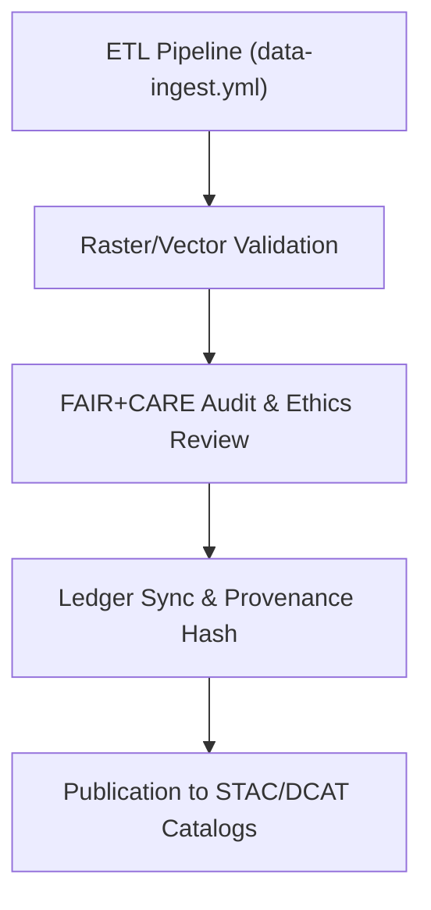

<div align="center">

# 📊 **Kansas Frontier Matrix — Data Validation Reports & FAIR+CARE Audits**
`docs/guides/data/reports/README.md`

**Purpose:**  
Central repository for **data validation outputs**, **schema checks**, and **FAIR+CARE compliance audits** across the Kansas Frontier Matrix (KFM).  
Each report documents reproducible data validation outcomes, provenance checks, and governance-ledger traceability.

[](../../README.md)
[](../../../../../LICENSE)
[](../../../../../docs/standards/README.md)
[](../../../../../releases/)
</div>

---

## 📘 Overview

This directory contains **validation report artifacts** automatically generated during data ingestion and FAIR+CARE verification workflows.  
It supports full lifecycle validation of:
- ETL schema compliance  
- Raster and vector integrity  
- STAC/DCAT metadata mapping  
- FAIR+CARE governance audits and provenance tracking  

All reports are JSON-based and appended to the Governance Ledger to maintain transparent auditability.

---

## 🗂️ Directory Layout

```plaintext
docs/guides/data/reports/
├── README.md                              # This documentation
├── etl-validation.json                    # Results from data ETL schema validation
├── raster-integrity.json                  # Raster (COG, GeoTIFF) consistency checks
├── vector-integrity.json                  # Vector geometry and attribute audits
├── stac-dcat-validation.json              # Metadata crosswalk validation results
├── faircare-audit.json                    # Ethical governance compliance summary
└── ledger-sync.json                       # Ledger record for all validation events
```

---

## ⚙️ Report Schema (Unified)

| Field | Description | Example |
|--------|-------------|----------|
| `report_id` | Unique identifier for validation run | `"data-etl-validate-2025-11-09"` |
| `dataset_id` | Dataset or layer name | `"kfm-hydrology-2025-001"` |
| `validation_type` | Validation category (ETL, Raster, Vector, Metadata) | `"Raster"` |
| `metrics` | Quantitative validation metrics | `{ "nodata_ratio": 0.01, "geometry_validity": 0.998 }` |
| `status` | Pass/Fail status | `"Pass"` |
| `faircare_status` | FAIR+CARE compliance outcome | `"Pass"` |
| `auditor` | Validator or FAIR+CARE Council name | `"Governance Ops"` |
| `timestamp` | ISO 8601 creation timestamp | `"2025-11-09T12:00:00Z"` |

---

## 🧾 Example Validation Report

```json
{
  "report_id": "data-raster-validate-2025-11-09",
  "dataset_id": "kfm-dem-2025-001",
  "validation_type": "Raster",
  "metrics": {
    "nodata_ratio": 0.01,
    "pixel_alignment": "Valid",
    "projection": "EPSG:4326",
    "file_integrity": "OK"
  },
  "status": "Pass",
  "faircare_status": "Pass",
  "auditor": "FAIR+CARE Council",
  "timestamp": "2025-11-09T12:00:00Z"
}
```

---

## ⚖️ FAIR+CARE Integration

| Principle | Implementation | Validation Artifact |
|------------|----------------|--------------------|
| **Findable** | Indexed validation reports by dataset UUID | `ledger-sync.json` |
| **Accessible** | Reports published under CC-BY 4.0 license | Repository access |
| **Interoperable** | JSON-LD schema for data validation results | `telemetry_schema` |
| **Reusable** | Includes provenance hashes + schema version | `sbom_ref` |
| **Collective Benefit** | Enables transparent data governance | FAIR+CARE ledger |
| **Authority to Control** | Review by FAIR+CARE Council for sensitive datasets | `faircare-audit.json` |
| **Responsibility** | Logs sustainable compute + validation metrics | `focus-telemetry.json` |
| **Ethics** | Flags and masks culturally sensitive layers | `data-generalization/README.md` |

---

## 🧮 CI/CD Integration Flow



---

## 🧰 CI/CD Workflows

| Workflow | Function | Output |
|-----------|-----------|--------|
| `data-ingest.yml` | Run ETL ingestion and schema checks | `etl-validation.json` |
| `raster-validate.yml` | Test raster CRS, NoData, and pixel alignment | `raster-integrity.json` |
| `vector-validate.yml` | Validate vector geometry and attribute completeness | `vector-integrity.json` |
| `stac-validate.yml` | Confirm metadata mapping accuracy | `stac-dcat-validation.json` |
| `faircare-validate.yml` | Conduct ethical and governance validation | `faircare-audit.json` |
| `ledger-sync.yml` | Log all reports to Governance Ledger | `ledger-sync.json` |

---

## 🧩 Governance Ledger Entry Example

```json
{
  "ledger_id": "data-ledger-2025-11-09-0001",
  "reports": [
    "etl-validation.json",
    "raster-integrity.json",
    "vector-integrity.json"
  ],
  "faircare_status": "Pass",
  "signed_by": "FAIR+CARE Council",
  "sha256": "4d8acb76f1e923ff...",
  "timestamp": "2025-11-09T12:00:00Z"
}
```

---

## ⚙️ Validation Targets

| Check | Standard | Threshold |
|--------|-----------|-----------|
| **Raster Integrity** | GDAL/COG | ≥ 99% valid pixels |
| **Vector Validity** | OGC Topology | ≥ 99% valid geometries |
| **Metadata Schema** | STAC/DCAT 3.0 | 100% compliance |
| **FAIR+CARE Audit** | CARE Council Review | “Pass” required |
| **Provenance Ledger** | MCP-DL v6.3 | SHA256 validated |

---

## 🕰️ Version History

| Version | Date | Author | Summary |
|----------|------|--------|----------|
| v10.0.0 | 2025-11-09 | Core Team | Created comprehensive FAIR+CARE data validation and governance audit framework |
| v9.7.0 | 2025-11-03 | A. Barta | Added automated ETL and raster/vector schema validation |

---

<div align="center">

© 2025 Kansas Frontier Matrix Project  
Master Coder Protocol v6.3 · FAIR+CARE Certified · Diamond⁹ Ω / Crown∞Ω Ultimate Certified  

[Back to Data Guides](../README.md) · [Governance Charter](../../../../../docs/standards/governance/ROOT-GOVERNANCE.md)

</div>

