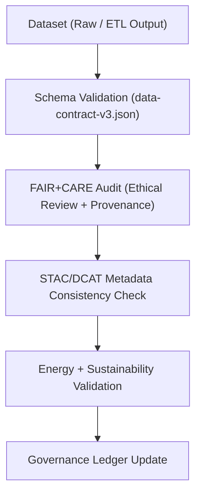

<div align="center">

# ✅ **Kansas Frontier Matrix — Data Validation & FAIR+CARE Compliance Framework**
`docs/guides/data/validation-framework.md`

**Purpose:**  
Define the **validation architecture** used to ensure all datasets in the Kansas Frontier Matrix (KFM) are **technically sound**, **ethically governed**, and **FAIR+CARE-compliant**.  
This framework enforces MCP-DL v6.3 validation protocols across data schemas, ETL pipelines, and metadata catalogs.

[](../../README.md)
[](../../../LICENSE)
[](../../../docs/standards/README.md)
[](../../../releases/)
</div>

---

## 📘 Overview

KFM’s **validation framework** integrates schema validation, spatial quality checks, metadata consistency, and FAIR+CARE audits into a single reproducible workflow.  
All validations are performed automatically through **GitHub Actions**, **data-contract schemas**, and **telemetry-linked governance reporting**.

**Core Objectives**
- Guarantee every dataset aligns with FAIR+CARE principles  
- Provide transparent validation reports and provenance trails  
- Automate schema conformance and ethical review within CI/CD  

---

## 🗂️ Directory Layout

```plaintext
docs/guides/data/
├── validation-framework.md                # This document
├── schemas/                               # JSON & FAIR+CARE schema definitions
├── reports/                               # Validation result outputs
└── ingestion-pipeline.md                  # Data ETL and governance documentation
```

---

## 🧩 Validation Workflow Architecture



---

## ⚙️ Validation Categories

| Category | Description | Validation Tool | Output |
|-----------|-------------|----------------|---------|
| **Schema Validation** | Ensures field types and structures match data contract | `schema-validate.yml` | `reports/data/schema-validation.json` |
| **Spatial Validation** | Confirms CRS, geometry validity, and alignment | `vector-validate.yml` | `reports/data/vector-integrity.json` |
| **Raster Validation** | Tests COG compliance and NoData handling | `raster-validate.yml` | `reports/data/raster-integrity.json` |
| **Metadata Validation** | Cross-checks STAC/DCAT/CIDOC metadata | `stac-validate.yml` | `reports/data/stac-dcat-validation.json` |
| **FAIR+CARE Audit** | Assesses ethics, consent, and cultural sensitivity | `faircare-validate.yml` | `reports/faircare/data-audit.json` |
| **Governance Ledger Sync** | Appends verified records to ledger | `ledger-sync.yml` | `docs/standards/governance/LEDGER/data-ledger.json` |

---

## 🧾 Validation Criteria

| Criterion | Definition | Target |
|------------|-------------|--------|
| **CRS Consistency** | All geometries in EPSG:4326 | 100% |
| **Schema Compliance** | Matches `data-contract-v3.json` | 100% |
| **License Presence** | SPDX or CC license required | Mandatory |
| **FAIR+CARE Compliance** | Ethical audit passed | Required |
| **Provenance Hash** | SHA256 checksum logged | Verified |
| **Energy Audit** | ISO 50001-aligned energy report | Logged |

---

## 🧮 Example Validation Report

```json
{
  "report_id": "data-validate-2025-11-09",
  "dataset_id": "kfm-hydrology-2025-001",
  "schema_status": "Pass",
  "faircare_status": "Pass",
  "license": "CC-BY 4.0",
  "metrics": {
    "geometry_validity": 0.999,
    "nodata_ratio": 0.01
  },
  "provenance_sha256": "4a8dcb12345a...",
  "energy_joules": 0.87,
  "carbon_gCO2e": 0.0032,
  "timestamp": "2025-11-09T12:00:00Z"
}
```

---

## ⚖️ FAIR+CARE Integration

| Principle | Implementation | Evidence Artifact |
|------------|----------------|-------------------|
| **Findable** | Unique dataset UUID + STAC/DCAT IDs | `stac-validation.json` |
| **Accessible** | Public JSON-LD metadata | `data/stac/` |
| **Interoperable** | JSON Schema + DCAT mapping | `schemas/metadata-schema.json` |
| **Reusable** | Linked provenance & reproducibility metadata | `sbom_ref` |
| **Collective Benefit** | Open validation transparency | FAIR+CARE Council |
| **Authority to Control** | Community sign-off on sensitive datasets | `data-generalization/README.md` |
| **Responsibility** | Energy & audit telemetry logged | `focus-telemetry.json` |
| **Ethics** | Validation requires ethical audit pass | `faircare-validate.yml` |

---

## ⚙️ CI/CD Workflows

| Workflow | Purpose | Output |
|-----------|----------|--------|
| `schema-validate.yml` | Validate schema & data contracts | `schema-validation.json` |
| `raster-validate.yml` | Test raster compliance | `raster-integrity.json` |
| `vector-validate.yml` | Geometry & attribute audit | `vector-integrity.json` |
| `faircare-validate.yml` | FAIR+CARE compliance audit | `faircare-audit.json` |
| `ledger-sync.yml` | Ledger record generation | `ledger-sync.json` |

---

## 🔐 Governance and Security Rules

- Validation must pass **all FAIR+CARE checks** before dataset publication.  
- Each dataset must include a **license and provenance record**.  
- Reports are immutable and signed via **SHA-256** digests.  
- Quarterly audits are led by the **FAIR+CARE Council** for compliance assurance.  

---

## 🧾 Governance Ledger Record Example

```json
{
  "ledger_id": "data-ledger-2025-11-09-002",
  "dataset": "kfm-hydrology-2025-001",
  "sha256": "e92d0afbc23a...",
  "validation_reports": [
    "schema-validation.json",
    "raster-integrity.json",
    "faircare-audit.json"
  ],
  "auditor": "FAIR+CARE Council",
  "faircare_status": "Pass",
  "timestamp": "2025-11-09T12:10:00Z"
}
```

---

## 🧩 Energy & Sustainability Validation (ISO 50001 / 14064)

| Metric | Description | Target |
|---------|--------------|---------|
| **ETL Energy Use (J)** | Total joules consumed during data load | ≤ 1500 J |
| **Carbon Intensity (gCO₂e)** | Emission equivalent per ETL task | ≤ 0.005 |
| **System Efficiency (%)** | Ratio of energy-to-data throughput | ≥ 90% |

Energy telemetry is automatically written to `focus-telemetry.json` and verified in `energy-monitor.yml`.

---

## 🕰️ Version History

| Version | Date | Author | Summary |
|----------|------|--------|----------|
| v10.0.0 | 2025-11-09 | Core Team | Established comprehensive FAIR+CARE validation and ledger integration for data governance |
| v9.7.0  | 2025-11-03 | A. Barta | Added STAC/DCAT validation workflow and schema checks |

---

<div align="center">

© 2025 Kansas Frontier Matrix Project  
Master Coder Protocol v6.3 · FAIR+CARE Certified · Diamond⁹ Ω / Crown∞Ω Ultimate Certified  

[Back to Data Guides](./README.md) · [Governance Charter](../../../docs/standards/governance/ROOT-GOVERNANCE.md)

</div>

