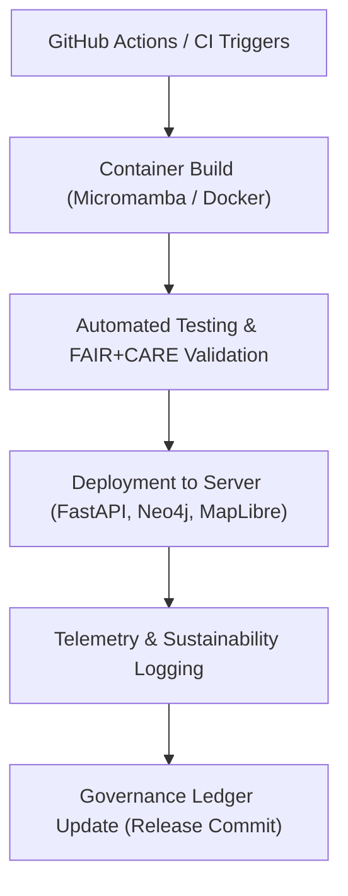

<div align="center">

# 🚀 **Kansas Frontier Matrix — Deployment & Infrastructure Automation Guides**
`docs/guides/deployment/README.md`

**Purpose:**  
Document and standardize **deployment procedures**, **CI/CD automation**, and **sustainability-focused infrastructure practices** for the Kansas Frontier Matrix (KFM).  
Defines version-controlled workflows for deploying APIs, web apps, and telemetry systems under **FAIR+CARE** governance.

[](../../README.md)
[](../../../LICENSE)
[](../../../docs/standards/README.md)
[](../../../releases/)
</div>

---

## 📘 Overview

The **Deployment Guides** define reproducible, containerized workflows for operating KFM across local, cloud, and on-prem environments.  
Every infrastructure component—from FastAPI and Neo4j services to MapLibre rendering and FAIR+CARE governance pipelines—is automated for consistency, auditability, and carbon-aware performance tracking.

---

## 🗂️ Directory Layout

```plaintext
docs/guides/deployment/
├── README.md                             # This overview
├── ci-cd-automation.md                   # Continuous integration and delivery pipelines
├── containerization-guide.md             # Docker, Micromamba, and Conda environments
├── infrastructure-setup.md               # Server provisioning, Neo4j, FastAPI configuration
├── monitoring-and-telemetry.md           # System observability and FAIR+CARE sustainability tracking
└── reports/                              # CI/CD and deployment validation outputs
```

---

## 🧩 Deployment Stack Architecture



---

## ⚙️ Core Components

| Component | Description | Technology |
|------------|--------------|-------------|
| **Web API** | FastAPI serving AI, metadata, and governance endpoints | FastAPI, Uvicorn |
| **Knowledge Graph** | Neo4j instance linking historical and environmental entities | Neo4j 5.x |
| **Web Frontend** | React + MapLibre interface for exploration | React 18, MapLibre GL JS |
| **Data Pipelines** | FAIR+CARE ETL and validation workflows | GDAL, GeoPandas, Micromamba |
| **Telemetry Stack** | Monitors energy, latency, and governance | Focus Telemetry JSON, Prometheus |
| **Governance Layer** | FAIR+CARE Council ledger synchronization | `docs/standards/governance/LEDGER/` |

---

## ⚙️ CI/CD Automation Summary

| Workflow | Purpose | Output |
|-----------|----------|--------|
| `build.yml` | Builds and validates container environments | `reports/deployment/build-report.json` |
| `test.yml` | Runs automated unit + integration tests | `reports/deployment/test-results.json` |
| `deploy.yml` | Pushes validated builds to target infrastructure | `reports/deployment/deploy-log.json` |
| `faircare-validate.yml` | Ensures ethical + environmental compliance | `reports/faircare/deployment-audit.json` |
| `ledger-sync.yml` | Updates governance ledger with release hashes | `docs/standards/governance/LEDGER/deployment-ledger.json` |

---

## 🧮 Deployment Environment Matrix

| Environment | Purpose | Tools | Telemetry Tracking |
|--------------|----------|-------|--------------------|
| **Development** | Local developer setup | Conda / Micromamba | Local telemetry logging |
| **Staging** | Test FAIR+CARE validation and release workflows | Docker Compose | Focus Telemetry API |
| **Production** | Public deployment under governance audit | Kubernetes / FastAPI | Prometheus + Grafana |

---

## 🧠 FAIR+CARE Integration in Deployment

| Principle | Implementation | Validation Artifact |
|------------|----------------|--------------------|
| **Findable** | Build and release tags embedded in SBOM | `sbom_ref` |
| **Accessible** | Open build logs and version manifests | `manifest_ref` |
| **Interoperable** | Cross-platform containers with OGC/FAIR metadata | Docker metadata labels |
| **Reusable** | Standardized environment definitions | `containerization-guide.md` |
| **Collective Benefit** | Carbon-aware scheduling for cloud deployments | FAIR+CARE audit |
| **Authority to Control** | Deployment changes require ledger-approved signoff | Governance CI |
| **Responsibility** | Logs compute energy and resource metrics | `telemetry_ref` |
| **Ethics** | Data access & automation reviewed for compliance | FAIR+CARE Council |

---

## ⚙️ Example FAIR+CARE Deployment Record

```json
{
  "deployment_id": "kfm-deploy-2025-11-09-001",
  "environment": "staging",
  "containers_built": 6,
  "test_pass_rate": 99.2,
  "energy_joules": 14.7,
  "carbon_gCO2e": 0.0068,
  "faircare_status": "Pass",
  "auditor": "FAIR+CARE Council",
  "timestamp": "2025-11-09T12:00:00Z"
}
```

---

## ⚖️ Governance Integration

Each deployment triggers:
1. FAIR+CARE validation (`faircare-validate.yml`)  
2. Telemetry report update (`telemetry-export.yml`)  
3. Governance ledger synchronization (`ledger-sync.yml`)  

All infrastructure deployments must include:
- Signed SBOM & manifest  
- Ethical AI & sustainability compliance report  
- Council validation before production release  

---

## 🕰️ Version History

| Version | Date | Author | Summary |
|----------|------|--------|----------|
| v10.0.0 | 2025-11-09 | Core Team | Consolidated deployment automation and governance pipeline under FAIR+CARE framework |
| v9.7.0 | 2025-11-03 | A. Barta | Introduced containerized CI/CD deployment workflows |

---

<div align="center">

© 2025 Kansas Frontier Matrix Project  
Master Coder Protocol v6.3 · FAIR+CARE Certified · Diamond⁹ Ω / Crown∞Ω Ultimate Certified  

[Back to Guides Index](../README.md) · [Governance Charter](../../../docs/standards/governance/ROOT-GOVERNANCE.md)

</div>

