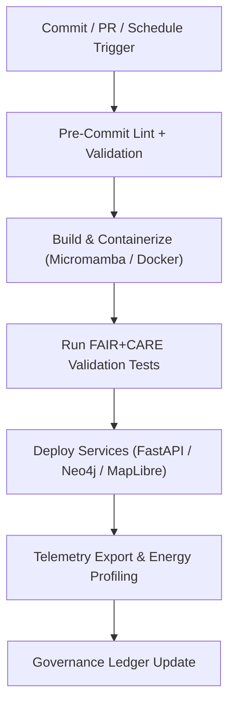
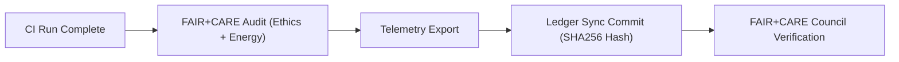

<div align="center">

# ⚙️ **Kansas Frontier Matrix — CI/CD Automation & Governance Pipeline Guide**
`docs/guides/deployment/ci-cd-automation.md`

**Purpose:**  
Define the **Continuous Integration and Continuous Deployment (CI/CD)** systems for the Kansas Frontier Matrix (KFM).  
Ensures that every automated process—build, validation, deployment, and telemetry logging—remains **FAIR+CARE-aligned**, **auditable**, and **sustainable** under **MCP-DL v6.3**.

[](../../README.md)
[](../../../LICENSE)
[](../../../docs/standards/README.md)
[](../../../releases/)
</div>

---

## 📘 Overview

KFM’s CI/CD automation is built on **GitHub Actions** and **containerized execution environments** (Micromamba + Docker).  
This guide explains how all automated pipelines—ranging from AI validation to web deployment—adhere to **FAIR+CARE principles** while maintaining energy-efficient operations.

---

## 🗂️ Directory Layout

```plaintext
docs/guides/deployment/
├── README.md                             # Deployment overview
├── ci-cd-automation.md                   # This document
├── containerization-guide.md             # Docker & Micromamba integration
├── infrastructure-setup.md               # Neo4j, FastAPI, MapLibre server configuration
├── monitoring-and-telemetry.md           # Observability & carbon-aware telemetry
└── reports/                              # CI/CD and deployment validation outputs
```

---

## 🧩 CI/CD Pipeline Architecture



---

## ⚙️ Pipeline Phases

| Phase | Function | Validation |
|--------|-----------|------------|
| **Pre-Commit** | Lint, format, and validate YAMLs & Markdown | `pre-commit.yml` |
| **Build** | Create reproducible Micromamba/Docker environments | `build.yml` |
| **Test** | Run integration and FAIR+CARE audits | `test.yml` |
| **Deploy** | Deploy services to staging/production environments | `deploy.yml` |
| **Monitor** | Export energy + telemetry metrics for review | `telemetry-export.yml` |
| **Govern** | Update governance ledger with audit hashes | `ledger-sync.yml` |

---

## 🧠 FAIR+CARE Integration Across CI/CD

| Principle | Implementation | Artifact |
|------------|----------------|----------|
| **Findable** | Build metadata logged in SBOM + manifest | `sbom_ref` |
| **Accessible** | CI logs published under open governance license | `reports/deployment/` |
| **Interoperable** | FAIR+CARE schema validation in workflows | `telemetry_schema` |
| **Reusable** | Shared workflow templates across pipelines | `.github/workflows/` |
| **Collective Benefit** | Green CI prioritization for off-peak compute | `energy-profile.json` |
| **Authority to Control** | Council approval required for production releases | `faircare-validate.yml` |
| **Responsibility** | Tracks CI energy & sustainability telemetry | `focus-telemetry.json` |
| **Ethics** | Validates data handling and release governance | `faircare-audit.json` |

---

## 🧮 Example CI/CD Run Log

```json
{
  "workflow": "build.yml",
  "run_id": "ci-2025-11-09-0003",
  "job_status": "Success",
  "steps": [
    "Lint and Validate YAML",
    "Micromamba Environment Build",
    "GDAL 3.12 CLI Check",
    "FAIR+CARE Validation",
    "Energy Profiling"
  ],
  "energy_joules": 8.7,
  "carbon_gCO2e": 0.0031,
  "faircare_status": "Pass",
  "timestamp": "2025-11-09T12:30:00Z"
}
```

---

## 🧾 Key Workflows & Artifacts

| Workflow | Description | Output |
|-----------|--------------|--------|
| `build.yml` | Builds Docker/Micromamba containers | `reports/deployment/build-report.json` |
| `test.yml` | Executes integration & validation tests | `reports/deployment/test-results.json` |
| `deploy.yml` | Pushes validated builds to server environments | `reports/deployment/deploy-log.json` |
| `faircare-validate.yml` | Runs ethical and sustainability validation | `reports/faircare/deployment-audit.json` |
| `telemetry-export.yml` | Logs runtime telemetry + carbon data | `releases/v*/focus-telemetry.json` |
| `ledger-sync.yml` | Writes ledger entries for each release | `docs/standards/governance/LEDGER/deployment-ledger.json` |

---

## ⚖️ Governance Integration Flow



---

## 🧩 Governance Ledger Example

```json
{
  "ledger_id": "ci-ledger-2025-11-09-0001",
  "workflow": "deploy.yml",
  "sha256": "e23d9b7f8a9c12d3...",
  "faircare_status": "Pass",
  "auditor": "FAIR+CARE Council",
  "energy_joules": 9.8,
  "timestamp": "2025-11-09T12:45:00Z"
}
```

---

## ⚙️ Sustainability & Energy Targets

| Metric | Threshold | Validation Source |
|---------|------------|-------------------|
| **Energy per CI Run** | ≤ 15 J | `telemetry-export.yml` |
| **Carbon Footprint (gCO₂e)** | ≤ 0.005 | `energy-profile.json` |
| **Test Pass Rate** | ≥ 98% | `test.yml` |
| **FAIR+CARE Compliance** | 100% Required | `faircare-validate.yml` |

---

## 🧾 SBOM & Manifest Verification

Each release automatically:
1. Generates an **SPDX-compliant SBOM**.  
2. Publishes a **manifest.zip** with reproducible build metadata.  
3. Includes CI job hashes for audit replayability.  

Artifacts are validated using `sbom-validate.yml` before Governance Ledger submission.

---

## 🕰️ Version History

| Version | Date | Author | Summary |
|----------|------|--------|----------|
| v10.0.0 | 2025-11-09 | Core Team | Unified CI/CD automation with FAIR+CARE energy tracking and governance synchronization |
| v9.7.0  | 2025-11-03 | A. Barta | Introduced build/test/deploy pipelines with container validation |

---

<div align="center">

© 2025 Kansas Frontier Matrix Project  
Master Coder Protocol v6.3 · FAIR+CARE Certified · Diamond⁹ Ω / Crown∞Ω Ultimate Certified  

[Back to Deployment Guides](./README.md) · [Governance Charter](../../../docs/standards/governance/ROOT-GOVERNANCE.md)

</div>

