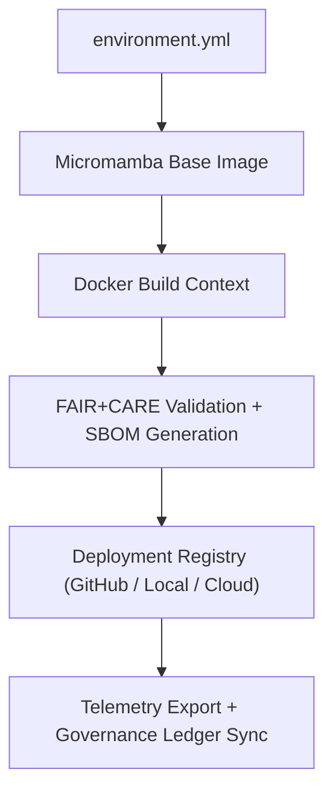

<div align="center">

# 🐳 **Kansas Frontier Matrix — Containerization & Environment Reproducibility Guide**
`docs/guides/deployment/containerization-guide.md`

**Purpose:**  
Define the **containerization standards and reproducible environment setup** for all Kansas Frontier Matrix (KFM) deployments.  
This guide ensures that development, CI/CD, and production environments are **consistent**, **FAIR+CARE-aligned**, and fully traceable through the **Governance Ledger**.

[](../../README.md)
[](../../../LICENSE)
[](../../../docs/standards/README.md)
[](../../../releases/)
</div>

---

## 📘 Overview

The **Containerization Guide** establishes a unified method for managing isolated, reproducible environments across KFM’s infrastructure.  
By leveraging **Docker**, **Micromamba**, and **Conda**, this framework guarantees deterministic builds, dependency transparency, and sustainability monitoring via telemetry.

Core goals:
- Fully reproducible builds across platforms  
- FAIR+CARE-compliant compute environments  
- Energy and carbon telemetry for all container runs  
- Integration with the Governance Ledger for deployment traceability  

---

## 🗂️ Directory Layout

```plaintext
docs/guides/deployment/
├── README.md                           # Deployment overview
├── containerization-guide.md           # This document
├── ci-cd-automation.md                 # CI/CD workflows & automation
├── infrastructure-setup.md             # Server provisioning & services
├── monitoring-and-telemetry.md         # Observability and carbon tracking
└── reports/                            # Container validation outputs
```

---

## 🧩 Container Architecture



---

## ⚙️ Standardized Environments

| Environment | Purpose | Container Type | Base Tool |
|--------------|----------|----------------|------------|
| **Development** | Local testing and experimentation | Conda / Micromamba | `environment.yml` |
| **CI/CD Build** | Continuous integration pipelines | Docker + Micromamba | `docker/geo.Dockerfile` |
| **Production** | Stable reproducible deployment | Docker Compose / Kubernetes | Versioned registry builds |

---

## 🧰 Example Micromamba + Docker Setup

### `environment.yml`
```yaml
name: kfm-core
channels:
  - conda-forge
dependencies:
  - python=3.11
  - gdal=3.12.*
  - geopandas
  - rasterio
  - fastapi
  - uvicorn
  - neo4j
  - pyarrow
  - shapely
```

### `docker/Dockerfile`
```dockerfile
FROM mambaorg/micromamba:1.5.7
ARG MAMBA_DOCKERFILE_ACTIVATE=1
COPY environment.yml /tmp/environment.yml
RUN micromamba install -y -n base -f /tmp/environment.yml && micromamba clean --all --yes
RUN python - <<'PY'\nimport sys; print('Micromamba Container Ready for KFM', sys.version)\nPY
WORKDIR /workspace
```

**Build Command:**
```bash
docker build -t kfm-core:3.12 -f docker/Dockerfile .
docker run --rm -it kfm-core:3.12 python -c "from osgeo import gdal; print(gdal.VersionInfo())"
```

---

## 🧾 FAIR+CARE Integration Matrix

| Principle | Implementation | Validation Artifact |
|------------|----------------|--------------------|
| **Findable** | Containers tagged with version + hash in SBOM | `sbom_ref` |
| **Accessible** | Images available in open registry or releases | `manifest_ref` |
| **Interoperable** | Conda/Mamba + Docker harmonized schema | `environment.yml` |
| **Reusable** | Environment lockfiles + reproducible builds | CI cache / registry |
| **Collective Benefit** | Sustainable compute resource management | FAIR+CARE audit |
| **Authority to Control** | FAIR+CARE Council approval for registry release | Governance Ledger |
| **Responsibility** | Records carbon and energy telemetry | `telemetry_ref` |
| **Ethics** | Validates data isolation and compliance | FAIR+CARE certification report |

---

## 🧮 Example Telemetry Record

```json
{
  "container_id": "kfm-core-3.12",
  "runtime_seconds": 245,
  "cpu_percent": 67.8,
  "memory_mb": 682,
  "energy_joules": 12.7,
  "carbon_gCO2e": 0.0058,
  "faircare_status": "Pass",
  "timestamp": "2025-11-09T12:00:00Z"
}
```

Telemetry logs are automatically collected during build and deployment via CI/CD.

---

## ⚙️ Validation & CI/CD Integration

| Workflow | Function | Output |
|-----------|-----------|--------|
| `build.yml` | Builds Docker images and validates dependencies | `reports/deployment/build-report.json` |
| `test.yml` | Runs integration and FAIR+CARE compliance tests | `reports/deployment/test-results.json` |
| `telemetry-export.yml` | Records performance and sustainability metrics | `releases/v*/focus-telemetry.json` |
| `ledger-sync.yml` | Syncs image hashes and telemetry with governance ledger | `docs/standards/governance/LEDGER/deployment-ledger.json` |

---

## 🧩 Governance Ledger Record

```json
{
  "ledger_id": "container-ledger-2025-11-09-0002",
  "container_tag": "kfm-core:3.12",
  "sha256": "8f9b13d8c4a7e92a...",
  "energy_joules": 12.7,
  "carbon_gCO2e": 0.0058,
  "faircare_status": "Pass",
  "auditor": "FAIR+CARE Council",
  "timestamp": "2025-11-09T12:00:00Z"
}
```

---

## ⚖️ Sustainability & Audit Criteria

| Metric | Target | Standard |
|---------|---------|-----------|
| **Build Reproducibility** | 100% deterministic | MCP-DL v6.3 |
| **Energy Use (J)** | ≤ 15 J per container build | ISO 50001 |
| **Carbon Emissions (gCO₂e)** | ≤ 0.006 | ISO 14064 |
| **FAIR+CARE Validation** | Required for production image | FAIR+CARE Council |
| **SBOM Hash Verification** | Mandatory for all releases | SPDX |

---

## 🕰️ Version History

| Version | Date | Author | Summary |
|----------|------|--------|----------|
| v10.0.0 | 2025-11-09 | Core Team | Added unified containerization framework with Micromamba, Docker, and FAIR+CARE telemetry |
| v9.7.0  | 2025-11-03 | A. Barta | Introduced initial reproducible environment guide for KFM services |

---

<div align="center">

© 2025 Kansas Frontier Matrix Project  
Master Coder Protocol v6.3 · FAIR+CARE Certified · Diamond⁹ Ω / Crown∞Ω Ultimate Certified  

[Back to Deployment Guides](./README.md) · [Governance Charter](../../../docs/standards/governance/ROOT-GOVERNANCE.md)

</div>

