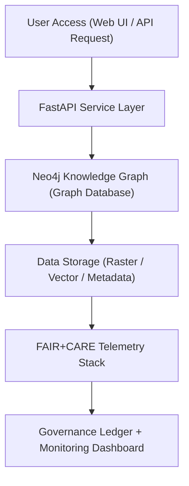

<div align="center">

# 🏗️ **Kansas Frontier Matrix — Infrastructure Setup & Environment Configuration Guide**
`docs/guides/deployment/infrastructure-setup.md`

**Purpose:**  
Provide detailed setup and configuration procedures for deploying and maintaining the **Kansas Frontier Matrix (KFM)** infrastructure.  
This includes **FastAPI services**, **Neo4j knowledge graph**, **MapLibre visualization stack**, and **FAIR+CARE telemetry systems**, ensuring reproducibility and ethical governance compliance.

[](../../README.md)
[](../../../LICENSE)
[](../../../docs/standards/README.md)
[](../../../releases/)
</div>

---

## 📘 Overview

This guide documents the complete infrastructure setup for KFM’s modular ecosystem, including:
- API and web service deployment  
- Neo4j database provisioning  
- MapLibre tile and asset configuration  
- FAIR+CARE governance telemetry integration  

The infrastructure supports reproducible, FAIR+CARE-certified deployments using **Docker**, **Micromamba**, and **Conda environments**, maintaining auditability and energy traceability.

---

## 🗂️ Directory Layout

```plaintext
docs/guides/deployment/
├── README.md                           # Deployment overview
├── infrastructure-setup.md             # This document
├── ci-cd-automation.md                 # Automated CI/CD pipelines
├── containerization-guide.md           # Reproducible container environments
├── monitoring-and-telemetry.md         # System observability & telemetry
└── reports/                            # Infrastructure validation logs
```

---

## 🧩 Infrastructure Architecture



---

## ⚙️ Core Services & Components

| Service | Function | Technology | Deployment Path |
|----------|-----------|-------------|----------------|
| **FastAPI** | Primary API for AI, data, and governance endpoints | FastAPI + Uvicorn | `src/api/` |
| **Neo4j** | Graph database linking entities, events, and places | Neo4j 5.x | `src/graph/` |
| **MapLibre Server** | WebGL visualization for maps and time layers | MapLibre GL JS, PMTiles | `web/` |
| **ETL Pipelines** | Ingest, transform, and validate FAIR+CARE datasets | Python + GDAL | `src/pipelines/etl/` |
| **Telemetry Services** | Tracks sustainability & governance data | JSON Telemetry / Prometheus | `releases/v*/focus-telemetry.json` |
| **Governance Ledger** | Immutable provenance log & FAIR+CARE audit records | JSON-LD + SBOM links | `docs/standards/governance/LEDGER/` |

---

## ⚙️ Environment Configuration

### 🧱 Prerequisites
- Docker ≥ 25.x  
- Python ≥ 3.11  
- Micromamba / Conda  
- GitHub Actions (CI/CD enabled)

### 🧰 Environment Variables

| Variable | Description | Example |
|-----------|-------------|----------|
| `NEO4J_URI` | Connection string for Neo4j | `bolt://neo4j:7687` |
| `NEO4J_USER` | Neo4j admin username | `neo4j` |
| `NEO4J_PASSWORD` | Neo4j password | `securepassword` |
| `FASTAPI_ENV` | API environment mode | `production` |
| `TELEMETRY_PATH` | FAIR+CARE telemetry output path | `releases/v10.0.0/focus-telemetry.json` |
| `MAPLIBRE_TILES_PATH` | Directory for PMTiles data | `data/processed/maps/` |

---

## 🧰 Docker Compose Example

```yaml
version: "3.9"
services:
  api:
    image: kfm/api:latest
    build:
      context: .
      dockerfile: docker/api.Dockerfile
    environment:
      - FASTAPI_ENV=production
      - NEO4J_URI=bolt://neo4j:7687
      - TELEMETRY_PATH=/workspace/releases/v10.0.0/focus-telemetry.json
    ports:
      - "8000:8000"
    depends_on:
      - neo4j
  neo4j:
    image: neo4j:5.14
    environment:
      - NEO4J_AUTH=neo4j/test123
    ports:
      - "7474:7474"
      - "7687:7687"
  maplibre:
    image: kfm/maplibre:latest
    build:
      context: .
      dockerfile: docker/maplibre.Dockerfile
    ports:
      - "8080:8080"
    volumes:
      - ./data/processed/maps:/tiles
```

---

## 🧾 FAIR+CARE Integration

| Principle | Implementation | Validation Artifact |
|------------|----------------|--------------------|
| **Findable** | Container configs and telemetry stored in SBOM | `sbom_ref` |
| **Accessible** | Public web + API endpoints with licenses | `manifest_ref` |
| **Interoperable** | OGC-compliant map data (COG/PMTiles) | `maplibre-ui-design.md` |
| **Reusable** | Docker/Conda environments with lockfiles | `containerization-guide.md` |
| **Collective Benefit** | Open, sustainable, multi-user access | FAIR+CARE Council Audit |
| **Authority to Control** | Council approval for server updates | Governance Ledger |
| **Responsibility** | Monitors energy, uptime, and telemetry | `focus-telemetry.json` |
| **Ethics** | Protects sensitive site data under CARE | `data-generalization/README.md` |

---

## ⚙️ Validation & Monitoring Workflows

| Workflow | Function | Output |
|-----------|-----------|--------|
| `build.yml` | Builds and validates API + server images | `reports/deployment/build-report.json` |
| `test.yml` | Runs integration and health checks | `reports/deployment/test-results.json` |
| `deploy.yml` | Deploys infrastructure stack to server | `reports/deployment/deploy-log.json` |
| `telemetry-export.yml` | Records uptime + sustainability metrics | `releases/v*/focus-telemetry.json` |
| `ledger-sync.yml` | Syncs telemetry and deployment hashes | `docs/standards/governance/LEDGER/deployment-ledger.json` |

---

## 🧩 Example Governance Ledger Record

```json
{
  "ledger_id": "infra-ledger-2025-11-09-0001",
  "environment": "production",
  "neo4j_version": "5.14",
  "api_version": "v10.0.0",
  "maplibre_build": "v10.0.0",
  "energy_joules": 16.2,
  "carbon_gCO2e": 0.0072,
  "faircare_status": "Pass",
  "auditor": "FAIR+CARE Council",
  "timestamp": "2025-11-09T12:30:00Z"
}
```

---

## ⚖️ Governance & Sustainability Targets

| Metric | Target | Standard |
|---------|--------|-----------|
| **Uptime** | ≥ 99.5% | ISO 27001 |
| **Energy per Session (J)** | ≤ 1.5 | ISO 50001 |
| **Carbon Intensity (gCO₂e)** | ≤ 0.007 | ISO 14064 |
| **FAIR+CARE Validation** | Pass Required | MCP-DL v6.3 |
| **Telemetry Coverage** | ≥ 95% of infrastructure components | Governance Audit |

---

## 🕰️ Version History

| Version | Date | Author | Summary |
|----------|------|--------|----------|
| v10.0.0 | 2025-11-09 | Core Team | Added complete infrastructure setup with FAIR+CARE telemetry and governance integration |
| v9.7.0 | 2025-11-03 | A. Barta | Established Neo4j, FastAPI, and MapLibre configuration base |

---

<div align="center">

© 2025 Kansas Frontier Matrix Project  
Master Coder Protocol v6.3 · FAIR+CARE Certified · Diamond⁹ Ω / Crown∞Ω Ultimate Certified  

[Back to Deployment Guides](./README.md) · [Governance Charter](../../../docs/standards/governance/ROOT-GOVERNANCE.md)

</div>

