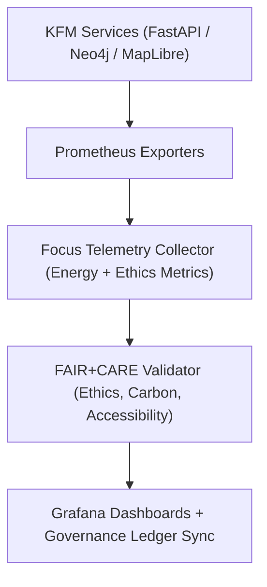

<div align="center">

# 📊 **Kansas Frontier Matrix — Monitoring & FAIR+CARE Telemetry Integration Guide**
`docs/guides/deployment/monitoring-and-telemetry.md`

**Purpose:**  
Define the monitoring architecture and telemetry collection strategy for the **Kansas Frontier Matrix (KFM)** infrastructure.  
Ensures system observability, energy transparency, and ethical compute tracking aligned with **FAIR+CARE principles** and **MCP-DL v6.3** standards.

[](../../README.md)
[](../../../LICENSE)
[](../../../docs/standards/README.md)
[](../../../releases/)
</div>

---

## 📘 Overview

The **Monitoring & Telemetry Guide** describes the integrated observability layer used across all KFM systems—tracking energy, performance, accessibility, and governance compliance.  
Telemetry ensures that each operation—data ETL, AI inference, or visualization—meets **FAIR+CARE sustainability metrics** and is logged in the Governance Ledger.

**Core Goals**
- Enable full system observability via Prometheus, Grafana, and Focus Telemetry  
- Record per-task energy (Joules) and carbon (gCO₂e) footprints  
- Integrate telemetry logs into FAIR+CARE audits and CI/CD pipelines  
- Guarantee transparent environmental reporting for all automated processes  

---

## 🗂️ Directory Layout

```plaintext
docs/guides/deployment/
├── README.md                             # Deployment overview
├── monitoring-and-telemetry.md           # This document
├── ci-cd-automation.md                   # CI/CD workflows
├── containerization-guide.md             # Docker & Micromamba builds
├── infrastructure-setup.md               # Neo4j, FastAPI, and MapLibre stack
└── reports/                              # Deployment + telemetry validation logs
```

---

## 🧩 Monitoring Architecture



---

## ⚙️ Core Monitoring Components

| Component | Function | Technology |
|------------|-----------|-------------|
| **Prometheus** | Collects real-time metrics (CPU, memory, latency) | Prometheus 2.x |
| **Grafana** | Visualizes metrics, telemetry dashboards, and FAIR+CARE reports | Grafana 10.x |
| **Focus Telemetry** | FAIR+CARE-compliant logging system for sustainability & ethics | JSON-based telemetry schema |
| **AlertManager** | Automated alerting for performance or ethics thresholds | Prometheus AlertManager |
| **Ledger Sync Service** | Commits telemetry hashes to FAIR+CARE Governance Ledger | Python + JSON-LD |

---

## 🧠 FAIR+CARE Telemetry Model

```json
{
  "telemetry_id": "monitoring-2025-11-09-0001",
  "component": "Neo4j Graph Service",
  "metrics": {
    "cpu_percent": 71.4,
    "memory_mb": 682,
    "disk_read_mb": 14.2,
    "energy_joules": 8.6,
    "carbon_gCO2e": 0.0043
  },
  "availability_uptime": "99.8%",
  "faircare_status": "Pass",
  "auditor": "FAIR+CARE Council",
  "timestamp": "2025-11-09T12:00:00Z"
}
```

---

## ⚖️ FAIR+CARE Telemetry Integration

| Principle | Implementation | Validation Artifact |
|------------|----------------|--------------------|
| **Findable** | Metrics and dashboards are linked to unique telemetry IDs | `focus-telemetry.json` |
| **Accessible** | Public FAIR+CARE dashboards and audit exports | Grafana / FAIR+CARE report |
| **Interoperable** | Telemetry schema aligned with ISO 50001 / 14064 | `telemetry_schema` |
| **Reusable** | Telemetry datasets stored with provenance metadata | `manifest_ref` |
| **Collective Benefit** | Provides transparent insight into sustainability | FAIR+CARE audit |
| **Authority to Control** | Council oversight for telemetry publication | Governance Ledger |
| **Responsibility** | Tracks compute, storage, and environmental impact | `telemetry_ref` |
| **Ethics** | Prevents opaque data or unethical compute usage | FAIR+CARE review |

---

## ⚙️ Prometheus Metrics Endpoints

| Service | Endpoint | Metrics |
|----------|-----------|----------|
| **FastAPI** | `/metrics` | Uptime, request latency, error rate |
| **Neo4j** | `/metrics` | Query execution time, connection pool usage |
| **MapLibre Server** | `/metrics` | Frame rendering FPS, tile load time |
| **AI Inference API** | `/metrics` | Inference latency, energy per prediction |
| **ETL Pipeline Jobs** | `/metrics` | Dataset throughput, schema validation count |

---

## 🧮 Key Sustainability Metrics

| Metric | Description | Target |
|---------|--------------|--------|
| **Energy Consumption (J)** | Power used during workflow execution | ≤ 15 J / task |
| **Carbon Intensity (gCO₂e)** | Emissions equivalent per task | ≤ 0.006 |
| **System Uptime (%)** | Availability of monitored services | ≥ 99.5% |
| **Telemetry Completeness (%)** | Portion of tasks with telemetry logs | ≥ 95% |
| **FAIR+CARE Audit Status** | Compliance pass rate | 100% |

---

## 🧾 Governance Ledger Entry Example

```json
{
  "ledger_id": "telemetry-ledger-2025-11-09-001",
  "monitored_services": ["FastAPI", "Neo4j", "MapLibre"],
  "uptime_percent": 99.7,
  "energy_joules": 14.8,
  "carbon_gCO2e": 0.0061,
  "faircare_status": "Pass",
  "auditor": "FAIR+CARE Council",
  "timestamp": "2025-11-09T12:30:00Z"
}
```

---

## 🧩 CI/CD Integration Workflows

| Workflow | Function | Output Artifact |
|-----------|-----------|----------------|
| `telemetry-export.yml` | Aggregates runtime telemetry during CI/CD | `releases/v*/focus-telemetry.json` |
| `faircare-validate.yml` | Performs ethical + energy audit validation | `reports/faircare/deployment-audit.json` |
| `ledger-sync.yml` | Syncs validated telemetry with Governance Ledger | `docs/standards/governance/LEDGER/telemetry-ledger.json` |
| `monitoring-healthcheck.yml` | Verifies uptime and service availability | `reports/deployment/healthcheck.json` |

---

## ⚙️ Example Grafana Dashboard Panels

| Panel | Description | Metric Source |
|--------|--------------|----------------|
| **System Load & CPU Utilization** | Real-time CPU and memory monitoring | Prometheus `/metrics` |
| **Energy & Carbon Emissions** | FAIR+CARE sustainability audit overlay | Focus Telemetry |
| **Governance Audit Trail** | Ledger-based verification of FAIR+CARE compliance | JSON-LD Governance Logs |
| **MapLibre Render FPS** | Frontend rendering performance | Telemetry Collector |
| **AI Inference Telemetry** | Inference latency and carbon metrics | Focus Mode AI API |

---

## 🧠 FAIR+CARE Audit Summary (Example)

```json
{
  "audit_id": "faircare-telemetry-2025-11-09-0004",
  "component": "AI Inference + Geo ETL Stack",
  "energy_joules": 15.1,
  "carbon_gCO2e": 0.0059,
  "telemetry_coverage_percent": 97.6,
  "faircare_status": "Pass",
  "recommendations": [
    "Maintain current sustainability thresholds.",
    "Increase sampling frequency for GPU energy metrics."
  ],
  "timestamp": "2025-11-09T12:45:00Z"
}
```

---

## ⚖️ Sustainability Governance Targets

| Objective | Target | Responsible System |
|------------|---------|--------------------|
| Reduce energy footprint | ≤ 0.005 gCO₂e per transaction | FAIR+CARE Telemetry |
| Increase transparency | 100% metrics public under CC-BY | Governance Ledger |
| Maintain ethical compute | Verified FAIR+CARE compliance | FAIR+CARE Council |
| Guarantee uptime | ≥ 99.5% service availability | Infrastructure Ops |

---

## 🕰️ Version History

| Version | Date | Author | Summary |
|----------|------|--------|----------|
| v10.0.0 | 2025-11-09 | Core Team | Added unified monitoring & FAIR+CARE telemetry architecture with governance integration |
| v9.7.0  | 2025-11-03 | A. Barta | Introduced Prometheus + Focus Telemetry integration framework |

---

<div align="center">

© 2025 Kansas Frontier Matrix Project  
Master Coder Protocol v6.3 · FAIR+CARE Certified · Diamond⁹ Ω / Crown∞Ω Ultimate Certified  

[Back to Deployment Guides](./README.md) · [Governance Charter](../../../docs/standards/governance/ROOT-GOVERNANCE.md)

</div>

