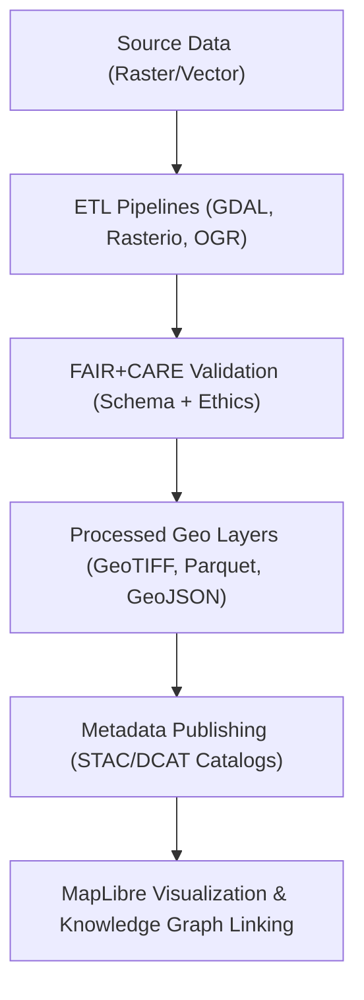
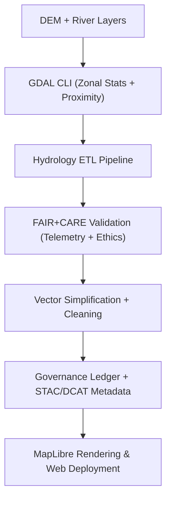
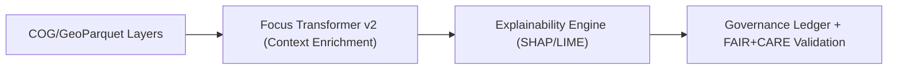

<div align="center">

# 🌎 **Kansas Frontier Matrix — Geospatial Guides & Tooling Overview**
`docs/guides/geo/README.md`

**Purpose:**  
Central reference for all **geospatial pipelines**, **GDAL/OGR upgrades**, **MapLibre rendering optimizations**, and **FAIR+CARE-aligned validation** processes within the Kansas Frontier Matrix (KFM).  
Defines reproducible workflows for raster/vector data, metadata interoperability, and spatial governance under **MCP-DL v6.3**.

[](../../README.md)
[](../../../LICENSE)
[](../../../docs/standards/README.md)
[](../../../releases/)
</div>

---

## 📘 Overview

The **Geospatial Guides** directory provides unified documentation for spatial workflows across the Kansas Frontier Matrix (KFM):  
- Raster and vector ETL operations  
- Map rendering and performance optimization  
- Metadata harmonization (STAC/DCAT)  
- FAIR+CARE validation and governance hooks  

All workflows are validated through **FAIR+CARE pipelines**, ensuring ethical, interoperable, and scientifically reproducible outputs.

---

## 🗂️ Directory Layout

```plaintext
docs/guides/geo/
├── README.md                        # This overview
├── gdal-3.12-upgrade.md             # GDAL 3.12 integration & CI upgrade playbook
├── maplibre-rendering-playbook.md   # Rendering optimization for MBTiles/PMTiles
├── hydrology-workflows.md           # Hydrology, terrain, and proximity analyses
├── vector-etl-pipelines.md          # Vector processing, simplification, and FAIR+CARE validation
├── stac-dcat-geo-bridge.md          # STAC ↔ DCAT metadata harmonization
├── validation-reports/              # FAIR+CARE audit reports for geo data
└── profiles/                        # MapLibre performance & telemetry profiles
```

---

## 🧩 Major Components

| Area | Purpose | Key Document |
|------|----------|--------------|
| **GDAL Upgrades** | CI/CD integration & performance benchmarking for GDAL 3.12 | `gdal-3.12-upgrade.md` |
| **Rendering Optimization** | MapLibre + PMTiles rendering, caching, and profiling | `maplibre-rendering-playbook.md` |
| **Hydrology & Terrain Analysis** | DEM preprocessing, flow accumulation, and proximity | `hydrology-workflows.md` |
| **Vector ETL Pipelines** | Simplify, clean, and validate spatial features | `vector-etl-pipelines.md` |
| **Metadata Bridge** | STAC/DCAT crosswalk for interoperable metadata | `stac-dcat-geo-bridge.md` |

---

## ⚙️ End-to-End Integration Flow



---

## 🧾 FAIR+CARE Integration Matrix

| Principle | Application in Geospatial Context | Validation Artifact |
|------------|-----------------------------------|----------------------|
| **Findable** | Indexed via STAC/DCAT 3.0 | `data/stac/`, `data/dcat/` |
| **Accessible** | Open geospatial formats (COG, PMTiles, GeoParquet) | CI validation artifacts |
| **Interoperable** | OGC CRS, GeoJSON, and Parquet schema conformance | `data-contract-v3.json` |
| **Reusable** | Metadata and lineage tracking with SBOM hash linkage | `releases/v*/manifest.zip` |
| **Collective Benefit** | Shared elevation and hazard models | FAIR+CARE audit reports |
| **Authority to Control** | CARE-based masking for sensitive site data | `data-generalization/README.md` |
| **Responsibility** | Telemetry logs & energy usage tracking | `focus-telemetry.json` |
| **Ethics** | FAIR+CARE Council review prior to publication | Governance Ledger |

---

## 🧰 Toolchain Summary

| Category | Tools / Frameworks | Notes |
|-----------|--------------------|-------|
| **Raster Processing** | GDAL 3.12, Rasterio, rio-cogeo | Unified CLI and COG optimization |
| **Vector Processing** | OGR, GeoPandas, Shapely, Fiona | Simplify + topology repair pipelines |
| **Catalog Management** | STAC 1.0, DCAT 3.0, Neo4j | Metadata and provenance graph linking |
| **Rendering & Visualization** | MapLibre GL, PMTiles, Tippecanoe | Offline vector rendering and analysis |
| **Automation** | GitHub Actions, Micromamba, Conda | Deterministic CI/CD pipelines |
| **Governance & Ethics** | FAIR+CARE Council Ledger | Validates ethical compliance |

---

## 🧮 Sample Workflow Stack



---

## ⚖️ Governance Hooks & Reporting

Each geospatial workflow produces:
- **Telemetry records** → `releases/v*/focus-telemetry.json`  
- **Provenance hashes** → `reports/geo/gdal-3.12/provenance.json`  
- **Ledger entries** → `docs/standards/governance/LEDGER/geo-ledger.json`  
- **Ethical sign-offs** → FAIR+CARE Council audit log  

### Required Validation Gates
1. Update SBOM + STAC/DCAT catalogs.  
2. Pass `geo-upgrade-validate.yml` (CI validation).  
3. Append verified checksums to governance ledger.  

---

## 🧠 Integration with Focus Mode & Knowledge Graph

Geospatial layers power KFM’s **Focus Mode AI** via contextual embeddings:
- **Terrain & hydrology features** enhance environmental inference.  
- **Vector entities** link to Neo4j graph nodes (CIDOC CRM).  
- **MapLibre visualizations** drive temporal + spatial explainability.  



---

## 🕰️ Version History

| Version | Date | Author | Summary |
|----------|------|--------|----------|
| v10.0.0 | 2025-11-09 | Core Team | Aligned Geospatial Guides to v10 with FAIR+CARE-led validation and metadata bridge |
| v9.7.0 | 2025-11-03 | A. Barta | Added GDAL 3.12 upgrade and MapLibre performance optimization playbooks |

---

<div align="center">

© 2025 Kansas Frontier Matrix Project  
Master Coder Protocol v6.3 · FAIR+CARE Certified · Diamond⁹ Ω / Crown∞Ω Ultimate Certified  

[Back to Guides Index](../README.md) · [Governance Charter](../../../docs/standards/governance/ROOT-GOVERNANCE.md)

</div>
