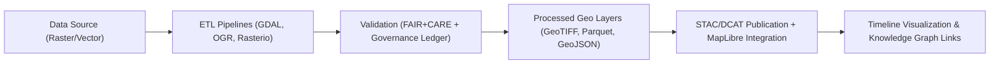
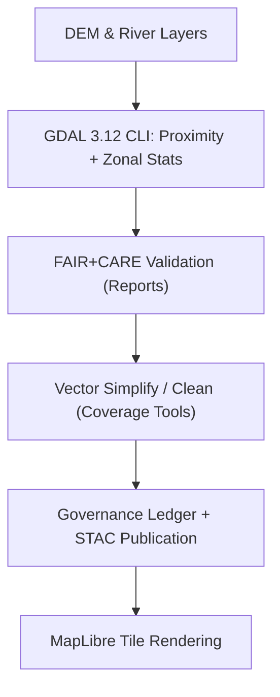

<div align="center">

# 🌎 **Kansas Frontier Matrix — Geospatial Guides & Tooling Overview**
`docs/guides/geo/README.md`

**Purpose:**  
Central reference for **geospatial data workflows**, **toolchain configuration**, and **GDAL / Raster / Vector operations** across the Kansas Frontier Matrix (KFM).  
Documents upgrade playbooks, STAC/DCAT integration, validation, and FAIR+CARE geospatial ethics under MCP-DL v6.3.

[](../../README.md)
[](../../../LICENSE)
[](../../../docs/standards/README.md)
[](../../../releases/)
</div>

---

## 📘 Overview

The **Geo Guides** directory consolidates documentation for spatial data ingestion, processing, and validation pipelines within the **Kansas Frontier Matrix (KFM)** ecosystem.  
These guides cover the **GDAL/OGR ecosystem**, **MapLibre rendering optimization**, **hydrology & terrain workflows**, and **FAIR+CARE spatial governance**.

All procedures follow the **Master Coder Protocol (MCP-DL v6.3)** for reproducibility, provenance, and ethical handling of spatial data.

---

## 🗂️ Directory Layout

```plaintext
docs/guides/geo/
├── README.md                        # This overview
├── gdal-3.12-upgrade.md             # GDAL upgrade & CI playbook
├── maplibre-rendering-playbook.md   # Rendering optimization for MBTiles/PMTiles
├── hydrology-workflows.md           # Flow accumulation & proximity analysis (planned)
├── vector-etl-pipelines.md          # Vector simplification, joins, and validation
├── stac-dcat-geo-bridge.md          # STAC ↔ DCAT 3.0 metadata harmonization (planned)
└── validation-reports/              # Auto-generated QA reports
```

---

## 🧩 Major Components

| Area | Purpose | Example File |
|------|----------|--------------|
| **GDAL Upgrades** | Tracks environment migration and CI integration | `gdal-3.12-upgrade.md` |
| **Rendering & Map Performance** | Offline visualization and tile optimization | `maplibre-rendering-playbook.md` |
| **Hydrology & Terrain** | Flow, proximity, and elevation analysis | `hydrology-workflows.md` |
| **Vector ETL Pipelines** | Simplification, joins, and FAIR+CARE geometry validation | `vector-etl-pipelines.md` |
| **Metadata Standards** | STAC/DCAT alignment, CRS metadata | `stac-dcat-geo-bridge.md` |

---

## ⚙️ Integration Overview



---

## 🧾 FAIR+CARE Integration in Geospatial Context

| Principle | Application | Validation Artifact |
|------------|--------------|--------------------|
| **Findable** | All rasters/vectors indexed via STAC/DCAT 3.0 | `data/stac/` |
| **Accessible** | Cloud-optimized formats (COG, PMTiles) | `data/processed/**` |
| **Interoperable** | GeoJSON, Parquet, and CRS WKT2 compliance | CI schema checks |
| **Reusable** | Provenance and SBOM tagging | `releases/v*/manifest.zip` |
| **Collective Benefit** | Shared elevation/hazard models for research | FAIR+CARE report |
| **Authority to Control** | Community masking for sacred/cultural sites | `data-generalization/README.md` |
| **Responsibility** | Telemetry-tracked CI/CD | `geo-upgrade-validate.yml` |
| **Ethics** | Data access reviewed by FAIR+CARE Council | Governance Ledger |

---

## 🧰 Toolchain Summary

| Category | Tools / Libraries | Notes |
|-----------|------------------|-------|
| **Raster Processing** | GDAL 3.12, Rasterio, rio-cogeo | Unified CLI, optimized COG output |
| **Vector Processing** | GDAL/OGR, GeoPandas, Fiona, Shapely | Simplify, merge, clean |
| **Database / Catalog** | Neo4j (spatial), STAC, DCAT 3.0 | Provenance + graph linking |
| **Visualization** | MapLibre GL JS, PMTiles | Offline rendering optimization |
| **Automation / CI** | GitHub Actions, Micromamba, Conda | Deterministic environments |
| **Ethics & Validation** | FAIR+CARE, Governance Ledger | Provenance + community oversight |

---

## 🧮 Example Pipeline Stack (Raster + Vector)



---

## ⚖️ Governance Hooks

All spatial workflows emit:
- **Telemetry logs** → `releases/v*/focus-telemetry.json`  
- **Provenance hashes** → `reports/geo/gdal-3.12/provenance.json`  
- **Ledger entries** → `docs/standards/governance/LEDGER/geo-ledger.json`  
- **Ethics sign-offs** → FAIR+CARE Council audit report  

Every commit changing geospatial data or tools **must**:
1. Update STAC catalog & SBOM.  
2. Pass FAIR+CARE validation CI.  
3. Record ledger checksum & governance metadata.  

---

## 🕰️ Version History

| Version | Date | Author | Summary |
|----------|------|---------|----------|
| v10.0.0 | 2025-11-09 | Core Team | Aligned Geo Guides with v10; added FAIR+CARE & governance hooks |
| v9.7.0 | 2025-11-09 | A. Barta | Initial GDAL + MapLibre performance playbooks |

---

<div align="center">

© 2025 Kansas Frontier Matrix Project  
Master Coder Protocol v6.3 · FAIR+CARE Certified · Diamond⁹ Ω / Crown∞Ω Ultimate Certified  

[Back to Guides Index](../README.md) · [Governance Charter](../../../docs/standards/governance/ROOT-GOVERNANCE.md)

</div>

