```mermaid
flowchart LR
A["Commit with geo changes"] --> B["CI Build with Conda or Docker"]
B --> C["GDAL 3.12 CLI Umbrella Self Test"]
C --> D["Raster Proximity and Zonal Stats"]
D --> E["Vector Coverage Clean and Simplify"]
E --> F["Parquet Update or Append"]
F --> G["Provenance and Telemetry Write"]
G --> H["Governance Ledger and STAC Validation"]
H --> I["Deploy Artifacts for Web and Graph"]
```

<div align="center">

# 🧩 **Kansas Frontier Matrix — GDAL 3.12 Upgrade Playbook**
`docs/guides/geo/gdal-3.12-upgrade.md`

**Purpose:** A practical, reproducible path to adopt **GDAL 3.12** in KFM’s ETL, AI, and map pipelines.  
Focuses on **Docker, Conda, Python bindings**, **new CLI umbrella commands**, and **validation** with FAIR and CARE guardrails.

[](../..)
[](../../../LICENSE)
[](../../standards/README.md)
[](../../README.md)

</div>

---

## 📘 Overview

This playbook upgrades KFM geospatial workflows to **GDAL 3.12** and leverages:
- **Unified CLI** `gdal` umbrella commands for raster and vector ops.
- **Raster band algebra** and **VRT pixel functions** for fast, scriptable analysis.
- **Vector Parquet update support** for incremental tabular geo upserts.
- Repeatable **Conda**, **Docker**, and **GitHub Actions** integration with **provenance**, **telemetry**, and **governance**.

> Outcome: faster hillshade and hydrology tiles, simpler ETL scripts, and cleaner artifacts mapped to our governance ledger.

---

## 🗂️ Directory Layout

```text
docs/
  guides/
    geo/
      gdal-3.12-upgrade.md       # This playbook
src/
  pipelines/
    etl/                         # Raster and vector ETL steps
    validation/                  # Schema and spatial checks
    governance/                  # Provenance and FAIR+CARE workflows
web/
  src/                           # MapLibre layers and data loaders
data/
  processed/
    terrain/                     # Hillshade, slope, aspect rasters
    hydrology/                   # Flow accumulation, proximity maps
.github/
  workflows/
    geo-upgrade-validate.yml     # CI checks specific to GDAL 3.12 upgrade
```

---

## 🧩 What We Will Use From GDAL 3.12

| Area | Capability | KFM Use Case |
|---|---|---|
| Unified CLI | `gdal raster zonal-stats`, `gdal raster proximity`, `gdal vector simplify-coverage` | Regional stats for counties, rivers, plats; feature cleaning before import |
| Raster Algebra | Inline band math on rasters | Derive slope risk, drought indices, moisture proxies for historic homestead inference |
| VRT Pixel Functions | Built in mean, median, harmonic_mean with NoData | Fast blended layers for multi-era imagery and DEM composites |
| Parquet Vector Update | Append or edit features in Parquet-backed layers | Incremental updates to entity layers from new OCR or NER passes |
| Pipeline Runner | `gdal pipeline` for mixed raster and vector chains | Single-run hydrology tiles → proximity → zonal stats → vector join |

---

## 🧾 Environment Options

### Option A — Conda (Recommended for Dev)
```bash
# environment.yml excerpt
name: kfm-geo
channels:
  - conda-forge
dependencies:
  - python=3.11
  - gdal=3.12.*
  - geopandas
  - pyproj
  - rasterio
  - rio-cogeo
  - numpy
  - pandas
  - pyarrow
  - shapely
  - fiona
```

**Create/Update:**
```bash
conda env update -f environment.yml --prune
python -c "from osgeo import gdal, ogr; print(gdal.VersionInfo())"
```

### Option B — Docker (CI and Repro)
```dockerfile
# docker/geo.Dockerfile
FROM mambaorg/micromamba:1.5.7
ARG MAMBA_DOCKERFILE_ACTIVATE=1
COPY --chown=$MAMBA_USER:$MAMBA_USER environment.yml /tmp/environment.yml
RUN micromamba install -y -n base -f /tmp/environment.yml && micromamba clean --all --yes
# health check for GDAL
RUN python - <<'PY'
from osgeo import gdal
print("GDAL_VERSION=", gdal.VersionInfo())
PY
WORKDIR /workspace
```

**Build/Run:**
```bash
docker build -t kfm-geo:3.12 -f docker/geo.Dockerfile .
docker run --rm -it -v "$PWD":/workspace kfm-geo:3.12 bash -lc "python - <<'PY'\nfrom osgeo import gdal\nprint(gdal.VersionInfo())\nPY"
```

---

## ⚙️ CI Integration

### Workflow → Artifact Mapping
| Workflow | Purpose | Key Artifacts |
|---|---|---|
| `.github/workflows/geo-upgrade-validate.yml` | Sanity, repro, and CLI umbrella checks | `reports/geo/gdal-3.12/cli-checks.json`, `reports/geo/gdal-3.12/provenance.json` |
| `stac-validate.yml` | Catalog integrity after new rasters/vectors | `reports/stac/validate.json` |
| `faircare-validate.yml` | FAIR+CARE assertions and ethics checks | `reports/faircare/audit.json` |
| `governance-ledger.yml` | Ledger write with hashes and SBOM refs | `reports/ledger/commit.json` |

### Example CI (Add)
```yaml
# .github/workflows/geo-upgrade-validate.yml
name: Geo Upgrade Validate
on:
  push:
    paths:
      - "docs/guides/geo/gdal-3.12-upgrade.md"
      - "src/pipelines/**"
      - "docker/**"
      - ".github/workflows/geo-upgrade-validate.yml"
  workflow_dispatch: {}

jobs:
  gdal-3-12:
    runs-on: ubuntu-latest
    permissions:
      contents: read
    steps:
      - uses: actions/checkout@v4
      - name: Set up Micromamba
        uses: mamba-org/setup-micromamba@v1
        with:
          environment-file: environment.yml
          cache-downloads: true
      - name: GDAL Version
        shell: bash
        run: python - <<'PY'\nfrom osgeo import gdal; print(gdal.VersionInfo())\nPY
      - name: CLI Umbrella Self-Test
        shell: bash
        run: |
          gdal --version || exit 1
          gdal raster --help | head -n 20
          gdal vector --help | head -n 20
      - name: Smoke: Raster Proximity
        shell: bash
        run: |
          mkdir -p reports/geo/gdal-3.12
          gdal raster proximity data/processed/terrain/dem.tif reports/geo/gdal-3.12/proximity.tif -values 1
      - name: Smoke: Zonal Stats
        shell: bash
        run: |
          gdal raster zonal-stats \
            -zones data/processed/hydrology/watersheds.gpkg:watersheds \
            -raster data/processed/terrain/dem.tif \
            -stats mean,median,min,max,stddev \
            -out data/processed/hydrology/watershed_stats.parquet
      - name: Provenance
        shell: bash
        run: |
          jq -n --arg v "$(python - <<'PY'\nfrom osgeo import gdal; print(gdal.VersionInfo())\nPY)" \
            '{tool:"gdal",version:$v,ts:now|tojson}' > reports/geo/gdal-3.12/cli-checks.json
      - name: Upload Artifacts
        uses: actions/upload-artifact@v4
        with:
          name: gdal-3.12-ci
          path: reports/geo/gdal-3.12/
```

---

## 🧩 Pipeline Examples Using New CLI

### 1) Hydrology Proximity Stack
```bash
# Input: river lines (GeoPackage), DEM (COG)
# Output: proximity raster and watershed zonal stats
gdal raster proximity data/processed/hydrology/rivers.gpkg:lines \
  data/processed/hydrology/rivers_proximity.tif \
  -distunits GEOG
gdal raster zonal-stats \
  -zones data/processed/hydrology/watersheds.gpkg:watersheds \
  -raster data/processed/hydrology/rivers_proximity.tif \
  -stats mean,median,min,max,stddev \
  -out data/processed/hydrology/rivers_proximity_stats.parquet
```

### 2) VRT Pixel Blending For Multi-Era Imagery
```bash
# Create a VRT that takes median of overlapping pixels
gdalbuildvrt -input_file_list inputs/multiera_imagery.txt tmp/multiera.vrt
# Configure pixel function via VRT metadata (median)
gdal_translate tmp/multiera.vrt data/processed/terrain/multiera_median.tif \
  -co COMPRESS=DEFLATE -co TILED=YES
```

### 3) Vector Cleaning With Coverage Tools
```bash
# Simplify and clean parcel coverage before graph ingest
gdal vector simplify-coverage \
  data/work/staging/parcels.gpkg:parcels \
  data/work/staging/parcels_simple.gpkg:parcels_simple \
  -tolerance 0.5
gdal vector clean-coverage \
  data/work/staging/parcels_simple.gpkg:parcels_simple \
  data/work/staging/parcels_clean.gpkg:parcels_clean
```

### 4) Parquet Update for Incremental Features
```bash
# Append or update features derived from OCR/NER entity linking
gdal vector set-field-type \
  data/processed/entities/places.parquet:places \
  data/processed/entities/places.parquet:places \
  -field id:STRING

ogr2ogr -f Parquet \
  -update -append \
  data/processed/entities/places.parquet \
  data/work/staging/entities_delta.gpkg -nln places
```

---

## 🧩 Automation Flow



---

## 🧾 Validation and Governance

| Check | Method | Output |
|---|---|---|
| Raster stats reproducibility | Re-run zonal stats on sample AOIs, compare JSON | `reports/geo/gdal-3.12/zonal_stats_compare.json` |
| CLI umbrella availability | `gdal raster --help` and `gdal vector --help` smoke tests | `cli-checks.json` |
| FAIR+CARE alignment | `faircare-validate.yml` | `reports/faircare/audit.json` |
| Ledger write | `governance-ledger.yml` | `reports/ledger/commit.json` |

**SBOM and Integrity:**
- Add `gdal` and transitive libs into `sbom.spdx.json`.
- Include SHA-256 of key outputs in the ledger entry.
- Record environment lockfiles (`environment.yml`, Docker image digest).

---

## 🧩 Web Integration Notes

| Component | Action | Result |
|---|---|---|
| MapLibre Layers | Load proximity and multiera rasters as COGs or PMTiles | Faster visualization and time-slice blending |
| Entity Panels | Join zonal stats to places and watersheds | Context for homestead inference and hazard overlays |
| Timeline | Use Parquet updates to surface new entities per ingest | Incremental refresh without full rebuilds |

---

## ⚖️ FAIR+CARE and Ethics Hooks

| Principle | Implementation | Evidence |
|---|---|---|
| Provenance | Hash artifacts, ledger commit, SBOM | Ledger entry with SHA-256 and tool versions |
| Transparency | Include `cli-checks.json` and environment lockfiles | CI artifacts uploaded per run |
| Accountability | Alerts on validation diff beyond threshold | Fails CI with clear report path |
| Respect | Mask sensitive locations when required | Vector clip and privacy filters in pipeline |

---

## 🕰️ Version History

| Version | Date | Author | Summary |
|---|---|---|---|
| v9.7.0 | 2025-11-09 | KFM Bot | Initial GDAL 3.12 upgrade playbook with CI, Docker, and pipelines |

---

<div align="center">

© Kansas Frontier Matrix — Master Coder Protocol v6.3 · FAIR+CARE Certified · Diamond⁹ Ω / Crown∞Ω Ultimate Certified  
[Back to Guides](../README.md) · [Governance Charter](../../standards/governance/ROOT-GOVERNANCE.md)

</div>
