```mermaid
flowchart LR
A["Commit with geo changes"] --> B["CI Build (Conda/Docker)"]
B --> C["GDAL 3.12 CLI Umbrella Self-Test"]
C --> D["Raster Proximity & Zonal Stats"]
D --> E["Vector Coverage Clean & Simplify"]
E --> F["Parquet Update/Append"]
F --> G["Provenance & Telemetry Write"]
G --> H["Governance Ledger & STAC Validation"]
H --> I["Deploy Artifacts to Web & Graph"]
```

<div align="center">

# 🧩 **Kansas Frontier Matrix — GDAL 3.12 Upgrade Playbook**  
`docs/guides/geo/gdal-3.12-upgrade.md`

**Purpose:**  
A practical, reproducible path to adopt **GDAL 3.12** across KFM’s ETL, AI, and web map pipelines.  
Covers **Docker & Conda envs**, **Python bindings**, **unified `gdal` CLI umbrella**, and end-to-end **validation** with FAIR+CARE guardrails and governance ledger hooks.

[](../../README.md)
[](../../../LICENSE)
[](../../../docs/standards/README.md)
[](../../../releases/)
</div>

---

## 📘 Overview

This playbook upgrades KFM geospatial workflows to **GDAL 3.12** and leverages:

- **Unified CLI** umbrella: `gdal raster …`, `gdal vector …`, `gdal pipeline …`
- **Raster band algebra** + **VRT pixel functions** (mean/median/harmonic_mean with NoData)
- **Vector Parquet update/append** for incremental feature upserts
- Reproducible **Conda**, **Docker**, and **GitHub Actions** with **provenance**, **telemetry**, and **governance** artifacts

> **Outcome:** faster hillshade & hydrology products, simpler ETL scripts, consistent artifacts logged to the governance ledger and STAC/DCAT catalogs.

---

## 🗂️ Directory Layout

```text
docs/
  guides/
    geo/
      gdal-3.12-upgrade.md       # This playbook
src/
  pipelines/
    etl/                         # Raster & vector ETL steps
    validation/                  # Schema & spatial checks
    governance/                  # Provenance & FAIR+CARE workflows
web/
  src/                           # MapLibre layers & data loaders
data/
  processed/
    terrain/                     # Hillshade, slope, aspect rasters
    hydrology/                   # Flow accumulation, proximity maps
.github/
  workflows/
    geo-upgrade-validate.yml     # CI checks specific to GDAL 3.12 upgrade
```

---

## 🧩 What We Will Use From GDAL 3.12

| Area | Capability | KFM Use Case |
|---|---|---|
| Unified CLI | `gdal raster zonal-stats`, `gdal raster proximity`, `gdal vector simplify-coverage` | County/river/plat stats; pre-ingest cleaning |
| Raster Algebra | Inline band math | Slope risk, drought proxies, moisture indices for homestead inference |
| VRT Pixel Functions | mean / median / harmonic_mean w/ NoData | Fast composites for multi-era imagery & DEM mosaics |
| Parquet Vector Update | Append / edit Parquet-backed layers | Incremental entity updates from OCR/NER passes |
| Pipeline Runner | `gdal pipeline` mixed chains | Hydrology tiles → proximity → zonal stats → vector join in one run |

---

## 🧾 Environment Options

### Option A — Conda (Recommended for Dev)

```bash
# environment.yml
name: kfm-geo
channels: [conda-forge]
dependencies:
  - python=3.11
  - gdal=3.12.*
  - geopandas
  - pyproj
  - rasterio
  - rio-cogeo
  - numpy
  - pandas
  - pyarrow
  - shapely
  - fiona
```

**Create / Update**
```bash
conda env update -f environment.yml --prune
python -c "from osgeo import gdal; print(gdal.VersionInfo())"
```

### Option B — Docker (CI & Repro)

```dockerfile
# docker/geo.Dockerfile
FROM mambaorg/micromamba:1.5.7
ARG MAMBA_DOCKERFILE_ACTIVATE=1
COPY --chown=$MAMBA_USER:$MAMBA_USER environment.yml /tmp/environment.yml
RUN micromamba install -y -n base -f /tmp/environment.yml && micromamba clean --all --yes
RUN python - <<'PY'\nfrom osgeo import gdal; print('GDAL_VERSION=', gdal.VersionInfo())\nPY
WORKDIR /workspace
```

**Build / Run**
```bash
docker build -t kfm-geo:3.12 -f docker/geo.Dockerfile .
docker run --rm -it -v "$PWD":/workspace kfm-geo:3.12 bash -lc "python - <<'PY'\nfrom osgeo import gdal\nprint(gdal.VersionInfo())\nPY"
```

---

## ⚙️ CI Integration

### Workflow → Artifact Mapping

| Workflow | Purpose | Key Artifacts |
|---|---|---|
| `.github/workflows/geo-upgrade-validate.yml` | Sanity, reproducibility, and CLI umbrella checks | `reports/geo/gdal-3.12/cli-checks.json`, `reports/geo/gdal-3.12/provenance.json` |
| `stac-validate.yml` | STAC catalog integrity post-build | `reports/stac/validate.json` |
| `faircare-validate.yml` | FAIR+CARE assertions & ethics checks | `reports/faircare/audit.json` |
| `governance-ledger.yml` | Ledger write with SBOM refs & output hashes | `reports/ledger/commit.json` |

### Example CI (Add)

```yaml
# .github/workflows/geo-upgrade-validate.yml
name: Geo Upgrade Validate
on:
  push:
    paths:
      - "docs/guides/geo/gdal-3.12-upgrade.md"
      - "src/pipelines/**"
      - "docker/**"
      - ".github/workflows/geo-upgrade-validate.yml"
  workflow_dispatch: {}

jobs:
  gdal-3-12:
    runs-on: ubuntu-latest
    permissions: { contents: read }
    steps:
      - uses: actions/checkout@v4
      - name: Set up Micromamba
        uses: mamba-org/setup-micromamba@v1
        with:
          environment-file: environment.yml
          cache-downloads: true

      - name: GDAL Version
        run: python - <<'PY'\nfrom osgeo import gdal; print(gdal.VersionInfo())\nPY

      - name: CLI Umbrella Self-Test
        run: |
          gdal --version || exit 1
          gdal raster --help | head -n 20
          gdal vector --help | head -n 20

      - name: Smoke: Raster Proximity
        run: |
          mkdir -p reports/geo/gdal-3.12
          gdal raster proximity data/processed/terrain/dem.tif reports/geo/gdal-3.12/proximity.tif -values 1

      - name: Smoke: Zonal Stats
        run: |
          gdal raster zonal-stats \
            -zones data/processed/hydrology/watersheds.gpkg:watersheds \
            -raster data/processed/terrain/dem.tif \
            -stats mean,median,min,max,stddev \
            -out data/processed/hydrology/watershed_stats.parquet

      - name: Provenance
        run: |
          jq -n --arg v "$(python - <<'PY'\nfrom osgeo import gdal; print(gdal.VersionInfo())\nPY)" \
            '{tool:"gdal",version:$v,ts:(now|todate)}' > reports/geo/gdal-3.12/cli-checks.json

      - name: Upload Artifacts
        uses: actions/upload-artifact@v4
        with:
          name: gdal-3.12-ci
          path: reports/geo/gdal-3.12/
```

---

## 🧩 Pipeline Examples Using New CLI

### 1) Hydrology Proximity Stack

```bash
# Input: rivers (GeoPackage), DEM (COG)
# Output: proximity raster + watershed zonal stats
gdal raster proximity data/processed/hydrology/rivers.gpkg:lines \
  data/processed/hydrology/rivers_proximity.tif \
  -distunits GEOG

gdal raster zonal-stats \
  -zones data/processed/hydrology/watersheds.gpkg:watersheds \
  -raster data/processed/hydrology/rivers_proximity.tif \
  -stats mean,median,min,max,stddev \
  -out data/processed/hydrology/rivers_proximity_stats.parquet
```

### 2) VRT Pixel Blending (Multi-Era Imagery)

```bash
# Build composite using median pixel function via VRT
gdalbuildvrt -input_file_list inputs/multiera_imagery.txt tmp/multiera.vrt
gdal translate tmp/multiera.vrt data/processed/terrain/multiera_median.tif \
  -co COMPRESS=DEFLATE -co TILED=YES
```

### 3) Vector Coverage Cleaning

```bash
# Simplify & clean parcel coverage before graph ingest
gdal vector simplify-coverage \
  data/work/staging/parcels.gpkg:parcels \
  data/work/staging/parcels_simple.gpkg:parcels_simple \
  -tolerance 0.5

gdal vector clean-coverage \
  data/work/staging/parcels_simple.gpkg:parcels_simple \
  data/work/staging/parcels_clean.gpkg:parcels_clean
```

### 4) Incremental Parquet Updates

```bash
# Append / update features derived from OCR/NER linking
gdal vector set-field-type \
  data/processed/entities/places.parquet:places \
  data/processed/entities/places.parquet:places \
  -field id:STRING

ogr2ogr -f Parquet -update -append \
  data/processed/entities/places.parquet \
  data/work/staging/entities_delta.gpkg -nln places
```

---

## 🧩 Automation Flow



---

## 🧾 Validation & Governance

| Check | Method | Output |
|---|---|---|
| Raster stats reproducibility | Re-run zonal stats on AOIs; JSON diff threshold | `reports/geo/gdal-3.12/zonal_stats_compare.json` |
| CLI umbrella availability | `gdal raster --help`, `gdal vector --help` | `cli-checks.json` |
| FAIR+CARE alignment | `faircare-validate.yml` | `reports/faircare/audit.json` |
| Ledger write | `governance-ledger.yml` | `reports/ledger/commit.json` |

**SBOM & Integrity**
- Include `gdal` + transitive libs in `sbom.spdx.json`.  
- Hash key outputs (SHA-256) and store in ledger entry.  
- Commit environment lockfiles (Conda `environment.yml`, Docker image digest).

---

## 🧩 Web Integration Notes

| Component | Action | Result |
|---|---|---|
| MapLibre Layers | Load proximity / composites as COGs or PMTiles | Faster visualization & blending |
| Entity Panels | Join zonal stats to places & watersheds | Context for inference & hazard overlays |
| Timeline | Parquet updates surface new entities per ingest | Incremental refresh without full rebuild |

---

## ⚖️ FAIR+CARE & Ethics Hooks

| Principle | Implementation | Evidence |
|---|---|---|
| Provenance | Hash artifacts, ledger commit, SBOM | Ledger entry with SHA-256 & versions |
| Transparency | `cli-checks.json` + env lockfiles | CI artifacts uploaded per run |
| Accountability | Thresholded diffs fail CI with report | `zonal_stats_compare.json` |
| Respect | Generalize or mask sensitive locations | Vector clip & privacy filters in ETL |

---

## 🧰 Acceptance Gates (CI)

- **Block** on: missing `gdal --version`, CLI umbrella not present, JSON diff > tolerance, ledger write failure.  
- **Require**: STAC validation **pass**, FAIR+CARE audit **pass**, SBOM updated, provenance JSON present.

---

## 🕰️ Version History

| Version | Date | Author | Summary |
|---|---|---|---|
| v10.0.0 | 2025-11-09 | Core Team | v10 alignment; CI gates, governance ledger & telemetry integration; unified CLI adoption. |
| v9.7.0  | 2025-11-09 | KFM Bot  | Initial GDAL 3.12 upgrade playbook for CI, Docker, pipelines. |

---

<div align="center">

© 2025 Kansas Frontier Matrix — Master Coder Protocol v6.3 · FAIR+CARE Certified · Diamond⁹ Ω / Crown∞Ω Ultimate Certified  
[Back to Guides](../README.md) · [Governance Charter](../../../docs/standards/governance/ROOT-GOVERNANCE.md)

</div>
