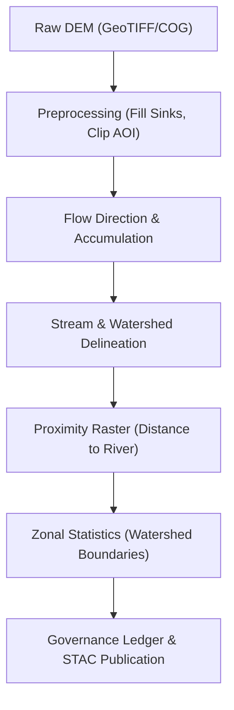

<div align="center">

# 💧 **Kansas Frontier Matrix — Hydrology Workflows & Terrain Analysis Guide**  
`docs/guides/geo/hydrology-workflows.md`

**Purpose:**  
Define reproducible, FAIR+CARE-compliant **hydrological and terrain modeling pipelines** in the Kansas Frontier Matrix (KFM).  
Covers DEM preprocessing, flow accumulation, proximity maps, zonal statistics, and lineage governance for watershed-level insight.

[](../../README.md)
[](../../../LICENSE)
[](../../../docs/standards/README.md)
[](../../../releases/)
</div>

---

## 📘 Overview

This guide documents the **terrain and hydrology processing stack** within KFM’s geospatial ETL framework, leveraging **GDAL 3.12**, **WhiteboxTools**, and **rio-cogeo** for efficient watershed and flow network derivation.  
Outputs are FAIR+CARE-certified and integrated with the **Knowledge Graph**, linking hydrological patterns to historical events (e.g., floods, homestead locations, or land use changes).

**Key Objectives**
- Standardize hydrological preprocessing workflows for reproducibility.  
- Use **COG-based DEM pipelines** for scalable raster analysis.  
- Connect hydrological data to **Focus Mode AI** and provenance governance.  

---

## 🗂️ Directory Layout

```plaintext
docs/guides/geo/
├── hydrology-workflows.md                # This document
├── gdal-3.12-upgrade.md                  # GDAL CLI integration
├── maplibre-rendering-playbook.md        # Map visualization optimization
└── validation-reports/                   # FAIR+CARE audit artifacts
src/pipelines/etl/
├── hydrology/                            # Core hydrology ETL
│   ├── preprocess_dem.py                 # Fill sinks, generate hillshade
│   ├── flow_accumulation.py              # Derive flow direction & accumulation
│   ├── proximity_analysis.py             # Calculate distance-to-water metrics
│   ├── zonal_stats.py                    # Aggregate raster values to polygons
│   └── governance_hooks.py               # Write lineage metadata
```

---

## 🧩 Hydrology Workflow (ETL Overview)



---

## ⚙️ Step-by-Step Procedure

### 1️⃣ DEM Preprocessing
```bash
# Fill sinks and prepare DEM for hydrology
gdal_fillnodata.py -md 5 -si 1 -of GTiff \
  data/raw/dem_kansas.tif data/work/hydrology/dem_filled.tif
gdaldem hillshade data/work/hydrology/dem_filled.tif \
  data/processed/terrain/hillshade.tif -z 2 -az 315 -alt 45
```
*Output:* `dem_filled.tif`, `hillshade.tif`

### 2️⃣ Flow Direction & Accumulation
```bash
# Using WhiteboxTools for precision hydrology
whitebox_tools --run="D8Pointer" \
  --dem="data/work/hydrology/dem_filled.tif" \
  --output="data/work/hydrology/flow_direction.tif"

whitebox_tools --run="D8FlowAccumulation" \
  --input="data/work/hydrology/dem_filled.tif" \
  --out_type="cells" \
  --output="data/processed/hydrology/flow_accumulation.tif"
```
*Output:* Flow direction & accumulation rasters.

### 3️⃣ Proximity & Distance-to-Water
```bash
# Compute distance raster from stream vector dataset
gdal raster proximity data/processed/hydrology/rivers.gpkg:lines \
  data/processed/hydrology/rivers_proximity.tif \
  -values 1 -distunits GEOG
```
*Output:* `rivers_proximity.tif` used for land suitability and flood analysis.

### 4️⃣ Zonal Statistics by Watershed
```bash
gdal raster zonal-stats \
  -zones data/processed/hydrology/watersheds.gpkg:watersheds \
  -raster data/processed/hydrology/flow_accumulation.tif \
  -stats mean,median,min,max,stddev \
  -out data/processed/hydrology/watershed_stats.parquet
```
*Output:* Parquet dataset joinable with Neo4j and Focus Mode dashboards.

---

## 🧾 Data Products & FAIR Metadata

| Output | Type | CRS | Description | STAC/DCAT Fields |
|---------|------|-----|--------------|------------------|
| `hillshade.tif` | Raster | EPSG:4326 | Terrain shading for visualization | `theme=Terrain` |
| `flow_accumulation.tif` | Raster | EPSG:4326 | Water flow intensity | `theme=Hydrology` |
| `rivers_proximity.tif` | Raster | EPSG:4326 | Distance to nearest stream | `theme=Hydrology` |
| `watershed_stats.parquet` | Vector/Tabular | EPSG:4326 | Aggregated watershed metrics | `distribution.format=Parquet` |

Each dataset automatically registers to the **STAC catalog** via the `geo-upgrade-validate.yml` workflow and writes a governance ledger entry with SHA-256 checksums.

---

## 🧮 Focus Mode AI Integration

Hydrology layers contribute environmental context to **Focus Transformer v2** models:

| Layer | AI Usage | Telemetry Source |
|--------|-----------|-----------------|
| `flow_accumulation.tif` | Identify water-adjacent historical sites | `focus-telemetry.json` |
| `rivers_proximity.tif` | Predict agricultural viability zones | `focus-telemetry.json` |
| `watershed_stats.parquet` | Rank sites by flood/drought likelihood | `focus-telemetry.json` |

AI reasoning includes hydrological features as environmental embeddings in Focus Mode’s entity scoring pipeline.

---

## ⚖️ Governance & FAIR+CARE Mapping

| Principle | Implementation | Artifact |
|------------|----------------|-----------|
| **Findable** | STAC/DCAT records with CRS and lineage | `data/stac/hydrology.json` |
| **Accessible** | Released as FAIR-compliant GeoTIFF and Parquet | `data/processed/hydrology/` |
| **Interoperable** | Open GeoTIFF, GeoParquet, and JSON schemas | `schemas/geo-hydrology-v1.json` |
| **Reusable** | Includes processing commands & parameters | `reports/geo/hydrology-validate.json` |
| **Collective Benefit** | Hydrological risk mapping supports public resilience | Governance Ledger |
| **Authority to Control** | Tribal and agency consent for watershed data | `data-generalization/README.md` |
| **Responsibility** | Sustainable compute logging (ISO 50001) | Telemetry output |
| **Ethics** | Avoids sensitive or sacred geographic disclosure | CARE-reviewed metadata |

---

## 🧩 CI/CD Integration

| Workflow | Purpose | Output |
|-----------|----------|--------|
| `geo-upgrade-validate.yml` | Runs hydrology ETL smoke tests | `reports/geo/hydrology-validate.json` |
| `stac-validate.yml` | Ensures metadata alignment | `reports/stac/hydrology.json` |
| `faircare-validate.yml` | FAIR+CARE compliance checks | `reports/faircare/hydrology.json` |
| `governance-ledger.yml` | Records provenance & ethics approval | `reports/ledger/hydrology.json` |

---

## 🕰️ Version History

| Version | Date | Author | Summary |
|----------|------|--------|----------|
| v10.0.0 | 2025-11-09 | Core Team | Introduced comprehensive hydrology guide with GDAL 3.12 and FAIR+CARE telemetry integration |
| v9.7.0 | 2025-10-28 | A. Barta | Initial prototype hydrology ETL documentation |

---

<div align="center">

© 2025 Kansas Frontier Matrix Project  
Master Coder Protocol v6.3 · FAIR+CARE Certified · Diamond⁹ Ω / Crown∞Ω Ultimate Certified  

[Back to Geo Guides](./README.md) · [Governance Charter](../../../docs/standards/governance/ROOT-GOVERNANCE.md)

</div>

