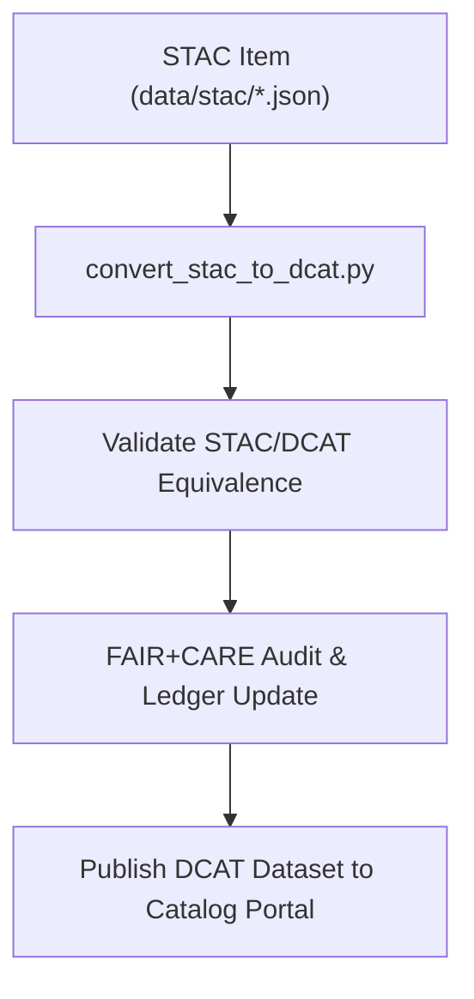

<div align="center">

# 🌐 **Kansas Frontier Matrix — STAC ↔ DCAT 3.0 Geo Metadata Bridge**
`docs/guides/geo/stac-dcat-geo-bridge.md`

**Purpose:**  
Define the translation and synchronization bridge between **STAC (SpatioTemporal Asset Catalog)** and **DCAT 3.0** metadata standards for geospatial datasets in the Kansas Frontier Matrix (KFM).  
Ensures that all raster, vector, and derived layers are interoperable with **FAIR+CARE**, **ISO 19115**, and **OGC** standards.

[](../../README.md)
[](../../../LICENSE)
[](../../../docs/standards/README.md)
[](../../../releases/)
</div>

---

## 📘 Overview

This bridge implements a **bidirectional translation layer** that allows geospatial metadata within KFM to be **published, discovered, and validated** across STAC- and DCAT-compliant systems.  
It harmonizes attributes, provenance, and governance metadata between the **OGC STAC 1.0.0** and **W3C DCAT 3.0** specifications.

**Use Cases**
- Automated conversion of KFM data catalogs (`data/stac/*.json`) → DCAT datasets (`data/dcat/*.json`)  
- Validation of FAIR+CARE fields across both metadata standards  
- Consistent provenance recording for raster/vector assets and STAC items  
- Enabling federated discovery via open data portals and APIs  

---

## 🗂️ Directory Layout

```plaintext
docs/guides/geo/
├── stac-dcat-geo-bridge.md                # This document
src/pipelines/metadata_bridge/
├── convert_stac_to_dcat.py                # Conversion script
├── convert_dcat_to_stac.py                # Reverse mapping
├── validate_stac_dcat_sync.py             # Schema alignment validation
├── stac_dcat_map.yaml                     # Field mapping specification
└── governance_hooks.py                    # Ledger & FAIR+CARE telemetry sync
```

---

## 🧩 STAC ↔ DCAT Field Mapping

| STAC Field | DCAT Equivalent | Description |
|-------------|----------------|-------------|
| `id` | `identifier` | Unique dataset identifier |
| `type` | `type` | Object class (`Dataset`, `Catalog`, `Collection`) |
| `stac_version` | `dcat:version` | Version metadata |
| `description` | `description` | Dataset abstract |
| `bbox` | `spatial/geographicBoundingBox` | Spatial extent |
| `datetime` | `temporal/startDate` & `endDate` | Temporal extent |
| `properties.license` | `license` | Usage license |
| `assets.href` | `distribution.downloadURL` | Asset link |
| `assets.type` | `distribution.mediaType` | File format |
| `collection` | `inCatalog` | Parent catalog link |
| `keywords` | `theme` | Tags or subject domains |
| `providers` | `publisher` | Originating organization |
| `created` | `issued` | Publication timestamp |
| `updated` | `modified` | Last update date |
| `provenance` | `dct:provenance` | FAIR+CARE provenance info |
| `faircare` | `dct:rights` | CARE ethical control declaration |

---

## ⚙️ Example Workflow (STAC → DCAT)

```bash
python src/pipelines/metadata_bridge/convert_stac_to_dcat.py \
  --input data/stac/hydrology.json \
  --output data/dcat/hydrology-dcat.json \
  --mapping src/pipelines/metadata_bridge/stac_dcat_map.yaml
```

*Output:* FAIR+CARE-aligned DCAT 3.0 dataset metadata generated from STAC item(s).

---

## 🧾 Example: STAC Item → DCAT Dataset

**Input (STAC)**
```json
{
  "stac_version": "1.0.0",
  "type": "Feature",
  "id": "hydrology_v10_001",
  "properties": {
    "datetime": "2025-11-09T00:00:00Z",
    "license": "CC-BY 4.0"
  },
  "bbox": [-102.05, 37.0, -94.6, 40.0],
  "assets": {
    "data": {
      "href": "https://data.kfm.org/tiles/hydrology.tif",
      "type": "image/tiff; application=geotiff"
    }
  },
  "collection": "hydrology_v10"
}
```

**Output (DCAT 3.0)**
```json
{
  "@context": "https://www.w3.org/ns/dcat3.jsonld",
  "id": "hydrology_v10_001",
  "type": "Dataset",
  "title": "Hydrology Flow Accumulation (v10)",
  "description": "Raster dataset showing flow accumulation from DEM data.",
  "spatial": {
    "bbox": [-102.05, 37.0, -94.6, 40.0],
    "crs": "EPSG:4326"
  },
  "temporal": {
    "startDate": "2025-11-09T00:00:00Z",
    "endDate": "2025-11-09T00:00:00Z"
  },
  "distribution": [{
    "downloadURL": "https://data.kfm.org/tiles/hydrology.tif",
    "mediaType": "image/tiff; application=geotiff"
  }],
  "license": "CC-BY 4.0",
  "provenance": {
    "wasGeneratedBy": "src/pipelines/etl/hydrology/flow_accumulation.py",
    "sha256": "f8c47d20..."
  },
  "rights": "FAIR+CARE compliant; approved by Council"
}
```

---

## 🧮 Validation Workflow (STAC ↔ DCAT Consistency)

| Workflow | Function | Output |
|-----------|-----------|--------|
| `stac-dcat-validate.yml` | Compare metadata equivalence | `reports/stac-dcat/sync-report.json` |
| `stac-validate.yml` | Validate against OGC STAC 1.0 schema | `reports/stac/validate.json` |
| `dcat-validate.yml` | Validate DCAT conformance | `reports/dcat/validate.json` |
| `ledger-sync.yml` | Append translation provenance | `docs/standards/governance/LEDGER/stac-dcat-bridge.json` |

Example command:
```bash
python src/pipelines/metadata_bridge/validate_stac_dcat_sync.py \
  --stac data/stac/hydrology.json \
  --dcat data/dcat/hydrology-dcat.json
```

---

## ⚖️ FAIR+CARE Mapping

| Principle | Implementation | Validation Artifact |
|------------|----------------|--------------------|
| **Findable** | Indexed in both STAC & DCAT catalogs | `stac-dcat/sync-report.json` |
| **Accessible** | Published in JSON-LD, open schema | `data/dcat/` |
| **Interoperable** | STAC ↔ DCAT bidirectional conversion | Conversion logs |
| **Reusable** | Linked provenance & license | Governance ledger |
| **Collective Benefit** | Promotes open, ethical dataset discovery | FAIR+CARE audit |
| **Authority to Control** | Governance Council review for release | `faircare-validate.yml` |
| **Responsibility** | Schema validation & telemetry logs | `focus-telemetry.json` |
| **Ethics** | No metadata leakage for restricted datasets | CARE review reports |

---

## 🧩 CI/CD Integration Flow



---

## 🧾 Governance Ledger Record

```json
{
  "bridge_id": "stac-dcat-hydrology-v10",
  "source": "data/stac/hydrology.json",
  "target": "data/dcat/hydrology-dcat.json",
  "validator": "stac-dcat-validate.yml",
  "sha256": "9af0b5e61a1d63f7...",
  "timestamp": "2025-11-09T12:00:00Z",
  "faircare_compliance": "Pass",
  "auditor": "FAIR+CARE Council"
}
```

---

## 🕰️ Version History

| Version | Date | Author | Summary |
|----------|------|--------|----------|
| v10.0.0 | 2025-11-09 | Core Team | Added STAC ↔ DCAT 3.0 bridge with governance integration and validation schema |
| v9.7.0 | 2025-10-30 | A. Barta | Prototype STAC/DCAT mapping for hydrology datasets |

---

<div align="center">

© 2025 Kansas Frontier Matrix Project  
Master Coder Protocol v6.3 · FAIR+CARE Certified · Diamond⁹ Ω / Crown∞Ω Ultimate Certified  

[Back to Geo Guides](./README.md) · [Governance Charter](../../../docs/standards/governance/ROOT-GOVERNANCE.md)

</div>

