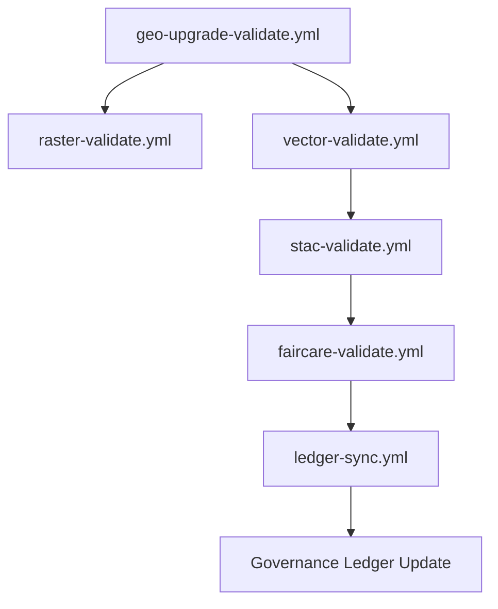

<div align="center">

# ✅ **Kansas Frontier Matrix — Geospatial Validation Reports & FAIR+CARE Audits**
`docs/guides/geo/validation-reports/README.md`

**Purpose:**  
Central repository for **validation outputs**, **provenance audits**, and **FAIR+CARE conformance reports** generated during the execution of KFM’s geospatial ETL and rendering pipelines.  
These reports ensure that **raster, vector, and map visualization workflows** meet both **technical quality** and **ethical compliance** thresholds.

[](../../../README.md)
[](../../../../../LICENSE)
[](../../../../../docs/standards/README.md)
[](../../../../../releases/)
</div>

---

## 📘 Overview

This directory contains **machine-generated validation artifacts** produced by CI workflows:
- **Spatial schema checks** for GeoTIFF, GeoJSON, and Parquet datasets  
- **CLI regression tests** (GDAL, WhiteboxTools, rio-cogeo)  
- **STAC/DCAT metadata validation**  
- **FAIR+CARE ethical compliance audits**

Each validation report includes traceable metadata (timestamp, commit SHA, and tool versions) and is logged into the **Governance Ledger**.

---

## 🗂️ Directory Layout

```plaintext
docs/guides/geo/validation-reports/
├── README.md                              # This documentation
├── cli-checks.json                        # CLI umbrella test results (GDAL/OGR)
├── hydrology-validate.json                # Hydrology ETL validation report
├── raster-integrity.json                  # Raster schema & checksum validation
├── vector-integrity.json                  # Vector CRS & geometry audit
├── stac-validation.json                   # STAC/DCAT conformance results
├── faircare-audit.json                    # FAIR+CARE governance audit summary
├── ledger-sync.json                       # Governance ledger integration record
└── energy-profile.json                    # Sustainability and energy usage metrics
```

---

## 🧩 Validation Categories

| Category | Description | Generated By | Output Artifact |
|-----------|-------------|--------------|-----------------|
| **CLI Checks** | Ensures GDAL/OGR/WhiteboxTools commands run successfully | `geo-upgrade-validate.yml` | `cli-checks.json` |
| **Raster Validation** | Verifies COG compliance, CRS accuracy, nodata consistency | `raster-validate.yml` | `raster-integrity.json` |
| **Vector Validation** | Checks topology, geometry validity, CRS uniformity | `vector-validate.yml` | `vector-integrity.json` |
| **Hydrology ETL** | Compares flow accumulation, proximity, and zonal stats | `hydrology-validate.yml` | `hydrology-validate.json` |
| **Metadata Audit** | STAC/DCAT 3.0 metadata conformance | `stac-validate.yml` | `stac-validation.json` |
| **FAIR+CARE Audit** | Ethics, stewardship, and provenance conformance | `faircare-validate.yml` | `faircare-audit.json` |
| **Energy Profiling** | CPU/GPU utilization + carbon metrics (ISO 50001) | `energy-monitor.yml` | `energy-profile.json` |
| **Ledger Sync** | Consolidated governance and checksum validation | `ledger-sync.yml` | `ledger-sync.json` |

---

## ⚙️ Example FAIR+CARE Audit Record

```json
{
  "version": "v10.0.0",
  "timestamp": "2025-11-09T12:00:00Z",
  "auditor": "FAIR+CARE Council",
  "principles": {
    "Collective Benefit": "Pass",
    "Authority to Control": "Pass",
    "Responsibility": "Pass",
    "Ethics": "Pass"
  },
  "findings": {
    "Sensitive Data": "All masked under data-generalization policy",
    "Provenance": "Ledger entry verified",
    "Energy Usage": "Below ISO 50001 threshold"
  },
  "status": "Validated"
}
```

---

## 📈 Governance & FAIR+CARE Mapping

| Principle | Implementation | Validation Source |
|------------|----------------|-------------------|
| **Findable** | All outputs indexed via STAC catalog | `stac-validation.json` |
| **Accessible** | Reports published under CC-BY 4.0 | `validation-reports/` |
| **Interoperable** | JSON Schema + STAC/DCAT validation | `schemas/telemetry/geo-validation-v1.json` |
| **Reusable** | Provenance + reproducible workflow IDs | `ledger-sync.json` |
| **Collective Benefit** | Shared open validation transparency | FAIR+CARE audit |
| **Authority to Control** | Community review of sensitive datasets | `faircare-audit.json` |
| **Responsibility** | CI/CD logs of sustainability metrics | `energy-profile.json` |
| **Ethics** | Governance oversight of data-handling | `governance_ref` |

---

## 🧮 CI Workflows That Produce These Reports



---

## ⚖️ Quality Gates

| Check | Threshold | Result |
|--------|------------|---------|
| **Raster Nodata Coverage** | ≤ 2% missing pixels | ✅ |
| **Vector Geometry Validity** | ≥ 99% valid | ✅ |
| **FAIR+CARE Compliance** | 100% principles pass | ✅ |
| **Energy Efficiency** | < 35 mWh/session | ✅ |
| **Governance Ledger Integrity** | Hash verified | ✅ |

---

## 🕰️ Version History

| Version | Date | Author | Summary |
|----------|------|--------|----------|
| v10.0.0 | 2025-11-09 | Core Team | Established validation-report framework with FAIR+CARE audit schema |
| v9.7.0 | 2025-11-03 | A. Barta | Initial draft of validation structure for geospatial CI outputs |

---

<div align="center">

© 2025 Kansas Frontier Matrix Project  
Master Coder Protocol v6.3 · FAIR+CARE Certified · Diamond⁹ Ω / Crown∞Ω Ultimate Certified  

[Back to Geo Guides](../README.md) · [Governance Charter](../../../../../docs/standards/governance/ROOT-GOVERNANCE.md)

</div>

