<div align="center">

# 🗺️ **Kansas Frontier Matrix — Vector ETL Pipelines & FAIR+CARE Validation Framework**
`docs/guides/geo/vector-etl-pipelines.md`

**Purpose:**  
Provide standardized, reproducible methods for **vector data extraction, transformation, and loading (ETL)** within the Kansas Frontier Matrix (KFM).  
Covers **GDAL/OGR**, **GeoPandas**, and **Parquet workflows**, with integrated **FAIR+CARE validation** and **governance-ledger recording**.

[](../../README.md)
[](../../../LICENSE)
[](../../../docs/standards/README.md)
[](../../../releases/)
</div>

---

## 📘 Overview

This guide defines **vector ETL patterns** for converting raw GIS data (e.g., shapefiles, GPKG, CSV, CAD) into **standardized GeoParquet** or **GeoJSON** outputs.  
It ensures data integrity, spatial validation, provenance tracking, and ethical masking through FAIR+CARE governance workflows.

Key operations:
- Schema harmonization (fields, types, and projections)
- Coverage cleaning and simplification
- Attribute normalization and enrichment
- Incremental Parquet updates for evolving datasets
- Ledger and provenance documentation for transparency

---

## 🗂️ Directory Layout

```plaintext
src/pipelines/etl/vector/
├── extract_vector.py            # Read shapefiles, GPKG, CSV, CAD
├── transform_vector.py          # Reproject, simplify, clean
├── enrich_attributes.py         # Normalize and compute derived fields
├── load_to_parquet.py           # Append or overwrite GeoParquet layers
├── validate_vector.py           # Geometry and schema integrity
└── governance_hooks.py          # Ledger, provenance, FAIR+CARE trace
```

---

## 🧩 Vector ETL Flow

```mermaid
flowchart TD
A["Source Data (Shapefile, GPKG, CSV, CAD)"] --> B["Extract + Reproject (EPSG:4326)"]
B --> C["Simplify + Clean Coverage (Topology Fixes)"]
C --> D["Normalize Attributes + Add Derived Fields"]
D --> E["Convert → GeoParquet / GeoJSON"]
E --> F["FAIR+CARE Validation + Governance Ledger Entry"]
```



---

## ⚙️ Step-by-Step Pipeline Examples

### 1️⃣ Extract and Reproject
```bash
ogr2ogr -f GPKG data/work/staging/parcels.gpkg data/raw/parcels.shp -t_srs EPSG:4326
```
*Output:* `data/work/staging/parcels.gpkg`

### 2️⃣ Simplify Coverage and Fix Topology
```bash
gdal vector simplify-coverage \
  data/work/staging/parcels.gpkg:parcels \
  data/work/staging/parcels_simple.gpkg:parcels_simple \
  -tolerance 0.5

gdal vector clean-coverage \
  data/work/staging/parcels_simple.gpkg:parcels_simple \
  data/work/staging/parcels_clean.gpkg:parcels_clean
```
*Output:* Cleaned geometries ready for attribute enrichment.

### 3️⃣ Normalize Attributes
```python
import geopandas as gpd
df = gpd.read_file("data/work/staging/parcels_clean.gpkg")
df["area_ha"] = df.geometry.area / 10000
df["source_dataset"] = "Kansas Parcel Register 2025"
df["year"] = 2025
df.to_file("data/work/staging/parcels_enriched.gpkg", driver="GPKG")
```

### 4️⃣ Append or Update GeoParquet
```bash
ogr2ogr -f Parquet -update -append \
  data/processed/vectors/parcels.parquet \
  data/work/staging/parcels_enriched.gpkg -nln parcels
```

### 5️⃣ Validate and Record Governance
```bash
python src/pipelines/etl/vector/validate_vector.py \
  --input data/processed/vectors/parcels.parquet \
  --output reports/geo/vector-integrity.json \
  --ledger docs/standards/governance/LEDGER/vector-parcels.json
```

---

## 🧾 Validation Rules (MCP-DL v6.3 Schema)

| Validation | Description | Threshold |
|-------------|--------------|------------|
| **CRS Check** | All layers must be EPSG:4326 | 100% |
| **Geometry Validity** | `is_valid == True` for all features | ≥ 99.5% |
| **Area Threshold** | No geometry < 1 m² unless type = Point | ≥ 99% |
| **Attribute Completeness** | Required fields (id, area, source, year) present | 100% |
| **FAIR+CARE Audit** | Metadata compliant with ethical rules | Pass/Fail |

Validation results are serialized to `reports/geo/vector-integrity.json` and appended to the Governance Ledger.

---

## 🧮 Attribute Normalization Schema

| Field | Type | Description | Example |
|-------|------|-------------|----------|
| `id` | string | Unique parcel or feature ID | `"KS-DOUGLAS-00123"` |
| `source_dataset` | string | Originating dataset or survey | `"Kansas Register of Deeds"` |
| `year` | integer | Year of record | `2025` |
| `area_ha` | float | Area in hectares | `0.65` |
| `geometry` | geometry | Spatial geometry | Polygon / MultiPolygon |
| `license` | string | Usage license (FAIR+CARE) | `"CC-BY 4.0"` |

---

## ⚖️ FAIR+CARE Integration

| Principle | Implementation | Validation Artifact |
|------------|----------------|--------------------|
| **Findable** | STAC/DCAT registered vector catalog | `data/stac/vector.json` |
| **Accessible** | Released in GeoParquet / GeoJSON | `data/processed/vectors/` |
| **Interoperable** | EPSG:4326, ISO 19115, DCAT metadata | `vector-integrity.json` |
| **Reusable** | Schema & provenance retained | Governance ledger |
| **Collective Benefit** | Data supports equitable land governance | FAIR+CARE audit |
| **Authority to Control** | Stewardship by FAIR+CARE Council | `governance_ref` |
| **Responsibility** | Telemetry of compute + validation logs | `focus-telemetry.json` |
| **Ethics** | Sensitive geometry masking rules applied | `data-generalization/README.md` |

---

## 🧩 CI/CD Integration

| Workflow | Function | Output Artifact |
|-----------|-----------|----------------|
| `vector-validate.yml` | Geometry and attribute validation | `reports/geo/vector-integrity.json` |
| `stac-validate.yml` | Vector metadata compliance | `reports/stac/vector-validation.json` |
| `faircare-validate.yml` | FAIR+CARE ethics confirmation | `reports/faircare/vector-audit.json` |
| `ledger-sync.yml` | Provenance record and checksum | `docs/standards/governance/LEDGER/vector-ledger.json` |

---

## 🧾 Example Governance Ledger Entry

```json
{
  "dataset": "parcels.parquet",
  "version": "v10.0.0",
  "sha256": "d4f3a9e7b6a3e2a58f11a7d0f85a6b3e9d2ac3d22c14b72e6e92452b9a7a5efc",
  "validated_by": "vector-validate.yml",
  "timestamp": "2025-11-09T12:00:00Z",
  "license": "CC-BY 4.0",
  "faircare_compliance": "Pass",
  "notes": "Dataset generalized under CARE governance; validated via GDAL 3.12 vector tools."
}
```

---

## 🕰️ Version History

| Version | Date | Author | Summary |
|----------|------|--------|----------|
| v10.0.0 | 2025-11-09 | Core Team | Unified vector ETL and FAIR+CARE validation guide for v10 |
| v9.7.0  | 2025-11-03 | A. Barta | Added topology cleaning and GeoParquet upsert workflow |

---

<div align="center">

© 2025 Kansas Frontier Matrix Project  
Master Coder Protocol v6.3 · FAIR+CARE Certified · Diamond⁹ Ω / Crown∞Ω Ultimate Certified  

[Back to Geo Guides](./README.md) · [Governance Charter](../../../docs/standards/governance/ROOT-GOVERNANCE.md)

</div>

