<div align="center">

# ⚖️ **Kansas Frontier Matrix — Governance, Ethics & FAIR+CARE Oversight Guides**
`docs/guides/governance/README.md`

**Purpose:**  
Provide a structured governance framework for **ethical data stewardship**, **FAIR+CARE compliance**, and **transparency auditing** across all Kansas Frontier Matrix (KFM) workflows.  
These guides define the **oversight pipelines**, **ledger validation systems**, and **Council procedures** that ensure every dataset, AI model, and publication aligns with equitable data principles.

[](../../README.md)
[](../../../LICENSE)
[](../../../docs/standards/README.md)
[](../../../releases/)
</div>

---

## 📘 Overview

KFM’s governance architecture ensures that **scientific rigor, ethical compliance, and cultural respect** guide every aspect of system development and operation.  
Governance documents define the **FAIR+CARE Council procedures**, **audit workflows**, and **provenance systems** that safeguard reproducibility and sustainability.

Key objectives:
- Maintain transparency through auditable FAIR+CARE ledgers  
- Embed ethical oversight in AI, data, and visualization pipelines  
- Align operational governance with international sustainability standards (ISO 50001 / 14064 / 26000)  

---

## 🗂️ Directory Layout

```plaintext
docs/guides/governance/
├── README.md                               # This overview
├── faircare-oversight.md                   # FAIR+CARE Council roles and audit process
├── governance-ledger-integration.md        # Ledger structure & synchronization standards
├── ethics-audit-protocols.md               # Ethical review and cultural data consent workflows
├── sustainability-compliance.md            # ISO 50001 / 14064 sustainability governance
└── reports/                                # Governance validation and audit reports
```

---

## 🧩 Governance Architecture Overview

```mermaid
flowchart TD
A["FAIR+CARE Council Oversight"] --> B["Governance Ledger Validation"]
B --> C["Ethics & Sustainability Audit Pipelines"]
C --> D["FAIR+CARE Certification Reports"]
D --> E["Governance Feedback → Dataset / AI / Visualization Teams"]
E --> F["Continuous Compliance & Release Signoff"]
```



---

## ⚙️ Key Governance Entities

| Entity | Function | Aligned Standard |
|---------|-----------|------------------|
| **FAIR+CARE Council** | Approves releases, audits cultural data, and reviews ethical metrics | FAIR Principles + CARE Guidelines |
| **Governance Ledger** | Immutable record of validation and audit results | MCP-DL v6.3 |
| **Data Stewardship Board** | Manages data licensing, access levels, and lineage | ISO 19115, DCAT 3.0 |
| **Sustainability Auditor** | Tracks energy and carbon efficiency across CI/CD | ISO 50001, 14064 |
| **AI Ethics Committee** | Reviews explainability reports, bias detection, and model fairness | OECD AI Ethics Framework |

---

## ⚖️ FAIR+CARE Compliance Framework

| Principle | Implementation | Audit Source |
|------------|----------------|---------------|
| **Findable** | Unique identifiers for all datasets and reports | Governance Ledger |
| **Accessible** | Open, license-aligned documentation and FAIR API | `manifest_ref` |
| **Interoperable** | STAC/DCAT + JSON-LD governance schemas | `telemetry_schema` |
| **Reusable** | SBOM and reproducible workflow metadata | `sbom_ref` |
| **Collective Benefit** | Council-approved governance promoting equity | FAIR+CARE audit logs |
| **Authority to Control** | Indigenous and local consent integrated into data release | `ethics-audit-protocols.md` |
| **Responsibility** | Continuous telemetry and carbon tracking | `focus-telemetry.json` |
| **Ethics** | FAIR+CARE Council review required for all releases | `faircare-oversight.md` |

---

## 🧮 Governance Ledger Record Example

```json
{
  "ledger_id": "governance-ledger-2025-11-09-001",
  "component": "AI Governance Validation",
  "sha256": "b3e0f89e7214...",
  "faircare_status": "Pass",
  "audit_trail": [
    "ai-explainability.yml",
    "faircare-validate.yml",
    "ledger-sync.yml"
  ],
  "energy_joules": 11.2,
  "carbon_gCO2e": 0.0051,
  "auditor": "FAIR+CARE Council",
  "timestamp": "2025-11-09T12:45:00Z"
}
```

---

## ⚙️ CI/CD Governance Validation Workflows

| Workflow | Purpose | Output |
|-----------|-----------|--------|
| `faircare-validate.yml` | Ethical & sustainability validation for all systems | `reports/faircare/governance-audit.json` |
| `ledger-sync.yml` | Appends validated records to the Governance Ledger | `docs/standards/governance/LEDGER/governance-ledger.json` |
| `telemetry-export.yml` | Publishes energy and ethics telemetry logs | `releases/v*/focus-telemetry.json` |
| `governance-audit.yml` | Ensures continuous compliance across releases | `reports/governance/governance-validation.json` |

---

## 🧾 Example FAIR+CARE Audit Summary

```json
{
  "audit_id": "faircare-governance-2025-11-09-0003",
  "audited_system": "Focus Mode AI + Data Pipelines",
  "metrics": {
    "faircare_alignment": 100,
    "carbon_savings_percent": 18.3,
    "sensitive_data_flags": 0
  },
  "recommendations": [
    "Increase telemetry sampling frequency",
    "Expand CARE Council participation in visualization design reviews"
  ],
  "faircare_status": "Pass",
  "auditor": "FAIR+CARE Council",
  "timestamp": "2025-11-09T12:50:00Z"
}
```

---

## 🧠 Governance Oversight Process

1. **FAIR+CARE Validation:**  
   Each dataset, AI model, and UI component undergoes pre-release validation.  
2. **Council Review:**  
   Ethics, sustainability, and accessibility results are evaluated by Council members.  
3. **Governance Ledger Sync:**  
   Audit entries appended with digital signatures (SHA-256).  
4. **Publication Approval:**  
   Council authorizes release under the proper licensing and ethical framework.  

---

## ⚖️ Governance Integration with FAIR+CARE Council

| Council Role | Function | Governance Artifact |
|---------------|-----------|---------------------|
| **Audit Chair** | Oversees validation and ledger approval | `governance-ledger-integration.md` |
| **Data Steward** | Validates provenance & CARE compliance | `ethics-audit-protocols.md` |
| **AI Reviewer** | Reviews model explainability & fairness | `faircare-oversight.md` |
| **Sustainability Lead** | Monitors carbon/energy benchmarks | `sustainability-compliance.md` |
| **Public Liaison** | Communicates results to public archives | `releases/v*/manifest.zip` |

---

## 🕰️ Version History

| Version | Date | Author | Summary |
|----------|------|--------|----------|
| v10.0.0 | 2025-11-09 | Core Team | Added comprehensive governance framework with FAIR+CARE oversight and CI integration |
| v9.7.0  | 2025-11-03 | A. Barta | Introduced ethical audit and sustainability governance model |

---

<div align="center">

© 2025 Kansas Frontier Matrix Project  
Master Coder Protocol v6.3 · FAIR+CARE Certified · Diamond⁹ Ω / Crown∞Ω Ultimate Certified  

[Back to Guides Index](../README.md) · [Governance Charter](../../../docs/standards/governance/ROOT-GOVERNANCE.md)

</div>

