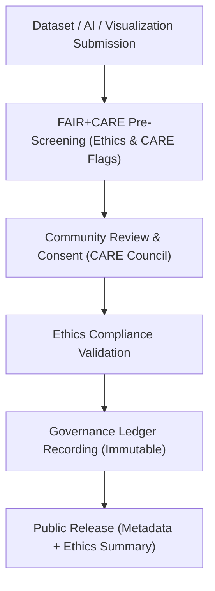

<div align="center">

# 🤝 **Kansas Frontier Matrix — Ethics Audit Protocols & Cultural Data Governance Framework**
`docs/guides/governance/ethics-audit-protocols.md`

**Purpose:**  
Define the ethical review and **CARE-governed cultural data auditing** system within the Kansas Frontier Matrix (KFM).  
These protocols ensure that all datasets, AI outputs, and visualizations adhere to **Collective Benefit**, **Authority to Control**, **Responsibility**, and **Ethics** standards under **FAIR+CARE** and **MCP-DL v6.3** certification.

[](../../README.md)
[](../../../LICENSE)
[](../../../docs/standards/README.md)
[](../../../releases/)
</div>

---

## 📘 Overview

The **Ethics Audit Protocols** establish the review methodology for identifying, classifying, and managing sensitive or culturally governed data in KFM.  
It ensures that **Indigenous sovereignty, community consent, and historical integrity** are maintained throughout data collection, publication, and visualization workflows.

**Objectives**
- Validate datasets for cultural sensitivity and ethical use  
- Apply FAIR+CARE Council consent workflows for data access  
- Record all audit results in the **Governance Ledger**  
- Implement AI and visualization content safeguards respecting cultural sovereignty  

---

## 🗂️ Directory Context

```plaintext
docs/guides/governance/
├── README.md                               # Governance overview
├── faircare-oversight.md                   # Council membership & oversight workflow
├── governance-ledger-integration.md        # Ledger synchronization standards
├── ethics-audit-protocols.md               # This document
├── sustainability-compliance.md            # Environmental audit framework
└── reports/                                # Ethics & CARE audit reports
```

---

## 🧩 Ethical Governance Architecture



---

## ⚙️ Ethical Review Categories

| Category | Description | Required Action | Governance Field |
|-----------|--------------|------------------|------------------|
| **Cultural Sensitivity** | Involves Indigenous or heritage sites | Requires CARE Council consent | `authority_to_control` |
| **Privacy Sensitivity** | Contains personal or identifiable data | Requires anonymization | `responsibility` |
| **Environmental Sensitivity** | Linked to protected habitats or geodata | Restrict precise coordinates | `ethics` |
| **Public Historical Content** | Archival or public-domain records | Public release with attribution | `collective_benefit` |

---

## 🧾 CARE Principle Integration Matrix

| CARE Principle | Implementation | Validation Artifact |
|----------------|----------------|--------------------|
| **Collective Benefit** | Datasets must demonstrate community or ecological value | FAIR+CARE validation report |
| **Authority to Control** | Indigenous communities review and authorize data use | CARE Council documentation |
| **Responsibility** | Data stewards maintain ethical metadata & governance trace | Governance Ledger |
| **Ethics** | Explicit consent required for publication or AI training | Ethics audit report |

---

## 🧠 Ethics Audit Workflow

| Step | Process | Responsible Entity | Deliverable |
|------|----------|--------------------|-------------|
| **1. Pre-Screening** | Identify sensitive datasets via metadata flags | FAIR+CARE Automation | `reports/faircare/ethics-scan.json` |
| **2. Community Consultation** | Engage relevant tribal or cultural stewards | CARE Council Liaison | Consent log |
| **3. Ethical Review** | Validate adherence to CARE & FAIR principles | FAIR+CARE Council | `ethics-audit.json` |
| **4. Governance Record** | Log results in immutable ledger | FAIR+CARE Secretariat | `governance-ledger.json` |
| **5. Public Release** | Approve or restrict dataset publication | FAIR+CARE Council | `manifest.zip` |

---

## 🧮 Example Ethics Audit Report

```json
{
  "audit_id": "ethics-audit-2025-11-09-0001",
  "dataset_id": "kfm-archaeology-2025-003",
  "reviewers": ["FAIR+CARE Council", "Tribal Data Liaison"],
  "ethical_flags": ["Cultural Sensitivity", "Indigenous Site"],
  "review_outcome": "Restricted Access",
  "consent_authority": "Prairie Band Potawatomi Nation",
  "recommendations": [
    "Apply coordinate generalization radius of 5 km",
    "Retain metadata with CARE disclosure notice"
  ],
  "faircare_status": "Pass",
  "timestamp": "2025-11-09T12:30:00Z"
}
```

---

## ⚖️ Governance Integration

| Workflow | Function | Output |
|-----------|-----------|--------|
| `faircare-validate.yml` | Runs FAIR+CARE ethical validation | `reports/faircare/ethics-audit.json` |
| `ledger-sync.yml` | Appends ethical audit results to governance ledger | `docs/standards/governance/LEDGER/ethics-ledger.json` |
| `telemetry-export.yml` | Tracks sustainability + ethics telemetry | `releases/v*/focus-telemetry.json` |
| `governance-audit.yml` | Consolidates all ethical and cultural audit results | `reports/governance/ethics-summary.json` |

---

## 🧩 Governance Ledger Record Example

```json
{
  "ledger_id": "ethics-ledger-2025-11-09-0004",
  "dataset": "Archaeological Sites of Kansas 2025",
  "consent_authority": "Prairie Band Potawatomi Nation",
  "restriction_level": "Generalized 5km",
  "faircare_status": "Pass",
  "auditor": "FAIR+CARE Council",
  "timestamp": "2025-11-09T12:40:00Z"
}
```

---

## 🧾 Ethical Compliance Validation Rules

| Validation Check | Description | Status |
|------------------|--------------|--------|
| **Community Consent Verified** | Cultural authority has reviewed dataset | ✅ |
| **License Compliance** | License aligns with CARE principles | ✅ |
| **Geospatial Masking Applied** | Sensitive coordinates generalized | ✅ |
| **Governance Record Signed** | Digital signature recorded in ledger | ✅ |
| **FAIR+CARE Validation Passed** | Ethical audit approved by Council | ✅ |

---

## 🧮 CARE Council Review Log Example

```json
{
  "council_meeting": "2025-Q4",
  "datasets_reviewed": 42,
  "restricted_datasets": 5,
  "approved_for_publication": 37,
  "pending_community_feedback": 3,
  "carbon_audit_joules": 8.1,
  "faircare_status": "Pass",
  "timestamp": "2025-11-09T12:45:00Z"
}
```

---

## ⚙️ Integration with FAIR+CARE Ledger

Ethics audit outcomes are appended to the **Governance Ledger**, establishing:
1. Immutable provenance records  
2. Digital signatures by CARE-authorized entities  
3. FAIR+CARE Council cross-validation reports  
4. Sustainability metrics tied to each ethics review  

---

## 🕰️ Version History

| Version | Date | Author | Summary |
|----------|------|--------|----------|
| v10.0.0 | 2025-11-09 | Core Team | Created complete ethical audit and cultural governance protocol aligned with CARE principles |
| v9.7.0  | 2025-11-03 | A. Barta | Introduced initial CARE consent framework and ethical audit schema |

---

<div align="center">

© 2025 Kansas Frontier Matrix Project  
Master Coder Protocol v6.3 · FAIR+CARE Certified · Diamond⁹ Ω / Crown∞Ω Ultimate Certified  

[Back to Governance Guides](./README.md) · [Governance Charter](../../../docs/standards/governance/ROOT-GOVERNANCE.md)

</div>

