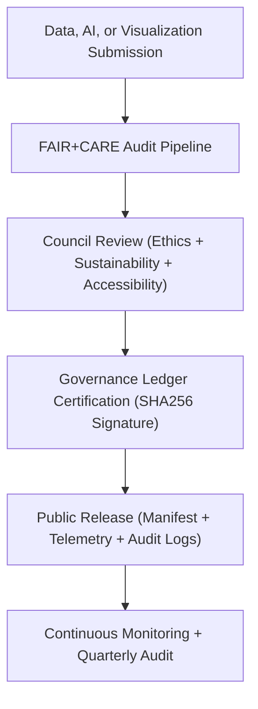

<div align="center">

# 🧭 **Kansas Frontier Matrix — FAIR+CARE Oversight & Council Governance Protocol**
`docs/guides/governance/faircare-oversight.md`

**Purpose:**  
Establish the ethical oversight, review processes, and certification structure for the **FAIR+CARE Council** within the Kansas Frontier Matrix (KFM).  
Defines Council membership, audit responsibilities, and compliance workflows ensuring transparent, equitable, and sustainable data governance under **MCP-DL v6.3**.

[](../../README.md)
[](../../../LICENSE)
[](../../../docs/standards/README.md)
[](../../../releases/)
</div>

---

## 📘 Overview

The **FAIR+CARE Oversight Framework** governs how data, AI models, and user interfaces are ethically managed and certified for release in KFM.  
The Council acts as an independent audit body ensuring that **Collective Benefit**, **Authority to Control**, **Responsibility**, and **Ethics** principles are embedded across all technical and organizational layers.

**Core Objectives**
- Maintain continuous ethical governance across KFM workflows  
- Validate FAIR+CARE compliance for datasets, AI, and visualizations  
- Approve releases and monitor sustainability, accessibility, and consent adherence  
- Provide transparent, public reports for reproducibility and accountability  

---

## 🗂️ Directory Context

```plaintext
docs/guides/governance/
├── README.md                            # Governance overview
├── faircare-oversight.md                # This document
├── governance-ledger-integration.md     # Ledger synchronization and validation
├── ethics-audit-protocols.md            # Ethical review and cultural consent processes
├── sustainability-compliance.md         # ISO energy and sustainability tracking
└── reports/                             # FAIR+CARE validation and oversight summaries
```

---

## 🧩 FAIR+CARE Council Composition

| Role | Responsibility | Audit Scope |
|------|----------------|--------------|
| **Council Chair** | Leads FAIR+CARE review meetings, oversees governance signoffs | All release categories |
| **Data Steward** | Ensures dataset provenance, licensing, and cultural control | Datasets / Metadata |
| **AI Ethics Lead** | Reviews model fairness, explainability, and sustainability | AI + Focus Mode systems |
| **Accessibility Officer** | Verifies WCAG 2.1 AA compliance and user inclusivity | Visualization interfaces |
| **Sustainability Auditor** | Monitors energy and carbon footprints | CI/CD + Telemetry Systems |
| **Community Liaison** | Engages Indigenous and local communities for CARE approval | CARE Principle Governance |

---

## ⚙️ Council Oversight Workflow



---

## ⚖️ FAIR+CARE Audit Stages

| Stage | Description | Responsible Role | Deliverable |
|--------|-------------|------------------|-------------|
| **1. Intake** | Submission of dataset, AI model, or visualization component | Data Steward | Intake Form + Metadata |
| **2. Ethical Screening** | Evaluation for cultural sensitivity & CARE compliance | Community Liaison | Ethics Report |
| **3. FAIR Validation** | Verification of metadata & technical standards | FAIR+CARE Engineer | FAIR Validation Log |
| **4. Sustainability Audit** | Review of energy and carbon telemetry | Sustainability Auditor | ISO 50001 Report |
| **5. Accessibility Review** | WCAG and usability audit | Accessibility Officer | UI Accessibility Report |
| **6. Council Approval** | Multi-role approval and certification | Council Chair | Governance Ledger Entry |

---

## 🧾 Example FAIR+CARE Council Decision Record

```json
{
  "review_id": "faircare-review-2025-11-09-0005",
  "submission_type": "AI Model (Focus Transformer v2)",
  "review_outcome": "Approved",
  "faircare_metrics": {
    "collective_benefit": "Pass",
    "authority_to_control": "Pass",
    "responsibility": "Pass",
    "ethics": "Pass"
  },
  "sustainability_metrics": {
    "energy_joules": 12.4,
    "carbon_gCO2e": 0.0052
  },
  "auditors": ["Council Chair", "AI Ethics Lead", "Sustainability Auditor"],
  "timestamp": "2025-11-09T12:45:00Z"
}
```

---

## 🧮 FAIR+CARE Compliance Matrix

| Principle | Implementation | Validation Artifact |
|------------|----------------|--------------------|
| **Findable** | Approved entries added to FAIR+CARE Governance Ledger | `governance-ledger-integration.md` |
| **Accessible** | Publicly available FAIR+CARE audit reports | `reports/faircare/governance-audit.json` |
| **Interoperable** | JSON-LD / STAC / DCAT3 alignment | `telemetry_schema` |
| **Reusable** | FAIR+CARE-certified datasets reused in other research contexts | FAIR+CARE manifest |
| **Collective Benefit** | Council approval ensures shared equity & value | Governance Ledger |
| **Authority to Control** | CARE Principle authority assigned to community | `ethics-audit-protocols.md` |
| **Responsibility** | Continuous energy & sustainability tracking | `focus-telemetry.json` |
| **Ethics** | FAIR+CARE certification required pre-release | `faircare-validate.yml` |

---

## 🧠 Council Review Schedule

| Frequency | Review Type | Description |
|------------|--------------|-------------|
| **Weekly** | Intake & Triage | Review new data submissions for FAIR+CARE alignment |
| **Monthly** | Technical Validation | Review telemetry, SBOM, and AI compliance results |
| **Quarterly** | Governance Audit | Publish public reports and ledger summaries |
| **Annual** | Sustainability Benchmark | Evaluate ISO 50001 and 14064 performance trends |

---

## 🧩 Governance Ledger Certification Example

```json
{
  "ledger_id": "faircare-ledger-2025-11-09-0002",
  "submission": "kfm-focus-transformer-v2",
  "review_status": "Approved",
  "faircare_status": "Pass",
  "cultural_review": "Complete",
  "sustainability_audit": "Verified",
  "sha256": "e9a12f7b3d5a...",
  "auditor": "FAIR+CARE Council",
  "timestamp": "2025-11-09T12:50:00Z"
}
```

---

## ⚙️ CI/CD Integration for Council Oversight

| Workflow | Function | Output |
|-----------|-----------|--------|
| `faircare-validate.yml` | Runs FAIR+CARE compliance & ethics validation | `reports/faircare/governance-audit.json` |
| `ledger-sync.yml` | Appends reviewed items to governance ledger | `docs/standards/governance/LEDGER/faircare-ledger.json` |
| `telemetry-export.yml` | Exports sustainability telemetry for Council review | `releases/v*/focus-telemetry.json` |
| `governance-audit.yml` | Validates FAIR+CARE compliance chain integrity | `reports/governance/faircare-validation.json` |

---

## ⚖️ Transparency & Accountability

The FAIR+CARE Council enforces:
- Open publication of audit results via governance reports  
- Signed and timestamped decisions appended to immutable ledgers  
- Public accessibility of FAIR+CARE certification via SBOM references  
- Commitment to intersectional, decolonial, and community-centered governance  

---

## 🕰️ Version History

| Version | Date | Author | Summary |
|----------|------|--------|----------|
| v10.0.0 | 2025-11-09 | Core Team | Established FAIR+CARE Council oversight and ethical governance review process |
| v9.7.0  | 2025-11-03 | A. Barta | Introduced Council roles, review scheduling, and governance ledger certification workflow |

---

<div align="center">

© 2025 Kansas Frontier Matrix Project  
Master Coder Protocol v6.3 · FAIR+CARE Certified · Diamond⁹ Ω / Crown∞Ω Ultimate Certified  

[Back to Governance Guides](./README.md) · [Governance Charter](../../../docs/standards/governance/ROOT-GOVERNANCE.md)

</div>

