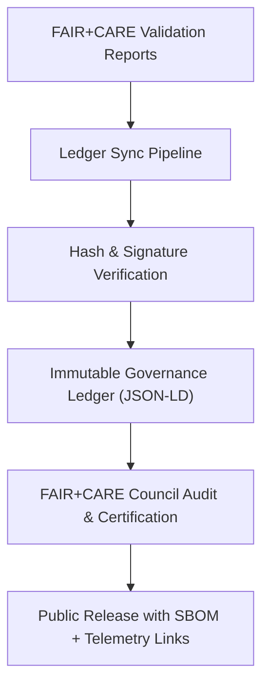
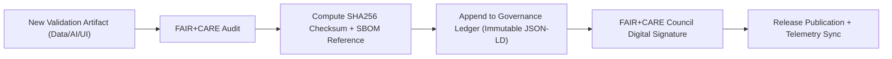

<div align="center">

# 📜 **Kansas Frontier Matrix — Governance Ledger Integration & Validation Framework**
`docs/guides/governance/governance-ledger-integration.md`

**Purpose:**  
Define the technical and ethical framework for **Governance Ledger synchronization, validation, and certification** within the Kansas Frontier Matrix (KFM).  
Ensures that all system outputs — data, AI, or visualization — are recorded immutably, ethically, and traceably under **FAIR+CARE** and **MCP-DL v6.3** governance.

[](../../README.md)
[](../../../LICENSE)
[](../../../docs/standards/README.md)
[](../../../releases/)
</div>

---

## 📘 Overview

The **Governance Ledger** functions as KFM’s central **audit and provenance registry**, ensuring that every validated artifact (dataset, AI inference, visualization, or telemetry record) maintains traceability and compliance with FAIR+CARE principles.  
This document defines the **data model**, **validation workflows**, and **automation standards** for Ledger updates, ensuring continuous governance transparency.

---

## 🗂️ Directory Context

```plaintext
docs/guides/governance/
├── README.md                               # Governance overview
├── faircare-oversight.md                   # Council oversight and audit workflows
├── governance-ledger-integration.md        # This document
├── ethics-audit-protocols.md               # CARE-informed ethical review processes
├── sustainability-compliance.md            # ISO energy and environmental validation
└── reports/                                # Ledger audit and synchronization reports
```

---

## 🧩 Governance Ledger System Overview



---

## ⚙️ Ledger Structure

| Field | Description | Example |
|--------|-------------|----------|
| `ledger_id` | Unique identifier for governance record | `"ledger-2025-11-09-001"` |
| `component` | System or process under review | `"AI Explainability Dashboard"` |
| `sha256` | Artifact integrity hash | `"a9d2efc3b4c1..."` |
| `reports` | Validation outputs linked to this record | `["faircare-audit.json", "telemetry-summary.json"]` |
| `faircare_status` | Outcome of FAIR+CARE audit | `"Pass"` |
| `energy_joules` | Energy consumption logged | `12.4` |
| `carbon_gCO2e` | Carbon equivalent emission | `0.0052` |
| `auditor` | Validating party | `"FAIR+CARE Council"` |
| `timestamp` | UTC timestamp of certification | `"2025-11-09T12:00:00Z"` |

---

## 🧮 Example Governance Ledger Entry

```json
{
  "ledger_id": "governance-ledger-2025-11-09-001",
  "component": "Hydrology Workflow Validation",
  "sha256": "5f8d9e2b6c73...",
  "reports": [
    "reports/faircare/data-audit.json",
    "reports/ledger/data-ledger.json"
  ],
  "faircare_status": "Pass",
  "energy_joules": 11.3,
  "carbon_gCO2e": 0.0048,
  "auditor": "FAIR+CARE Council",
  "timestamp": "2025-11-09T12:30:00Z"
}
```

---

## ⚖️ FAIR+CARE Integration

| Principle | Implementation | Verification Artifact |
|------------|----------------|------------------------|
| **Findable** | Ledger entries indexed and timestamped | `docs/standards/governance/LEDGER/` |
| **Accessible** | Openly published JSON-LD ledger files | Repository public release |
| **Interoperable** | FAIR+CARE schema + JSON-LD semantic model | `telemetry_schema` |
| **Reusable** | Provenance and audit chains retained for all releases | `manifest_ref` |
| **Collective Benefit** | Promotes accountable governance across systems | FAIR+CARE audit |
| **Authority to Control** | Council approval required for ledger updates | Governance Workflow |
| **Responsibility** | Logs sustainability metrics and provenance | `telemetry_ref` |
| **Ethics** | Ledger immutability ensures historical integrity | `sbom_ref` |

---

## ⚙️ CI/CD Integration Workflows

| Workflow | Function | Output |
|-----------|-----------|--------|
| `ledger-sync.yml` | Appends new records to the governance ledger | `docs/standards/governance/LEDGER/governance-ledger.json` |
| `faircare-validate.yml` | Performs ethical and sustainability validation | `reports/faircare/governance-audit.json` |
| `telemetry-export.yml` | Captures environmental metrics during validation | `releases/v*/focus-telemetry.json` |
| `ledger-validate.yml` | Checks ledger schema integrity and signatures | `reports/ledger/ledger-validate.json` |

---

## 🧾 Governance Ledger Validation Process



---

## 🧩 Example Ledger Sync Report

```json
{
  "sync_id": "ledger-sync-2025-11-09-0003",
  "new_entries": 12,
  "updated_components": ["AI Explainability", "MapLibre UI", "ETL Hydrology"],
  "energy_total_joules": 47.8,
  "carbon_total_gCO2e": 0.021,
  "status": "Completed",
  "timestamp": "2025-11-09T12:45:00Z"
}
```

---

## 🧠 Ledger Validation Rules

| Check | Description | Status |
|--------|--------------|--------|
| **SHA256 Hash Verification** | Ensures artifact authenticity | ✅ |
| **JSON Schema Compliance** | Matches `telemetry_schema` | ✅ |
| **Audit Link Presence** | All entries contain validation report references | ✅ |
| **Council Signature** | Verified FAIR+CARE certification | ✅ |
| **Immutable Record Lock** | Prevents ledger edits post-certification | ✅ |

---

## 🧾 FAIR+CARE Audit Snapshot

```json
{
  "audit_id": "faircare-ledger-2025-11-09-0004",
  "reviewed_ledger_entries": 128,
  "compliance_rate": "100%",
  "non_compliant_entries": 0,
  "carbon_offset_applied_gCO2e": 0.018,
  "faircare_status": "Pass",
  "auditor": "FAIR+CARE Council",
  "timestamp": "2025-11-09T12:50:00Z"
}
```

---

## ⚙️ Ledger Publication & Transparency

1. **Automated Synchronization**  
   Ledger updates are triggered by every validated CI/CD run.  
2. **Digital Signatures**  
   FAIR+CARE Council digitally signs all governance records.  
3. **Immutable Storage**  
   Once merged, entries are append-only and cryptographically verified.  
4. **Public Access**  
   JSON-LD ledgers are published under CC-BY 4.0 for public audit.  

---

## 🕰️ Version History

| Version | Date | Author | Summary |
|----------|------|--------|----------|
| v10.0.0 | 2025-11-09 | Core Team | Added comprehensive governance ledger synchronization and FAIR+CARE validation framework |
| v9.7.0  | 2025-11-03 | A. Barta | Introduced initial ledger structure with telemetry integration and Council signatures |

---

<div align="center">

© 2025 Kansas Frontier Matrix Project  
Master Coder Protocol v6.3 · FAIR+CARE Certified · Diamond⁹ Ω / Crown∞Ω Ultimate Certified  

[Back to Governance Guides](./README.md) · [Governance Charter](../../../docs/standards/governance/ROOT-GOVERNANCE.md)

</div>

