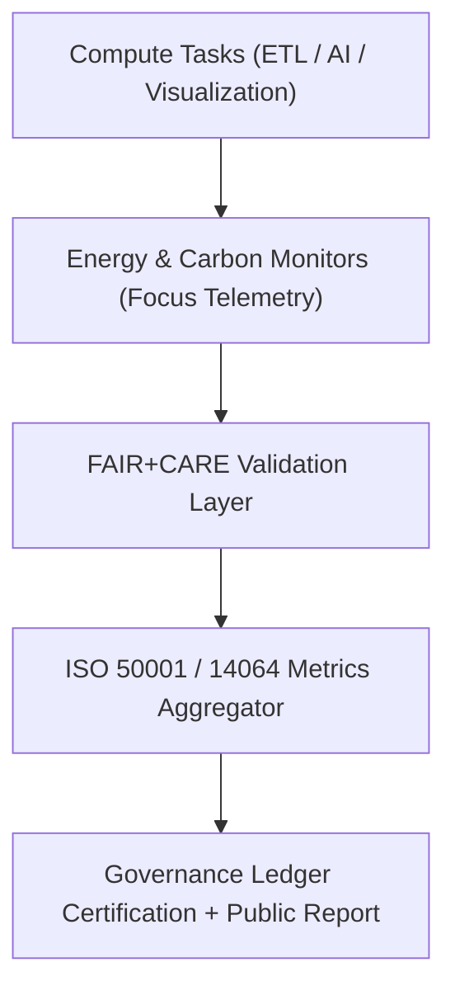
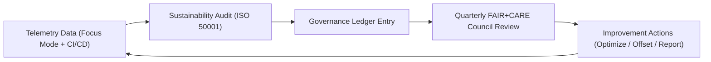

<div align="center">

# 🌱 **Kansas Frontier Matrix — Sustainability Compliance & ISO Energy Governance Framework**
`docs/guides/governance/sustainability-compliance.md`

**Purpose:**  
Define the sustainability governance, **ISO-aligned environmental compliance**, and **energy telemetry auditing** framework for the Kansas Frontier Matrix (KFM).  
Ensures that all workflows — data pipelines, AI models, and visualizations — maintain low carbon intensity, resource efficiency, and full traceability under **FAIR+CARE and MCP-DL v6.3** governance.

[](../../README.md)
[](../../../LICENSE)
[](../../../docs/standards/README.md)
[](../../../releases/)
</div>

---

## 📘 Overview

This guide outlines how the Kansas Frontier Matrix implements **ISO 50001 (Energy Management)** and **ISO 14064 (Carbon Footprint Accounting)** within FAIR+CARE governance.  
It defines the telemetry collection, reporting, and governance verification process for maintaining measurable sustainability across all deployments and compute-intensive tasks.

---

## 🗂️ Directory Context

```plaintext
docs/guides/governance/
├── README.md                             # Governance overview
├── faircare-oversight.md                 # Council & audit leadership
├── governance-ledger-integration.md      # Ledger synchronization framework
├── ethics-audit-protocols.md             # Cultural and ethical data auditing
├── sustainability-compliance.md          # This document
└── reports/                              # Sustainability and ISO audit reports
```

---

## 🧩 Sustainability Architecture



---

## ⚙️ ISO Governance Alignment

| ISO Standard | Scope | Implementation in KFM |
|---------------|--------|------------------------|
| **ISO 50001:2018** | Energy Management Systems | Tracks Joules per workflow and identifies efficiency improvements |
| **ISO 14064-1:2019** | Carbon Accounting | Converts telemetry energy data into carbon equivalents (gCO₂e) |
| **ISO 14001:2015** | Environmental Management | Ensures sustainable infrastructure and operations |
| **ISO 26000:2020** | Social Responsibility | Aligns sustainability with ethics and equity via FAIR+CARE Council |
| **MCP-DL v6.3** | Reproducibility & Provenance | Links energy records to digital signatures and governance ledgers |

---

## 🧮 Example Sustainability Telemetry Record

```json
{
  "telemetry_id": "sustainability-2025-11-09-0003",
  "component": "AI Inference Cluster",
  "metrics": {
    "cpu_usage_percent": 64.8,
    "gpu_usage_percent": 57.3,
    "runtime_seconds": 248,
    "energy_joules": 12.9,
    "carbon_gCO2e": 0.0054
  },
  "iso_certifications": ["ISO 50001", "ISO 14064"],
  "faircare_status": "Pass",
  "auditor": "FAIR+CARE Council",
  "timestamp": "2025-11-09T12:45:00Z"
}
```

---

## ⚖️ FAIR+CARE Sustainability Integration

| Principle | Implementation | Validation Artifact |
|------------|----------------|--------------------|
| **Findable** | Energy metrics indexed via telemetry ID | `focus-telemetry.json` |
| **Accessible** | Open sustainability dashboards (Grafana) | FAIR+CARE public audit |
| **Interoperable** | ISO metrics standardized under JSON schema | `telemetry_schema` |
| **Reusable** | Historical telemetry linked to Governance Ledger | `manifest_ref` |
| **Collective Benefit** | Open reporting of energy and carbon data | FAIR+CARE sustainability audit |
| **Authority to Control** | FAIR+CARE Council validates environmental claims | Governance Ledger |
| **Responsibility** | Continuous telemetry collection and reporting | `telemetry_ref` |
| **Ethics** | Energy optimization balanced with cultural responsibility | `ethics-audit-protocols.md` |

---

## 🧠 Key Sustainability Metrics

| Metric | Description | Target Threshold |
|---------|--------------|------------------|
| **Energy per Job (J)** | Total Joules consumed per workflow | ≤ 15 J |
| **Carbon Intensity (gCO₂e)** | Carbon equivalent emissions | ≤ 0.006 |
| **Renewable Energy Share (%)** | Portion of green power in data centers | ≥ 80% |
| **Efficiency Improvement (%)** | Reduction in energy per job since last audit | ≥ 10% per quarter |
| **Telemetry Coverage (%)** | Workflows with active sustainability tracking | ≥ 95% |

---

## 🧩 Sustainability Validation Workflows

| Workflow | Function | Output |
|-----------|-----------|--------|
| `telemetry-export.yml` | Captures and exports energy + carbon data | `releases/v*/focus-telemetry.json` |
| `faircare-validate.yml` | Ensures environmental sustainability alignment | `reports/faircare/sustainability-audit.json` |
| `ledger-sync.yml` | Commits energy and ISO compliance data to governance ledger | `docs/standards/governance/LEDGER/sustainability-ledger.json` |
| `iso-validate.yml` | Validates telemetry compliance with ISO 50001/14064 | `reports/governance/iso-validation.json` |

---

## 🧾 Example FAIR+CARE Sustainability Audit Report

```json
{
  "audit_id": "faircare-sustainability-2025-11-09-0002",
  "audited_system": "ETL + Visualization Stack",
  "energy_total_joules": 46.7,
  "carbon_total_gCO2e": 0.019,
  "renewable_energy_percent": 82,
  "improvement_since_last_audit_percent": 12.5,
  "faircare_status": "Pass",
  "iso_alignment": ["ISO 50001", "ISO 14064"],
  "auditor": "FAIR+CARE Council",
  "timestamp": "2025-11-09T13:00:00Z"
}
```

---

## ⚙️ Governance Ledger Record Example

```json
{
  "ledger_id": "sustainability-ledger-2025-11-09-0005",
  "system": "MapLibre + API Cluster",
  "energy_joules": 14.8,
  "carbon_gCO2e": 0.0063,
  "iso_certifications": ["ISO 50001", "ISO 14064"],
  "faircare_status": "Pass",
  "auditor": "FAIR+CARE Council",
  "timestamp": "2025-11-09T13:05:00Z"
}
```

---

## 🧩 Continuous Improvement Loop



---

## ⚖️ Environmental & Governance Targets

| Objective | Target | Metric Source |
|------------|---------|----------------|
| **Reduce carbon footprint** | 25% reduction by Q4 2026 | `focus-telemetry.json` |
| **Increase renewable energy** | ≥ 90% infrastructure power mix | Infrastructure telemetry |
| **Improve efficiency per build** | ≥ 15% reduction in average Joules | FAIR+CARE reports |
| **Maintain ISO compliance** | Validated each quarter | `iso-validate.yml` |
| **Audit transparency** | 100% public FAIR+CARE reports | Governance Ledger |

---

## 🕰️ Version History

| Version | Date | Author | Summary |
|----------|------|--------|----------|
| v10.0.0 | 2025-11-09 | Core Team | Added full sustainability governance with ISO 50001/14064 compliance and FAIR+CARE integration |
| v9.7.0  | 2025-11-03 | A. Barta | Introduced initial sustainability audit schema for KFM pipelines |

---

<div align="center">

© 2025 Kansas Frontier Matrix Project  
Master Coder Protocol v6.3 · FAIR+CARE Certified · Diamond⁹ Ω / Crown∞Ω Ultimate Certified  

[Back to Governance Guides](./README.md) · [Governance Charter](../../../docs/standards/governance/ROOT-GOVERNANCE.md)

</div>

