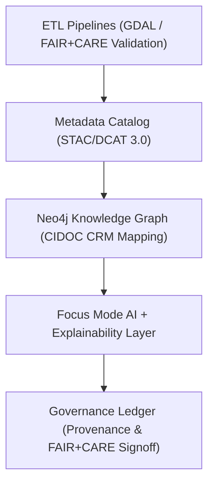

<div align="center">

# 🔗 **Kansas Frontier Matrix — Integration & Interoperability Guides**
`docs/guides/integration/README.md`

**Purpose:**  
Document and standardize **system interoperability, API linkage, and metadata integration** across all Kansas Frontier Matrix (KFM) components.  
Ensures all pipelines — from **STAC/DCAT catalogs** to **Neo4j graph queries** — communicate through FAIR+CARE-compliant standards with traceable governance hooks.

[](../../README.md)
[](../../../LICENSE)
[](../../../docs/standards/README.md)
[](../../../releases/)
</div>

---

## 📘 Overview

The **Integration Guides** define how systems within the Kansas Frontier Matrix interact and exchange data using open standards.  
These documents ensure seamless interoperability between **AI services**, **ETL pipelines**, **metadata catalogs**, and **governance ledgers**, providing transparency and reproducibility under **FAIR+CARE** principles.

---

## 🗂️ Directory Layout

```plaintext
docs/guides/integration/
├── README.md                             # This overview
├── stac-dcat-bridge.md                   # STAC ↔ DCAT metadata translation
├── api-data-flow.md                      # API architecture and data synchronization
├── neo4j-integration.md                  # Knowledge graph interoperability
├── provenance-linking.md                 # Provenance and ledger cross-system linkage
└── reports/                              # Integration validation reports
```

---

## 🧩 Integration Architecture



---

## ⚙️ Core Interoperability Standards

| Layer | Standard | Purpose | Integration Point |
|--------|-----------|----------|-------------------|
| **Metadata Catalogs** | STAC 1.0.0 / DCAT 3.0 | Crosswalks between spatial and open data standards | `stac-dcat-bridge.md` |
| **Knowledge Graph** | CIDOC CRM + JSON-LD | Semantic linking of historical and spatial data | `neo4j-integration.md` |
| **APIs & Services** | OpenAPI 3.1 / REST / WebSocket | Connects ETL, AI, and web components | `api-data-flow.md` |
| **Provenance & Governance** | FAIR+CARE + MCP-DL v6.3 | Traceability and ethical validation across systems | `provenance-linking.md` |

---

## ⚖️ FAIR+CARE Integration Framework

| Principle | Implementation | Validation Artifact |
|------------|----------------|--------------------|
| **Findable** | Persistent URIs and metadata UUIDs | `stac-dcat-bridge.md` |
| **Accessible** | Public endpoints for validated datasets | `api-data-flow.md` |
| **Interoperable** | STAC/DCAT, CIDOC CRM, and FAIR+CARE schema fusion | `neo4j-integration.md` |
| **Reusable** | Data provenance and licensing transparency | `provenance-linking.md` |
| **Collective Benefit** | Promotes open, sustainable knowledge ecosystems | FAIR+CARE audit |
| **Authority to Control** | Community-verified governance signoffs | `ethics-audit-protocols.md` |
| **Responsibility** | Tracks telemetry for interoperability health | `focus-telemetry.json` |
| **Ethics** | Prevents misuse of linked cultural or environmental data | Governance Ledger |

---

## 🧠 Integration Data Flow

| System | Function | Example Output |
|---------|-----------|----------------|
| **STAC/DCAT Catalog** | Metadata interoperability | `data/stac/hydrology.json` → `data/dcat/hydrology-dcat.json` |
| **Neo4j Graph** | Linked entities and provenance paths | Entity → Treaty → Parcel → Watershed |
| **AI Explainability** | Model insights mapped to data lineage | Focus Transformer → SHAP → FAIR+CARE Ledger |
| **Governance Ledger** | Immutable record of all system linkages | `docs/standards/governance/LEDGER/` |

---

## 🧾 Example Provenance Chain Record

```json
{
  "chain_id": "kfm-provenance-2025-11-09-0001",
  "stac_item": "kfm-hydrology-2025-001",
  "neo4j_nodes": ["Place:Kansas River", "Dataset:DEM_2025"],
  "linked_ai_inference": "focus-transformer-v2",
  "governance_ledger_ref": "ledger-2025-11-09-0042",
  "faircare_status": "Pass",
  "timestamp": "2025-11-09T12:00:00Z"
}
```

---

## ⚙️ Validation Workflows

| Workflow | Function | Output |
|-----------|-----------|--------|
| `integration-validate.yml` | Validates API + metadata interoperability | `reports/integration-validation.json` |
| `stac-dcat-validate.yml` | Checks schema translation between catalogs | `reports/stac-dcat-validation.json` |
| `neo4j-sync.yml` | Validates entity and relationship imports | `reports/neo4j-sync.json` |
| `provenance-validate.yml` | Verifies traceability links across systems | `reports/provenance-audit.json` |
| `ledger-sync.yml` | Commits validated cross-links to Governance Ledger | `docs/standards/governance/LEDGER/integration-ledger.json` |

---

## 🧩 Example FAIR+CARE Integration Audit Report

```json
{
  "audit_id": "integration-audit-2025-11-09-0003",
  "audited_systems": [
    "STAC/DCAT Catalog",
    "Neo4j Knowledge Graph",
    "Focus Mode AI"
  ],
  "compliance": {
    "schema_integrity": "Pass",
    "data_linkage": "Verified",
    "governance_traceability": "Confirmed"
  },
  "energy_joules": 8.6,
  "carbon_gCO2e": 0.0039,
  "faircare_status": "Pass",
  "auditor": "FAIR+CARE Council",
  "timestamp": "2025-11-09T12:30:00Z"
}
```

---

## ⚖️ Integration Governance Metrics

| Metric | Target | Validation Source |
|---------|---------|-------------------|
| **Interoperability Coverage** | ≥ 98% of data entities linked | `integration-validate.yml` |
| **Schema Compliance** | 100% STAC/DCAT valid JSON | `stac-dcat-validate.yml` |
| **Neo4j Sync Rate** | ≥ 99% successful imports | `neo4j-sync.yml` |
| **Provenance Traceability** | 100% ledger references linked | `provenance-validate.yml` |
| **FAIR+CARE Compliance** | Pass Required | Governance Ledger |

---

## 🧮 Example Governance Ledger Entry

```json
{
  "ledger_id": "integration-ledger-2025-11-09-0006",
  "linked_systems": ["STAC/DCAT", "Neo4j", "AI Explainability"],
  "sha256": "e91b7f3c2d6e...",
  "faircare_status": "Pass",
  "auditor": "FAIR+CARE Council",
  "timestamp": "2025-11-09T12:45:00Z"
}
```

---

## 🕰️ Version History

| Version | Date | Author | Summary |
|----------|------|--------|----------|
| v10.0.0 | 2025-11-09 | Core Team | Added full interoperability governance guide for STAC/DCAT/Neo4j with FAIR+CARE traceability |
| v9.7.0  | 2025-11-03 | A. Barta | Introduced metadata integration framework and provenance linking structure |

---

<div align="center">

© 2025 Kansas Frontier Matrix Project  
Master Coder Protocol v6.3 · FAIR+CARE Certified · Diamond⁹ Ω / Crown∞Ω Ultimate Certified  

[Back to Guides Index](../README.md) · [Governance Charter](../../../docs/standards/governance/ROOT-GOVERNANCE.md)

</div>

