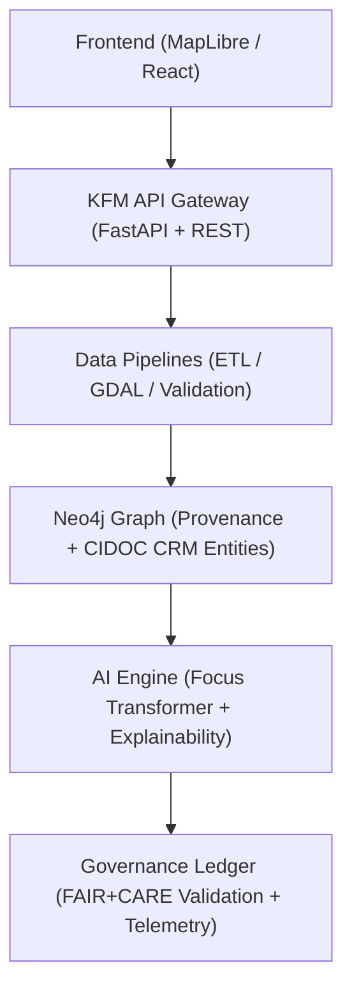
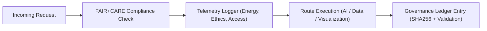

<div align="center">

# 🌐 **Kansas Frontier Matrix — API Data Flow & FAIR+CARE Service Integration Guide**
`docs/guides/integration/api-data-flow.md`

**Purpose:**  
Define and standardize the **data exchange, API architecture, and FAIR+CARE governance integration** across all Kansas Frontier Matrix (KFM) services.  
Ensures all API endpoints—AI, metadata, and visualization—are interoperable, secure, and auditable through the Governance Ledger.

[](../../README.md)
[](../../../LICENSE)
[](../../../docs/standards/README.md)
[](../../../releases/)
</div>

---

## 📘 Overview

This guide defines the **API and data flow architecture** connecting KFM’s AI, ETL, governance, and visualization components.  
It provides a reproducible structure for secure, FAIR+CARE-compliant data sharing between the **FastAPI**, **Neo4j**, and **MapLibre** subsystems with complete telemetry tracking.

---

## 🗂️ Directory Context

```plaintext
docs/guides/integration/
├── README.md                         # Integration overview
├── api-data-flow.md                  # This document
├── stac-dcat-bridge.md               # Metadata catalog translation
├── neo4j-integration.md              # Graph database interoperability
├── provenance-linking.md             # Provenance and ledger cross-system linkage
└── reports/                          # Integration audit reports
```

---

## 🧩 API Architecture Overview



---

## ⚙️ API Categories

| API | Function | Endpoint Prefix | Primary Integration |
|------|-----------|----------------|----------------------|
| **Metadata API** | Access STAC/DCAT catalog and provenance | `/api/metadata` | `stac-dcat-bridge.md` |
| **AI Inference API** | Focus Mode AI reasoning and explainability | `/api/ai` | `graph-augmented-intelligence.md` |
| **Governance API** | FAIR+CARE ledger, audit trails, validation | `/api/governance` | `governance-ledger-integration.md` |
| **Telemetry API** | Sustainability and energy metrics | `/api/telemetry` | `monitoring-and-telemetry.md` |
| **Visualization API** | MapLibre & timeline data provisioning | `/api/visualization` | `maplibre-ui-design.md` |

---

## 🧮 API Data Flow Example

```json
{
  "request_id": "api-dataflow-2025-11-09-0003",
  "route": "/api/ai/inference",
  "input_payload": {
    "context": "Landcover change near 1870 homestead sites",
    "spatial_extent": [-97.5, 38.9, -96.8, 39.3],
    "temporal_range": ["1870-01-01", "1930-12-31"]
  },
  "response": {
    "explanation": "Environmental shift detected: 0.12 NDVI decline",
    "confidence": 0.93,
    "top_factors": ["soil_moisture", "ownership_parcel", "flood_risk"]
  },
  "telemetry": {
    "runtime_ms": 245,
    "energy_joules": 1.4,
    "carbon_gCO2e": 0.0043
  },
  "faircare_status": "Pass",
  "timestamp": "2025-11-09T12:00:00Z"
}
```

---

## ⚖️ FAIR+CARE API Integration

| Principle | Implementation | Validation Artifact |
|------------|----------------|--------------------|
| **Findable** | Endpoints documented in OpenAPI 3.1 spec | `/openapi.json` |
| **Accessible** | Public routes follow secure FAIR+CARE access rules | API Gateway Logs |
| **Interoperable** | Uses JSON-LD + STAC/DCAT schemas | `stac-dcat-bridge.md` |
| **Reusable** | Responses versioned with SBOM provenance | `manifest_ref` |
| **Collective Benefit** | APIs provide public-good historical and environmental insights | FAIR+CARE Audit |
| **Authority to Control** | CARE-based restrictions on cultural data | `ethics-audit-protocols.md` |
| **Responsibility** | Telemetry tracking for each API call | `telemetry_ref` |
| **Ethics** | Governance checks validate requests before execution | Governance Middleware |

---

## ⚙️ Governance Middleware Workflow



---

## 🧾 Example FAIR+CARE Governance Log

```json
{
  "log_id": "governance-api-2025-11-09-001",
  "endpoint": "/api/governance/ledger",
  "user_role": "Data Steward",
  "action": "Append Ledger Record",
  "validation_result": "Pass",
  "energy_joules": 0.78,
  "carbon_gCO2e": 0.0031,
  "faircare_status": "Pass",
  "auditor": "FAIR+CARE Council",
  "timestamp": "2025-11-09T12:20:00Z"
}
```

---

## 🧠 API Telemetry & Monitoring

| Metric | Description | Target |
|---------|--------------|--------|
| **Latency (ms)** | Average response time per API | ≤ 300 |
| **Energy (J)** | Energy consumed per request | ≤ 2.0 |
| **Carbon (gCO₂e)** | Equivalent emissions | ≤ 0.005 |
| **Uptime (%)** | Service availability | ≥ 99.5 |
| **FAIR+CARE Compliance (%)** | Governance audit pass rate | 100 |

---

## 🧩 API Security & Governance

| Control | Description | FAIR+CARE Integration |
|----------|--------------|------------------------|
| **Role-Based Access (RBAC)** | Limits sensitive data operations to approved roles | CARE oversight enforcement |
| **Rate Limiting** | Prevents compute-intensive misuse | FAIR+CARE performance guardrail |
| **Telemetry Hooks** | Embedded in API middleware | Energy and sustainability audit logs |
| **Governance Tokens** | Signed requests tied to ledger entries | Governance verification chain |

---

## 🧾 Governance Ledger Record Example

```json
{
  "ledger_id": "api-ledger-2025-11-09-0009",
  "component": "API Gateway",
  "validated_endpoints": ["/api/metadata", "/api/ai", "/api/governance"],
  "faircare_status": "Pass",
  "auditor": "FAIR+CARE Council",
  "energy_joules": 7.9,
  "carbon_gCO2e": 0.0034,
  "timestamp": "2025-11-09T12:30:00Z"
}
```

---

## ⚙️ CI/CD Integration Workflows

| Workflow | Function | Output |
|-----------|-----------|--------|
| `api-test.yml` | Runs unit and integration API tests | `reports/integration/api-test-results.json` |
| `api-faircare-validate.yml` | Ensures all endpoints follow FAIR+CARE | `reports/faircare/api-validation.json` |
| `telemetry-export.yml` | Records API performance metrics | `releases/v*/focus-telemetry.json` |
| `ledger-sync.yml` | Logs API activity to governance ledger | `docs/standards/governance/LEDGER/api-ledger.json` |

---

## 🕰️ Version History

| Version | Date | Author | Summary |
|----------|------|--------|----------|
| v10.0.0 | 2025-11-09 | Core Team | Created FAIR+CARE-compliant API data flow guide with telemetry and governance middleware |
| v9.7.0  | 2025-11-03 | A. Barta | Added initial API linkage between AI, ETL, and metadata systems |

---

<div align="center">

© 2025 Kansas Frontier Matrix Project  
Master Coder Protocol v6.3 · FAIR+CARE Certified · Diamond⁹ Ω / Crown∞Ω Ultimate Certified  

[Back to Integration Guides](./README.md) · [Governance Charter](../../../docs/standards/governance/ROOT-GOVERNANCE.md)

</div>

