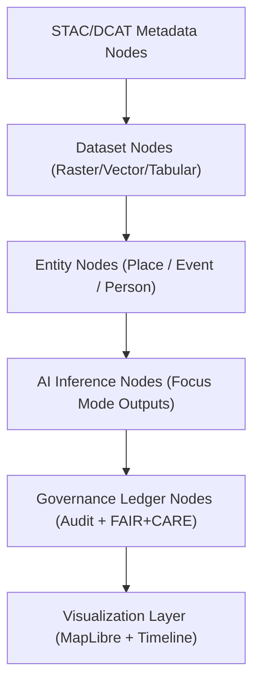
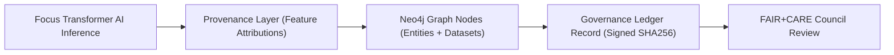

<div align="center">

# 🧠 **Kansas Frontier Matrix — Neo4j Integration & Knowledge Graph Interoperability Guide**
`docs/guides/integration/neo4j-integration.md`

**Purpose:**  
Define the data model, interoperability framework, and governance integration of **Neo4j Knowledge Graphs** within the Kansas Frontier Matrix (KFM).  
Ensures FAIR+CARE-aligned linking between **historical records**, **environmental datasets**, and **AI reasoning outputs** via **CIDOC CRM** and **DCAT 3.0** standards.

[](../../README.md)
[](../../../LICENSE)
[](../../../docs/standards/README.md)
[](../../../releases/)
</div>

---

## 📘 Overview

This guide documents how **Neo4j** is used to model and query KFM’s interconnected data ecosystem.  
The Knowledge Graph enables FAIR+CARE-compliant linking of:
- Historical treaties, sites, and land records  
- Environmental datasets (hydrology, terrain, climate)  
- AI explainability and provenance data  
- Governance and audit trail nodes  

All graph relationships conform to **CIDOC CRM** (Cultural Heritage Ontology) and FAIR+CARE ethical principles.

---

## 🗂️ Directory Context

```plaintext
docs/guides/integration/
├── README.md                        # Integration overview
├── neo4j-integration.md             # This document
├── api-data-flow.md                 # API and data exchange documentation
├── stac-dcat-bridge.md              # STAC ↔ DCAT metadata mapping
├── provenance-linking.md            # Provenance and ledger relationships
└── reports/                         # Graph validation and sync reports
```

---

## 🧩 Graph Architecture



---

## ⚙️ Data Model Structure (CIDOC CRM-Aligned)

| Node Type | Label | Description | Example Property |
|------------|--------|-------------|------------------|
| **Dataset** | `Dataset` | Represents a dataset from STAC/DCAT | `title`, `license`, `spatial_extent` |
| **Entity** | `E53_Place` / `E21_Person` | Real-world object or person | `name`, `location`, `period` |
| **Event** | `E5_Event` | Historical or environmental occurrence | `date`, `description`, `impact` |
| **AI Inference** | `Inference` | AI reasoning result with explainability | `model`, `confidence`, `explanation` |
| **Ledger Record** | `Ledger` | Governance or audit node | `sha256`, `faircare_status`, `timestamp` |

---

## 🧮 Example Graph Data Record

```json
{
  "dataset_id": "kfm-hydrology-2025-001",
  "entity": {
    "type": "E53_Place",
    "name": "Kansas River Basin"
  },
  "event": {
    "type": "E5_Event",
    "description": "Flood risk analysis conducted in 1870"
  },
  "inference": {
    "model": "focus-transformer-v2",
    "confidence": 0.92,
    "top_features": ["soil_moisture", "elevation", "river_distance"]
  },
  "ledger": {
    "sha256": "b29a3f65a2c...",
    "faircare_status": "Pass",
    "timestamp": "2025-11-09T12:00:00Z"
  }
}
```

---

## ⚖️ FAIR+CARE Integration Mapping

| Principle | Implementation | Validation Artifact |
|------------|----------------|--------------------|
| **Findable** | Nodes indexed with UUIDs, dataset IDs, and URIs | `neo4j-sync.json` |
| **Accessible** | Graph endpoints available via REST + Cypher | `/api/graph` |
| **Interoperable** | CIDOC CRM & DCAT schema alignment | `telemetry_schema` |
| **Reusable** | Exportable via JSON-LD and FAIR+CARE metadata | `manifest_ref` |
| **Collective Benefit** | Promotes cultural and environmental research collaboration | FAIR+CARE audit report |
| **Authority to Control** | Indigenous entities control data visibility | `ethics-audit-protocols.md` |
| **Responsibility** | Sustainability telemetry linked to graph operations | `focus-telemetry.json` |
| **Ethics** | Governance ledger entries verified before node creation | `governance-ledger-integration.md` |

---

## ⚙️ Cypher Example: FAIR+CARE Query

```cypher
MATCH (d:Dataset)-[:RELATED_TO]->(e:E53_Place)
WHERE d.faircare_status = 'Pass'
RETURN d.title AS Dataset, e.name AS Place, d.license AS License, d.sha256 AS Hash
ORDER BY e.name;
```

---

## 🧾 Example Graph Export (JSON-LD)

```json
{
  "@context": "https://www.cidoc-crm.org/cidoc-crm/",
  "@type": "E53_Place",
  "name": "Prairie Band Potawatomi Reservation",
  "relatedDataset": {
    "@type": "Dataset",
    "title": "Generalized Archaeological Sites of NE Kansas",
    "license": "CC BY-NC 4.0",
    "governance": {
      "faircareStatus": "Pass",
      "ledgerHash": "91d7a3efb...",
      "audit": "FAIR+CARE Council"
    }
  }
}
```

---

## 🧩 Graph Telemetry Metrics

| Metric | Description | Target |
|---------|--------------|---------|
| **Node Count (Datasets)** | Number of STAC/DCAT-linked datasets | ≥ 5,000 |
| **Relationship Integrity (%)** | Ratio of valid vs. broken links | ≥ 99% |
| **Energy per Query (J)** | Energy consumed by query execution | ≤ 0.005 |
| **Carbon Output (gCO₂e)** | Emission equivalent | ≤ 0.002 |
| **FAIR+CARE Compliance** | Required for public graph nodes | 100% |

---

## ⚙️ Validation Workflows

| Workflow | Function | Output |
|-----------|-----------|--------|
| `neo4j-sync.yml` | Validates node creation and relationship integrity | `reports/neo4j-sync.json` |
| `graph-validate.yml` | Checks CIDOC CRM and FAIR+CARE conformance | `reports/graph-validation.json` |
| `ledger-sync.yml` | Updates graph ledger entries post-validation | `docs/standards/governance/LEDGER/graph-ledger.json` |
| `faircare-validate.yml` | Ensures all graph data follow FAIR+CARE standards | `reports/faircare/graph-audit.json` |

---

## 🧾 Example Governance Ledger Record

```json
{
  "ledger_id": "graph-ledger-2025-11-09-001",
  "component": "Neo4j Graph Integration",
  "nodes_synced": 18234,
  "relationships_validated": 100,
  "energy_joules": 14.2,
  "carbon_gCO2e": 0.0059,
  "faircare_status": "Pass",
  "auditor": "FAIR+CARE Council",
  "timestamp": "2025-11-09T12:30:00Z"
}
```

---

## 🧠 Neo4j + AI Integration Flow



---

## 🕰️ Version History

| Version | Date | Author | Summary |
|----------|------|--------|----------|
| v10.0.0 | 2025-11-09 | Core Team | Introduced FAIR+CARE-aligned Neo4j integration with CIDOC CRM and ledger synchronization |
| v9.7.0  | 2025-11-03 | A. Barta | Added baseline knowledge graph model and provenance linkage workflow |

---

<div align="center">

© 2025 Kansas Frontier Matrix Project  
Master Coder Protocol v6.3 · FAIR+CARE Certified · Diamond⁹ Ω / Crown∞Ω Ultimate Certified  

[Back to Integration Guides](./README.md) · [Governance Charter](../../../docs/standards/governance/ROOT-GOVERNANCE.md)

</div>

