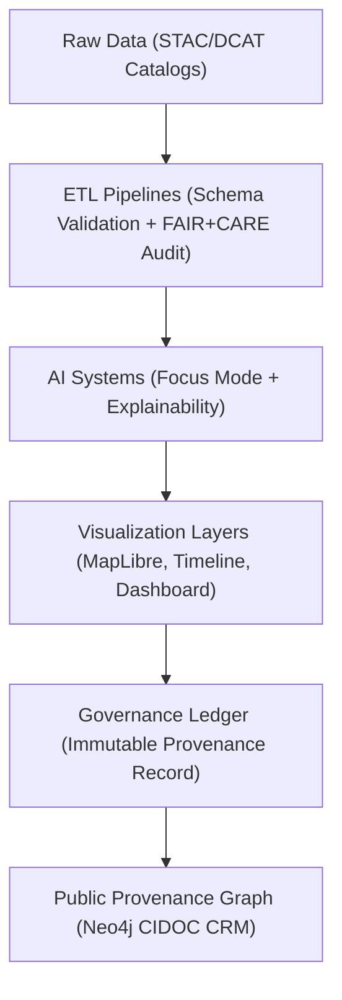

<div align="center">

# 🧬 **Kansas Frontier Matrix — Provenance Linking & Cross-System Traceability Guide**
`docs/guides/integration/provenance-linking.md`

**Purpose:**  
Define the **provenance tracing, cross-system lineage mapping, and FAIR+CARE governance linkage** processes for the Kansas Frontier Matrix (KFM).  
This ensures every dataset, AI inference, and visualization can be traced back to its source with verifiable ethics, energy, and validation metadata.

[](../../README.md)
[](../../../LICENSE)
[](../../../docs/standards/README.md)
[](../../../releases/)
</div>

---

## 📘 Overview

The **Provenance Linking Framework** establishes verifiable chains of custody between **data ingestion**, **AI reasoning**, and **governance validation** within the Kansas Frontier Matrix.  
It combines **FAIR+CARE metadata**, **Neo4j graph relations**, and **Governance Ledger** records to ensure ethical traceability and technical reproducibility.

Core Objectives:
- Link all derived outputs (AI, visualization, metadata) to original datasets  
- Log provenance chains in the Governance Ledger using SHA256 integrity hashes  
- Ensure FAIR+CARE ethics metadata persists across all transformations  
- Automate validation and audit workflows for long-term accountability  

---

## 🗂️ Directory Context

```plaintext
docs/guides/integration/
├── README.md                        # Integration overview
├── provenance-linking.md             # This document
├── stac-dcat-bridge.md               # Metadata bridge between STAC and DCAT
├── neo4j-integration.md              # Knowledge graph integration
├── api-data-flow.md                  # Service-level interoperability
└── reports/                          # Provenance validation reports
```

---

## 🧩 Provenance Architecture



---

## ⚙️ Provenance Data Model

| Element | Description | Source |
|----------|--------------|--------|
| **Dataset ID** | Unique dataset identifier (STAC/DCAT UUID) | `data/stac/*.json` |
| **Ingestion Pipeline** | Script or workflow responsible for dataset generation | `src/pipelines/etl/` |
| **AI Model Reference** | Model producing downstream inference | `src/ai/models/focus_transformer_v2/` |
| **Transformation Chain** | Chronological sequence of processing stages | Governance Ledger |
| **Ledger Hash** | SHA256 checksum ensuring artifact immutability | `docs/standards/governance/LEDGER/` |
| **FAIR+CARE Status** | Ethical and sustainability compliance result | FAIR+CARE Council Audit |

---

## 🧾 Example Provenance Record

```json
{
  "provenance_id": "kfm-provenance-2025-11-09-0005",
  "dataset_source": "kfm-hydrology-2025-001",
  "etl_pipeline": "src/pipelines/etl/hydrology/process_rasters.py",
  "derived_output": "data/processed/hydrology/watershed_stats.parquet",
  "ai_model_used": "focus-transformer-v2",
  "visualization": "MapLibre Proximity Dashboard",
  "governance_ledger_hash": "f9d13a73b27d...",
  "energy_joules": 12.4,
  "carbon_gCO2e": 0.0051,
  "faircare_status": "Pass",
  "auditor": "FAIR+CARE Council",
  "timestamp": "2025-11-09T12:20:00Z"
}
```

---

## ⚖️ FAIR+CARE Provenance Integration

| Principle | Implementation | Validation Artifact |
|------------|----------------|--------------------|
| **Findable** | Every artifact linked to Governance Ledger via UUID | `ledger-sync.json` |
| **Accessible** | Provenance reports stored in open repository | `reports/provenance-audit.json` |
| **Interoperable** | Neo4j + STAC/DCAT metadata harmonization | `neo4j-integration.md` |
| **Reusable** | Reproducible ETL pipelines + provenance metadata | `manifest_ref` |
| **Collective Benefit** | Promotes transparent, community-beneficial traceability | FAIR+CARE audit |
| **Authority to Control** | Cultural entities control publication of sensitive provenance | `ethics-audit-protocols.md` |
| **Responsibility** | Tracks sustainability and consent through transformations | `focus-telemetry.json` |
| **Ethics** | Requires FAIR+CARE validation before public release | Governance Ledger entry |

---

## 🧮 Provenance Validation Metrics

| Metric | Description | Target |
|---------|--------------|---------|
| **Chain Completeness (%)** | Number of outputs with full traceability | ≥ 99% |
| **Ledger Link Integrity (%)** | Validation of governance hashes | 100% |
| **Energy per Workflow (J)** | Joules consumed per complete chain | ≤ 15 |
| **Carbon Emissions (gCO₂e)** | Equivalent footprint per chain | ≤ 0.006 |
| **FAIR+CARE Compliance** | Required for all provenance links | 100% |

---

## ⚙️ Validation Workflows

| Workflow | Function | Output |
|-----------|-----------|--------|
| `provenance-validate.yml` | Checks dataset → AI → visualization linkage integrity | `reports/provenance-audit.json` |
| `ledger-sync.yml` | Appends validated provenance hashes to ledger | `docs/standards/governance/LEDGER/provenance-ledger.json` |
| `faircare-validate.yml` | Runs FAIR+CARE validation on provenance records | `reports/faircare/provenance-validation.json` |
| `neo4j-sync.yml` | Verifies cross-graph provenance relationships | `reports/neo4j-sync.json` |

---

## 🧩 Governance Ledger Example Record

```json
{
  "ledger_id": "provenance-ledger-2025-11-09-001",
  "linked_entities": [
    "dataset:kfm-hydrology-2025-001",
    "model:focus-transformer-v2",
    "visualization:maplibre-hydrology"
  ],
  "chain_integrity": "Complete",
  "energy_joules": 13.1,
  "carbon_gCO2e": 0.0054,
  "faircare_status": "Pass",
  "auditor": "FAIR+CARE Council",
  "timestamp": "2025-11-09T12:45:00Z"
}
```

---

## 🧠 Provenance Graph Query Example (Cypher)

```cypher
MATCH (d:Dataset)-[:DERIVED_IN]->(m:Model)-[:VISUALIZED_AS]->(v:Visualization)
WHERE d.faircare_status = 'Pass'
RETURN d.id AS Dataset, m.name AS Model, v.component AS Visualization, d.sha256 AS Hash;
```

---

## ⚙️ Transparency & Public Access

- All provenance chains are stored as **JSON-LD FAIR+CARE records**  
- Records include **digital signatures** and **immutable hashes**  
- FAIR+CARE Council reviews provenance linkages quarterly  
- Sensitive cultural datasets follow **CARE data control workflows** before release  

---

## 🕰️ Version History

| Version | Date | Author | Summary |
|----------|------|--------|----------|
| v10.0.0 | 2025-11-09 | Core Team | Added complete provenance traceability and FAIR+CARE integration guide |
| v9.7.0  | 2025-11-03 | A. Barta | Introduced provenance validation and ledger synchronization workflows |

---

<div align="center">

© 2025 Kansas Frontier Matrix Project  
Master Coder Protocol v6.3 · FAIR+CARE Certified · Diamond⁹ Ω / Crown∞Ω Ultimate Certified  

[Back to Integration Guides](./README.md) · [Governance Charter](../../../docs/standards/governance/ROOT-GOVERNANCE.md)

</div>

