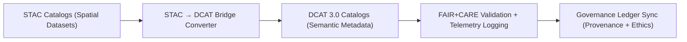

<div align="center">

# 🌐 **Kansas Frontier Matrix — STAC ↔ DCAT Metadata Bridge & FAIR+CARE Interoperability Framework**
`docs/guides/integration/stac-dcat-bridge.md`

**Purpose:**  
Establish the **translation logic**, **schema mapping**, and **governance synchronization** between **STAC 1.0.0** (SpatioTemporal Asset Catalog) and **DCAT 3.0** (W3C Data Catalog Vocabulary).  
Ensures FAIR+CARE-compliant metadata interoperability and dataset traceability across the Kansas Frontier Matrix (KFM) ecosystem.

[](../../README.md)
[](../../../LICENSE)
[](../../../docs/standards/README.md)
[](../../../releases/)
</div>

---

## 📘 Overview

The **STAC ↔ DCAT Bridge** serves as KFM’s metadata interoperability backbone, connecting spatial datasets with open data catalog standards.  
It enables seamless exchange between **geospatial metadata (STAC)** and **FAIR-aligned semantic metadata (DCAT)**, preserving provenance, sustainability, and ethical governance metadata under FAIR+CARE.

Core objectives:
- Synchronize dataset metadata across KFM components  
- Maintain compatibility with STAC 1.0.0, DCAT 3.0, and CIDOC CRM vocabularies  
- Include FAIR+CARE governance and energy telemetry fields in both schema formats  

---

## 🗂️ Directory Context

```plaintext
docs/guides/integration/
├── README.md                          # Integration overview
├── stac-dcat-bridge.md                # This document
├── api-data-flow.md                   # API data exchange integration
├── neo4j-integration.md               # Knowledge graph linking
├── provenance-linking.md              # Provenance & ledger traceability
└── reports/                           # Metadata interoperability audits
```

---

## 🧩 STAC ↔ DCAT Field Mapping

| STAC Field | DCAT Field | Description |
|-------------|------------|--------------|
| `id` | `dct:identifier` | Unique dataset identifier |
| `stac_version` | `dct:conformsTo` | Metadata schema version |
| `description` | `dct:description` | Dataset abstract |
| `properties.license` | `dct:license` | Dataset license (SPDX or CC) |
| `properties.datetime` | `dct:temporal` | Temporal extent (start/end dates) |
| `bbox` | `dct:spatial` | Spatial extent (bounding box) |
| `links` | `dcat:distribution` | Related assets and metadata references |
| `assets` | `dcat:distribution` | Individual data assets (raster/vector files) |
| `providers` | `dct:publisher` | Data provider or organization |
| `keywords` | `dcat:theme` | Thematic tags or classifications |
| `faircare` | `dct:rights` | FAIR+CARE ethical compliance field |
| `provenance` | `dct:provenance` | Lineage and governance record reference |

---

## ⚙️ Example Conversion (STAC → DCAT)

```bash
python src/pipelines/metadata_bridge/convert_stac_to_dcat.py \
  --input data/stac/hydrology.json \
  --output data/dcat/hydrology-dcat.json \
  --mapping src/pipelines/metadata_bridge/stac_dcat_map.yaml
```

**Output Example (DCAT 3.0)**

```json
{
  "@context": "https://www.w3.org/ns/dcat3.jsonld",
  "id": "kfm-hydrology-2025-001",
  "type": "Dataset",
  "title": "Kansas Hydrology & Terrain 2025",
  "description": "Derived hydrology dataset of Kansas rivers and DEM tiles.",
  "spatial": {
    "bbox": [-102.05, 37.0, -94.6, 40.0],
    "crs": "EPSG:4326"
  },
  "temporal": {
    "startDate": "2025-01-01T00:00:00Z",
    "endDate": "2025-11-09T00:00:00Z"
  },
  "license": "CC-BY 4.0",
  "provenance": {
    "wasGeneratedBy": "src/pipelines/etl/hydrology/flow_accumulation.py",
    "sha256": "4fe3e7c5...",
    "faircareStatus": "Pass"
  },
  "rights": "FAIR+CARE compliant; community-reviewed",
  "distribution": [
    {
      "downloadURL": "https://data.kfm.org/hydrology/hydro_raster.tif",
      "mediaType": "image/tiff; application=geotiff"
    }
  ]
}
```

---

## 🧾 FAIR+CARE Integration Matrix

| Principle | Implementation | Validation Artifact |
|------------|----------------|--------------------|
| **Findable** | Catalogs indexed by UUID and temporal metadata | `stac-dcat-validation.json` |
| **Accessible** | Publicly available metadata under open license | `data/dcat/` |
| **Interoperable** | Harmonized STAC/DCAT metadata schemas | `telemetry_schema` |
| **Reusable** | Metadata export includes provenance and ledger hashes | `sbom_ref` |
| **Collective Benefit** | Encourages open sharing of spatial heritage data | FAIR+CARE audit |
| **Authority to Control** | CARE validation for sensitive datasets | `ethics-audit-protocols.md` |
| **Responsibility** | Telemetry and FAIR+CARE status embedded | `focus-telemetry.json` |
| **Ethics** | Ledger links guarantee cultural and ethical oversight | `governance-ledger-integration.md` |

---

## ⚙️ Validation Workflows

| Workflow | Function | Output |
|-----------|-----------|--------|
| `stac-dcat-validate.yml` | Validates mapping between STAC and DCAT schemas | `reports/stac-dcat-validation.json` |
| `metadata-validate.yml` | Checks completeness of STAC/DCAT metadata | `reports/metadata-validation.json` |
| `faircare-validate.yml` | Audits FAIR+CARE ethical compliance | `reports/faircare/metadata-audit.json` |
| `ledger-sync.yml` | Updates provenance and validation hashes in ledger | `docs/standards/governance/LEDGER/metadata-ledger.json` |

---

## 🧮 Example STAC ↔ DCAT Validation Report

```json
{
  "report_id": "stac-dcat-validate-2025-11-09-0002",
  "validated_datasets": 128,
  "schema_compatibility": "Pass",
  "metadata_integrity": 100,
  "energy_joules": 6.7,
  "carbon_gCO2e": 0.0029,
  "faircare_status": "Pass",
  "auditor": "FAIR+CARE Council",
  "timestamp": "2025-11-09T12:40:00Z"
}
```

---

## ⚖️ Governance Ledger Record Example

```json
{
  "ledger_id": "metadata-ledger-2025-11-09-0007",
  "component": "STAC ↔ DCAT Metadata Bridge",
  "datasets_validated": 128,
  "faircare_status": "Pass",
  "energy_joules": 6.7,
  "carbon_gCO2e": 0.0029,
  "auditor": "FAIR+CARE Council",
  "timestamp": "2025-11-09T12:45:00Z"
}
```

---

## 🧠 Metadata Integration Flow



---

## 🕰️ Version History

| Version | Date | Author | Summary |
|----------|------|--------|----------|
| v10.0.0 | 2025-11-09 | Core Team | Added FAIR+CARE-aligned STAC↔DCAT bridge documentation with telemetry integration |
| v9.7.0  | 2025-11-03 | A. Barta | Introduced metadata bridge schema and initial validation logic |

---

<div align="center">

© 2025 Kansas Frontier Matrix Project  
Master Coder Protocol v6.3 · FAIR+CARE Certified · Diamond⁹ Ω / Crown∞Ω Ultimate Certified  

[Back to Integration Guides](./README.md) · [Governance Charter](../../../docs/standards/governance/ROOT-GOVERNANCE.md)

</div>

