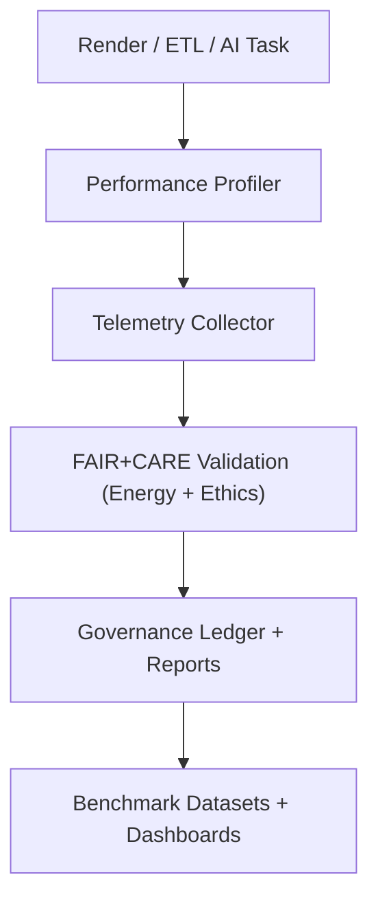

<div align="center">

# ⚙️ **Kansas Frontier Matrix — Performance Optimization Guides Overview**
`docs/guides/perf/README.md`

**Purpose:**  
Centralized documentation for **system, rendering, and pipeline performance tuning** across the Kansas Frontier Matrix (KFM).  
These guides focus on **render profiling**, **tile optimization**, **ETL efficiency**, and **AI inference sustainability**—integrating metrics under the **FAIR+CARE and MCP-DL v6.3** frameworks.

[](../../README.md)
[](../../../LICENSE)
[](../../../docs/standards/README.md)
[](../../../releases/)
</div>

---

## 📘 Overview

The **Performance Guides** directory defines standards and best practices for ensuring **energy-efficient**, **high-throughput**, and **low-latency** workflows within the KFM system.  
Each document focuses on profiling and optimizing different subsystems—geospatial rendering, data pipelines, and AI inference—while maintaining FAIR+CARE transparency and sustainability metrics.

---

## 🗂️ Directory Layout

```plaintext
docs/guides/perf/
├── README.md                              # This overview
├── maplibre-rendering-playbook.md         # Rendering and cache optimization
├── gdal-3.12-upgrade.md                   # Raster/vector ETL performance improvements
├── telemetry-profiling.md                 # Benchmarking & telemetry correlation
└── reports/                               # Benchmark summaries & validation outputs
```

---

## 🧩 Performance Domains

| Domain | Focus Area | Example File |
|--------|-------------|--------------|
| **Rendering** | Optimize MapLibre + PMTiles rendering | `maplibre-rendering-playbook.md` |
| **Geoprocessing** | Tune GDAL/OGR performance & cache use | `gdal-3.12-upgrade.md` |
| **Telemetry & Profiling** | Collect runtime metrics for reproducibility | `telemetry-profiling.md` |
| **Energy Efficiency** | Track Joules/inference + CI energy footprint | `focus-telemetry.json` |

---

## ⚙️ Performance Monitoring Architecture



---

## 🧮 Example Telemetry Metrics

| Metric | Description | Unit | Source |
|---------|--------------|------|---------|
| **P90 Frame Time** | 90th percentile render latency | ms | MapLibre Profiler |
| **CPU Utilization** | Processor usage during ETL | % | CI Job Metrics |
| **GPU Load** | GPU draw and memory occupancy | % | Browser DevTools |
| **Energy Consumption** | Energy used per task | Joules | Focus Telemetry |
| **Carbon Output** | Emissions equivalence per run | gCO₂e | FAIR+CARE Audit |

---

## 🧾 FAIR+CARE Integration

| Principle | Implementation | Validation Artifact |
|------------|----------------|--------------------|
| **Findable** | All benchmarks recorded in reports & telemetry | `reports/perf/` |
| **Accessible** | Results open under MIT license | Repository-hosted JSON |
| **Interoperable** | JSON Schema + FAIR telemetry API | `telemetry_schema` |
| **Reusable** | Energy and performance trends reusable for research | `focus-telemetry.json` |
| **Collective Benefit** | Promotes eco-efficient scientific computing | FAIR+CARE audit |
| **Authority to Control** | Governance Council reviews sustainability data | `governance_ref` |
| **Responsibility** | Tracks carbon intensity and runtime ethics | `telemetry_ref` |
| **Ethics** | Validates sustainability against ISO 50001 | CI Sustainability Audit |

---

## 📊 Example Performance Report

```json
{
  "report_id": "render-benchmark-2025-11-09",
  "component": "MapLibre GL",
  "hardware": "Mac M1 Pro",
  "metrics": {
    "p50_ms": 11.3,
    "p90_ms": 15.8,
    "p99_ms": 21.7,
    "fps": 60,
    "energy_joules": 1.21,
    "carbon_gCO2e": 0.004
  },
  "telemetry_ref": "../../../releases/v10.0.0/focus-telemetry.json",
  "timestamp": "2025-11-09T12:00:00Z"
}
```

---

## 🧩 Validation & CI/CD Workflows

| Workflow | Function | Output |
|-----------|-----------|--------|
| `geo-upgrade-validate.yml` | GDAL upgrade regression tests | `reports/geo/gdal-3.12/cli-checks.json` |
| `maplibre-benchmark.yml` | Rendering frame-time and FPS benchmarking | `reports/perf/maplibre-profiles.json` |
| `telemetry-export.yml` | Aggregate performance metrics | `releases/v*/focus-telemetry.json` |
| `energy-monitor.yml` | Record ISO 50001 energy compliance | `reports/perf/energy-audit.json` |

---

## ⚖️ Governance & Sustainability Hooks

All performance metrics are:
- Logged in **focus-telemetry.json**  
- Audited under FAIR+CARE Council sustainability review  
- Integrated into **Governance Ledger** for transparency  
- Used to calibrate future **AI and geospatial optimizations**

**Audit Criteria**
- P90 frame time ≤ 20 ms  
- Carbon emissions ≤ 0.005 gCO₂e / inference  
- Energy efficiency ≥ 90% compute utilization  

---

## 🕰️ Version History

| Version | Date | Author | Summary |
|----------|------|--------|----------|
| v10.0.0 | 2025-11-09 | Core Team | Created centralized performance guide with FAIR+CARE telemetry governance |
| v9.7.0 | 2025-11-03 | A. Barta | Added GDAL and rendering optimization baselines |

---

<div align="center">

© 2025 Kansas Frontier Matrix Project  
Master Coder Protocol v6.3 · FAIR+CARE Certified · Diamond⁹ Ω / Crown∞Ω Ultimate Certified  

[Back to Guides Index](../README.md) · [Governance Charter](../../../docs/standards/governance/ROOT-GOVERNANCE.md)

</div>

