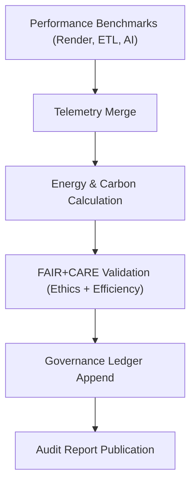

<div align="center">

# 📊 **Kansas Frontier Matrix — Performance Reports & FAIR+CARE Telemetry Summaries**
`docs/guides/perf/reports/README.md`

**Purpose:**  
Aggregate and publish all **performance benchmarking reports**, **energy metrics**, and **FAIR+CARE-compliant telemetry summaries** for KFM’s rendering, ETL, and AI subsystems.  
Provides transparency in performance outcomes and environmental accountability under **MCP-DL v6.3** governance.

[](../../../README.md)
[](../../../../../LICENSE)
[](../../../../../docs/standards/README.md)
[](../../../../../releases/)
</div>

---

## 📘 Overview

This directory archives **machine-generated performance reports** for all major KFM processes:
- **Map rendering benchmarks** (MapLibre + PMTiles)  
- **GDAL / ETL CLI tests** (raster + vector pipelines)  
- **AI inference and explainability performance**  
- **Energy and sustainability telemetry audits**

Reports are validated automatically through CI/CD, signed via checksum, and appended to the FAIR+CARE governance ledger.

---

## 🗂️ Directory Layout

```plaintext
docs/guides/perf/reports/
├── README.md                              # This documentation
├── maplibre-benchmarks.json               # Map rendering FPS & frame latency
├── gdal-cli-checks.json                   # GDAL CLI umbrella benchmark results
├── ai-inference-metrics.json              # Focus Transformer & GAI performance stats
├── energy-audit.json                      # ISO 50001/14064 sustainability audit
├── telemetry-summary.json                 # Aggregated telemetry from all systems
└── ledger-sync.json                       # FAIR+CARE ledger sync report
```

---

## ⚙️ Report Schema (Unified)

| Field | Description | Example |
|--------|-------------|----------|
| `report_id` | Unique identifier | `"perf-report-2025-11-09-001"` |
| `component` | Subsystem benchmarked | `"MapLibre Renderer"` |
| `metrics` | Performance measurements | `{ "fps": 60, "p90_ms": 16.2, "cpu_percent": 65 }` |
| `energy_metrics` | Energy and carbon telemetry | `{ "joules": 1.14, "carbon_gCO2e": 0.004 }` |
| `faircare_status` | FAIR+CARE audit result | `"Pass"` |
| `auditor` | Reviewer (FAIR+CARE Council or CI) | `"Governance Ops Team"` |
| `timestamp` | UTC report creation time | `"2025-11-09T12:00:00Z"` |

---

## 🧮 Example Performance Report

```json
{
  "report_id": "perf-report-2025-11-09-0007",
  "component": "GDAL CLI Umbrella",
  "metrics": {
    "raster_zonal_stats_ms": 8200,
    "vector_clean_ms": 4100,
    "cpu_util": 84.5,
    "memory_mb": 512
  },
  "energy_metrics": {
    "joules": 1.21,
    "carbon_gCO2e": 0.0041
  },
  "faircare_status": "Pass",
  "auditor": "FAIR+CARE Council",
  "timestamp": "2025-11-09T12:30:00Z"
}
```

---

## ⚖️ FAIR+CARE Integration

| Principle | Implementation | Evidence Artifact |
|------------|----------------|------------------|
| **Findable** | Reports indexed by component + date | `telemetry-summary.json` |
| **Accessible** | Published under open MIT license | Repository JSON reports |
| **Interoperable** | Schema `perf-reports-v1.json` supports all modules | `telemetry_schema` |
| **Reusable** | Provides standardized performance metrics | `releases/v*/focus-telemetry.json` |
| **Collective Benefit** | Encourages open benchmarking culture | FAIR+CARE Council review |
| **Authority to Control** | Governance Council oversight of audit results | `governance_ref` |
| **Responsibility** | Sustainability and energy traceability | `energy-audit.json` |
| **Ethics** | Public disclosure of compute costs | Governance Ledger log |

---

## 🧰 CI/CD Validation Workflows

| Workflow | Function | Output |
|-----------|-----------|--------|
| `maplibre-benchmark.yml` | FPS, latency, and frame-time profiling | `maplibre-benchmarks.json` |
| `geo-upgrade-validate.yml` | GDAL 3.12 CLI checks | `gdal-cli-checks.json` |
| `ai-inference-benchmark.yml` | Focus Transformer & GAI inference profiling | `ai-inference-metrics.json` |
| `energy-monitor.yml` | Track energy use and ISO 50001 compliance | `energy-audit.json` |
| `telemetry-export.yml` | Merge all metrics into telemetry summary | `telemetry-summary.json` |
| `ledger-sync.yml` | Update FAIR+CARE governance ledger | `ledger-sync.json` |

---

## 🧩 Governance Ledger Record Example

```json
{
  "ledger_id": "perf-ledger-2025-11-09-001",
  "reports": [
    "maplibre-benchmarks.json",
    "gdal-cli-checks.json",
    "ai-inference-metrics.json"
  ],
  "faircare_status": "Pass",
  "auditor": "FAIR+CARE Council",
  "sha256": "b7e6fa34d29e9ac2...",
  "timestamp": "2025-11-09T12:40:00Z"
}
```

---

## 🧾 Performance Benchmark Targets

| Metric | Threshold | Validation |
|---------|------------|-------------|
| **P90 Render Time** | ≤ 20 ms | MapLibre CI |
| **Energy per ETL Run** | ≤ 1.5 J | FAIR+CARE Telemetry |
| **AI Inference Runtime** | ≤ 3.0 s | AI Benchmark |
| **CPU Utilization** | ≤ 85% | GDAL CI |
| **Carbon Emissions (gCO₂e)** | ≤ 0.005 | Energy Monitor |

---

## 🧮 Telemetry Summary Schema Example

```json
{
  "component": "AI + Geo Stack",
  "average_energy_joules": 1.25,
  "average_fps": 59.4,
  "average_runtime_ms": 8900,
  "compliance": {
    "faircare": "Pass",
    "iso50001": "Pass"
  },
  "timestamp": "2025-11-09T12:45:00Z"
}
```

---

## ⚖️ Sustainability Audit Workflow



---

## 🕰️ Version History

| Version | Date | Author | Summary |
|----------|------|--------|----------|
| v10.0.0 | 2025-11-09 | Core Team | Established FAIR+CARE performance reporting structure and telemetry ledger integration |
| v9.7.0 | 2025-11-03 | A. Barta | Added baseline profiling reports for MapLibre and GDAL pipelines |

---

<div align="center">

© 2025 Kansas Frontier Matrix Project  
Master Coder Protocol v6.3 · FAIR+CARE Certified · Diamond⁹ Ω / Crown∞Ω Ultimate Certified  

[Back to Performance Guides](../README.md) · [Governance Charter](../../../../../docs/standards/governance/ROOT-GOVERNANCE.md)

</div>

