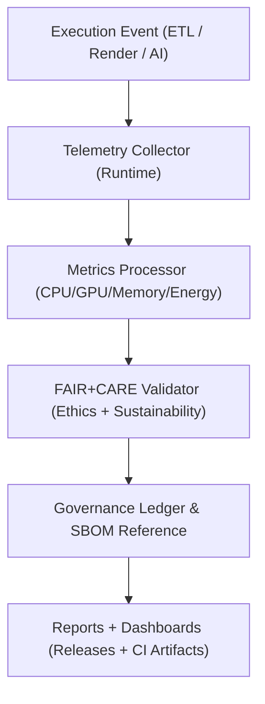

<div align="center">

# 📈 **Kansas Frontier Matrix — Telemetry Profiling & Performance Benchmark Framework**
`docs/guides/perf/telemetry-profiling.md`

**Purpose:**  
Establish standardized **telemetry profiling and performance benchmarking** practices across all Kansas Frontier Matrix (KFM) systems — including **MapLibre rendering**, **GDAL pipelines**, and **AI inference modules**.  
This framework enables **FAIR+CARE-compliant performance monitoring**, energy tracking, and reproducible benchmarking for sustainable operations.

[](../../README.md)
[](../../../LICENSE)
[](../../../docs/standards/README.md)
[](../../../releases/)
</div>

---

## 📘 Overview

Telemetry profiling within KFM provides **system-level observability** across pipelines, map rendering engines, and AI inference operations.  
It ensures that each major process — ETL, visualization, or reasoning — is benchmarked for **energy efficiency**, **latency**, and **ethical sustainability**.

Key objectives:
- Record consistent **Joules, CPU, GPU, and memory usage** metrics.  
- Enable FAIR+CARE-compliant monitoring of data processing workloads.  
- Correlate **telemetry metrics** with pipeline versions and governance ledgers.  
- Publish standardized performance reports for reproducibility and transparency.  

---

## 🗂️ Directory Layout

```plaintext
docs/guides/perf/
├── telemetry-profiling.md             # This documentation
├── gdal-3.12-upgrade.md               # Geoprocessing performance upgrades
├── maplibre-rendering-playbook.md     # Rendering optimization playbook
└── reports/                           # Benchmark and telemetry logs
```

---

## 🧩 Telemetry Pipeline Architecture



---

## ⚙️ Data Sources & Metrics

| Category | Metric | Description | Unit |
|-----------|--------|-------------|------|
| **CPU** | `cpu_usage_percent` | Average CPU utilization during task | % |
| **GPU** | `gpu_load_percent` | GPU draw usage (MapLibre/AI rendering) | % |
| **Memory** | `memory_mb` | Average memory footprint | MB |
| **Energy** | `energy_joules` | Energy consumed by task | Joules |
| **Carbon** | `carbon_gCO2e` | Equivalent carbon footprint | gCO₂e |
| **Performance** | `runtime_ms` | Task duration | ms |
| **Throughput** | `processed_mb_s` | Data throughput per second | MB/s |
| **Ethics** | `faircare_status` | FAIR+CARE compliance result | Pass/Fail |

---

## 🧮 Example Telemetry Record

```json
{
  "telemetry_id": "perf-2025-11-09-001",
  "component": "MapLibre Rendering Engine",
  "task": "Offline PMTiles Render (Kansas Hydrology Layer)",
  "metrics": {
    "cpu_usage_percent": 58.3,
    "gpu_load_percent": 62.7,
    "memory_mb": 428,
    "energy_joules": 1.12,
    "carbon_gCO2e": 0.0041,
    "runtime_ms": 14230
  },
  "faircare_status": "Pass",
  "auditor": "FAIR+CARE Council",
  "timestamp": "2025-11-09T12:00:00Z"
}
```

---

## 🧾 FAIR+CARE Integration

| Principle | Implementation | Evidence |
|------------|----------------|-----------|
| **Findable** | Telemetry reports indexed by version and UUID | `telemetry_id` |
| **Accessible** | JSON files in open repositories | `focus-telemetry.json` |
| **Interoperable** | Shared schema `perf-telemetry-profiling-v1.json` | `telemetry_schema` |
| **Reusable** | Energy and carbon metrics for reproducible benchmarking | `releases/v*/focus-telemetry.json` |
| **Collective Benefit** | Promotes sustainable data science and AI governance | FAIR+CARE audit |
| **Authority to Control** | FAIR+CARE Council reviews telemetry releases | `governance_ref` |
| **Responsibility** | Carbon neutrality monitored under ISO 50001 | `telemetry_ref` |
| **Ethics** | Transparency in compute use and environmental impact | Governance Ledger |

---

## ⚙️ Profiling & CI/CD Integration

| Workflow | Function | Output Artifact |
|-----------|-----------|----------------|
| `telemetry-export.yml` | Collect runtime metrics during CI/CD | `reports/perf/telemetry-summary.json` |
| `energy-monitor.yml` | Calculate energy and carbon equivalence | `reports/perf/energy-audit.json` |
| `faircare-validate.yml` | Validate sustainability & ethical metrics | `reports/faircare/perf-audit.json` |
| `ledger-sync.yml` | Append results to FAIR+CARE ledger | `docs/standards/governance/LEDGER/perf-ledger.json` |

---

## 🧰 Profiling Tools

| Tool | Use | Integration |
|------|-----|-------------|
| **perf-tools** | Command-line resource profiler for Linux systems | CI performance pipelines |
| **pyRAPL** | Python energy and power profiler | AI inference benchmarking |
| **telemetry-agent** | Custom KFM logger for energy + ethics reporting | `focus-telemetry.json` |
| **Chrome DevTools / Web Tracing** | Frame-time capture for MapLibre benchmarks | Rendering profiles |

---

## 📊 Benchmark Validation Thresholds

| Metric | Target | Notes |
|---------|---------|-------|
| **CPU Utilization** | ≤ 85% | Avoid resource contention |
| **GPU Load** | ≤ 70% | Maintain rendering stability |
| **Energy per Job** | ≤ 2.0 J | ISO 50001-compliant efficiency |
| **Carbon Footprint** | ≤ 0.005 gCO₂e | FAIR+CARE threshold |
| **Runtime Variance** | ≤ ±10% | Stable across environments |

---

## 🧩 Governance Ledger Integration

```json
{
  "ledger_id": "perf-ledger-2025-11-09-0001",
  "telemetry_source": "docs/guides/perf/reports/telemetry-summary.json",
  "auditor": "FAIR+CARE Council",
  "metrics_verified": ["energy_joules", "carbon_gCO2e", "runtime_ms"],
  "faircare_status": "Pass",
  "sha256": "9fa03e77a1b7...",
  "timestamp": "2025-11-09T12:30:00Z"
}
```

---

## ⚖️ Sustainability Reporting (ISO Alignment)

| ISO Standard | Purpose | Alignment in KFM |
|---------------|----------|------------------|
| **ISO 50001** | Energy management & efficiency | `energy-monitor.yml` |
| **ISO 14064** | Carbon footprint quantification | Telemetry audit |
| **ISO 19115** | Geospatial metadata consistency | STAC/DCAT integration |
| **ISO 26000** | Social responsibility framework | FAIR+CARE governance |

---

## 🕰️ Version History

| Version | Date | Author | Summary |
|----------|------|--------|----------|
| v10.0.0 | 2025-11-09 | Core Team | Established telemetry profiling standard for FAIR+CARE performance benchmarking |
| v9.7.0 | 2025-11-03 | A. Barta | Introduced energy profiling and sustainable CI metrics collection |

---

<div align="center">

© 2025 Kansas Frontier Matrix Project  
Master Coder Protocol v6.3 · FAIR+CARE Certified · Diamond⁹ Ω / Crown∞Ω Ultimate Certified  

[Back to Performance Guides](./README.md) · [Governance Charter](../../../docs/standards/governance/ROOT-GOVERNANCE.md)

</div>

