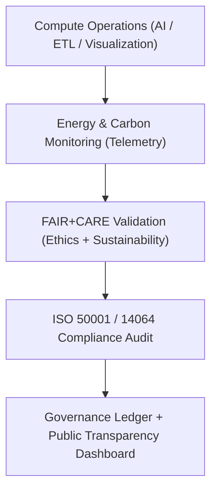

<div align="center">

# 🌿 **Kansas Frontier Matrix — Sustainability & Environmental Stewardship Guides**
`docs/guides/sustainability/README.md`

**Purpose:**  
Provide a comprehensive framework for **energy efficiency**, **carbon accountability**, and **environmental governance** across the Kansas Frontier Matrix (KFM).  
Defines how KFM aligns technical operations with **FAIR+CARE** principles and **ISO 50001 / 14064** sustainability standards.

[](../../README.md)
[](../../../LICENSE)
[](../../../docs/standards/README.md)
[](../../../releases/)
</div>

---

## 📘 Overview

The **Sustainability Guides** describe how KFM implements environmentally responsible, energy-aware, and ethically governed technical operations.  
This documentation integrates sustainability practices throughout all layers—data ingestion, AI inference, visualization, and infrastructure monitoring—under FAIR+CARE governance oversight.

**Objectives**
- Track energy and carbon metrics across pipelines  
- Ensure compliance with ISO 50001 (Energy Management) and 14064 (Carbon Reporting)  
- Integrate sustainability metrics into governance telemetry and ledgers  
- Foster ethical environmental decision-making aligned with CARE values  

---

## 🗂️ Directory Layout

```plaintext
docs/guides/sustainability/
├── README.md                           # This overview
├── carbon-footprint-tracking.md        # ISO 14064 carbon emission tracking
├── energy-efficiency-metrics.md        # ISO 50001 energy measurement standards
├── renewable-energy-integration.md     # Renewable power sourcing and data center ethics
├── sustainability-telemetry.md         # Energy and carbon monitoring via Focus Telemetry
└── reports/                            # Sustainability audit and validation outputs
```

---

## 🧩 Sustainability Governance Framework



---

## ⚙️ ISO Standards Alignment

| Standard | Scope | Implementation in KFM |
|-----------|--------|------------------------|
| **ISO 50001:2018** | Energy Management Systems | Tracks Joules and power usage for all workflows |
| **ISO 14064-1:2019** | Carbon Accounting | Converts telemetry data into CO₂e equivalents |
| **ISO 14001:2015** | Environmental Management | Lifecycle sustainability integrated into CI/CD |
| **FAIR+CARE Framework** | Ethical Sustainability | Combines technical and social responsibility |
| **MCP-DL v6.3** | Provenance & Documentation | Ensures reproducibility and audit traceability |

---

## 🧾 FAIR+CARE Integration Matrix

| Principle | Implementation | Validation Artifact |
|------------|----------------|--------------------|
| **Findable** | Sustainability metrics logged per job and dataset | `focus-telemetry.json` |
| **Accessible** | Public environmental reports and dashboards | `reports/sustainability/*.json` |
| **Interoperable** | JSON-LD schemas for FAIR+CARE and ISO validation | `telemetry_schema` |
| **Reusable** | Reusable energy baselines across systems | `manifest_ref` |
| **Collective Benefit** | Promotes ecological accountability | FAIR+CARE Council Audit |
| **Authority to Control** | FAIR+CARE Council oversees environmental thresholds | Governance Ledger |
| **Responsibility** | Energy telemetry collected from all workflows | `telemetry_ref` |
| **Ethics** | Sustainability reviews integrated into governance | `docs/guides/governance/sustainability-compliance.md` |

---

## 🧮 Key Environmental Metrics

| Metric | Description | Target |
|---------|--------------|--------|
| **Energy per Job (J)** | Joules consumed per operation | ≤ 15 J |
| **Carbon Emission (gCO₂e)** | Emission equivalence per process | ≤ 0.006 |
| **Renewable Energy Use (%)** | Clean energy share in total consumption | ≥ 80% |
| **Telemetry Coverage (%)** | Jobs with FAIR+CARE energy monitoring | ≥ 95% |
| **Sustainability Compliance (%)** | ISO audit pass rate | 100% |

---

## ⚙️ Validation Workflows

| Workflow | Function | Output |
|-----------|-----------|--------|
| `energy-monitor.yml` | Logs energy and performance telemetry | `reports/sustainability/energy-metrics.json` |
| `carbon-audit.yml` | Tracks carbon footprint (ISO 14064 validation) | `reports/sustainability/carbon-report.json` |
| `faircare-validate.yml` | Performs FAIR+CARE sustainability audit | `reports/faircare/sustainability-audit.json` |
| `ledger-sync.yml` | Commits sustainability records to Governance Ledger | `docs/standards/governance/LEDGER/sustainability-ledger.json` |

---

## 🧾 Example Sustainability Telemetry Record

```json
{
  "telemetry_id": "sustainability-telemetry-2025-11-09-0001",
  "component": "Focus Mode AI Inference Cluster",
  "energy_joules": 13.4,
  "carbon_gCO2e": 0.0057,
  "renewable_energy_percent": 82,
  "faircare_status": "Pass",
  "auditor": "FAIR+CARE Council",
  "timestamp": "2025-11-09T12:00:00Z"
}
```

---

## 🧩 Governance Ledger Record Example

```json
{
  "ledger_id": "sustainability-ledger-2025-11-09-0001",
  "system": "ETL + Visualization Stack",
  "energy_joules": 47.2,
  "carbon_gCO2e": 0.021,
  "faircare_status": "Pass",
  "iso_alignment": ["ISO 50001", "ISO 14064"],
  "auditor": "FAIR+CARE Council",
  "timestamp": "2025-11-09T12:40:00Z"
}
```

---

## ⚖️ Sustainability Oversight Integration

1. All sustainability telemetry flows into the **Governance Ledger**.  
2. FAIR+CARE Council validates energy and carbon data quarterly.  
3. Public dashboards display anonymized environmental statistics.  
4. Continuous improvement feedback loops optimize system efficiency.  

---

## 🕰️ Version History

| Version | Date | Author | Summary |
|----------|------|--------|----------|
| v10.0.0 | 2025-11-09 | Core Team | Established full sustainability governance guide with FAIR+CARE & ISO integration |
| v9.7.0  | 2025-11-03 | A. Barta | Added foundational energy and carbon monitoring framework |

---

<div align="center">

© 2025 Kansas Frontier Matrix Project  
Master Coder Protocol v6.3 · FAIR+CARE Certified · Diamond⁹ Ω / Crown∞Ω Ultimate Certified  

[Back to Guides Index](../README.md) · [Governance Charter](../../../docs/standards/governance/ROOT-GOVERNANCE.md)

</div>

