<div align="center">

# 🌎 **Kansas Frontier Matrix — Carbon Footprint Tracking & ISO 14064 Compliance Guide**
`docs/guides/sustainability/carbon-footprint-tracking.md`

**Purpose:**  
Establish the methodology and governance framework for **carbon emission measurement, reduction, and reporting** within the Kansas Frontier Matrix (KFM).  
Implements **ISO 14064** carbon accounting and **FAIR+CARE environmental ethics** across all compute operations and data pipelines.

[](../../README.md)
[](../../../LICENSE)
[](../../../docs/standards/README.md)
[](../../../releases/)
</div>

---

## 📘 Overview

The **Carbon Footprint Tracking Guide** defines how KFM quantifies, validates, and reports **greenhouse gas (GHG) emissions** for all systems.  
It provides a standardized model for measuring energy use (Joules) and converting it to carbon equivalents (gCO₂e), ensuring compliance with **ISO 14064-1:2019** and FAIR+CARE sustainability standards.

**Core Objectives**
- Measure carbon emissions across AI, ETL, and visualization workloads  
- Automate telemetry-based emissions calculations via Focus Telemetry  
- Log all audit results in the FAIR+CARE Governance Ledger  
- Integrate continuous sustainability feedback into infrastructure operations  

---

## 🗂️ Directory Context

```plaintext
docs/guides/sustainability/
├── README.md                           # Sustainability framework overview
├── carbon-footprint-tracking.md        # This document
├── energy-efficiency-metrics.md        # Energy measurement and ISO 50001 compliance
├── renewable-energy-integration.md     # Green power sourcing for infrastructure
├── sustainability-telemetry.md         # Carbon & energy monitoring pipeline
└── reports/                            # Carbon audit & sustainability validation results
```

---

## 🧩 Carbon Measurement Architecture

```mermaid
flowchart TD
A["Compute Process (ETL / AI / Visualization)"] --> B["Energy Telemetry (Joules Collected)"]
B --> C["Conversion Module (J → gCO₂e)"]
C --> D["FAIR+CARE Sustainability Validator"]
D --> E["ISO 14064 Carbon Audit Report"]
E --> F["Governance Ledger + Public Summary"]
```



---

## ⚙️ Carbon Conversion Formula

> **CO₂e = (Energy (J) × Emission Factor) / 1000**

Where:  
- **Energy (J)** — Joules measured from telemetry logs  
- **Emission Factor** — Grams of CO₂ per Joule (region-specific, default = 0.00043 gCO₂/J)  
- **Result** — Output in grams of CO₂ equivalent (gCO₂e)

---

## 🧾 Example Carbon Audit Record

```json
{
  "carbon_audit_id": "carbon-audit-2025-11-09-0001",
  "component": "AI Inference Cluster",
  "energy_joules": 13.8,
  "emission_factor": 0.00043,
  "carbon_gCO2e": 0.0059,
  "region": "US-Central",
  "iso_standard": "ISO 14064-1:2019",
  "faircare_status": "Pass",
  "auditor": "FAIR+CARE Council",
  "timestamp": "2025-11-09T12:30:00Z"
}
```

---

## ⚖️ FAIR+CARE Carbon Integration Matrix

| Principle | Implementation | Validation Artifact |
|------------|----------------|--------------------|
| **Findable** | All emission records assigned unique audit IDs | `carbon-report.json` |
| **Accessible** | Public FAIR+CARE carbon dashboard | `reports/sustainability/carbon-report.json` |
| **Interoperable** | JSON-LD schema with ISO 14064 alignment | `telemetry_schema` |
| **Reusable** | Historical carbon metrics used in quarterly reviews | `manifest_ref` |
| **Collective Benefit** | Supports transparent sustainability progress tracking | FAIR+CARE audit |
| **Authority to Control** | Council approves emission methodology updates | Governance Ledger |
| **Responsibility** | Tracks per-job carbon output for all workflows | `focus-telemetry.json` |
| **Ethics** | Integrates environmental responsibility in system design | `sustainability-compliance.md` |

---

## 🧮 Example Conversion Workflow (Python Snippet)

```python
def calculate_carbon_joules(energy_joules, emission_factor=0.00043):
    carbon_gco2e = energy_joules * emission_factor
    return round(carbon_gco2e, 6)

# Example usage
energy_used = 13.8  # Joules
carbon_output = calculate_carbon_joules(energy_used)
print(f"Carbon equivalent: {carbon_output} gCO₂e")
```

---

## 🧠 Sustainability Targets

| Metric | Description | Target |
|---------|--------------|---------|
| **Carbon per Workflow (gCO₂e)** | CO₂ equivalent per system operation | ≤ 0.006 |
| **Total Emissions per Release (gCO₂e)** | Sum across all processes per release cycle | ≤ 0.5 |
| **Renewable Energy Share (%)** | Portion of green energy used | ≥ 80 |
| **FAIR+CARE Audit Compliance (%)** | Governance-certified emission validation | 100 |

---

## ⚙️ CI/CD Integration Workflows

| Workflow | Function | Output |
|-----------|-----------|--------|
| `carbon-audit.yml` | Calculates emissions via telemetry | `reports/sustainability/carbon-report.json` |
| `energy-monitor.yml` | Records Joule-level telemetry metrics | `reports/sustainability/energy-metrics.json` |
| `faircare-validate.yml` | Ensures ethical environmental compliance | `reports/faircare/sustainability-audit.json` |
| `ledger-sync.yml` | Commits verified carbon data to governance ledger | `docs/standards/governance/LEDGER/carbon-ledger.json` |

---

## 🧾 Governance Ledger Record Example

```json
{
  "ledger_id": "carbon-ledger-2025-11-09-0005",
  "component": "Hydrology ETL Pipeline",
  "energy_joules": 11.8,
  "carbon_gCO2e": 0.0051,
  "iso_standard": "ISO 14064-1:2019",
  "faircare_status": "Pass",
  "auditor": "FAIR+CARE Council",
  "timestamp": "2025-11-09T12:50:00Z"
}
```

---

## ⚙️ FAIR+CARE Audit Report Example

```json
{
  "audit_id": "faircare-carbon-2025-11-09-0004",
  "audited_components": [
    "AI Focus Mode Inference",
    "ETL Hydrology",
    "Visualization Stack"
  ],
  "carbon_total_gCO2e": 0.072,
  "carbon_reduction_percent": 10.6,
  "renewable_energy_percent": 83,
  "faircare_status": "Pass",
  "iso_alignment": "ISO 14064-1:2019",
  "auditor": "FAIR+CARE Council",
  "timestamp": "2025-11-09T13:00:00Z"
}
```

---

## ⚖️ Governance Integration Flow


---

## 🕰️ Version History

| Version | Date | Author | Summary |
|----------|------|--------|----------|
| v10.0.0 | 2025-11-09 | Core Team | Added ISO 14064-based carbon accounting and FAIR+CARE audit integration |
| v9.7.0  | 2025-11-03 | A. Barta | Introduced carbon telemetry pipeline and governance synchronization |

---

<div align="center">

© 2025 Kansas Frontier Matrix Project  
Master Coder Protocol v6.3 · FAIR+CARE Certified · Diamond⁹ Ω / Crown∞Ω Ultimate Certified  

[Back to Sustainability Guides](./README.md) · [Governance Charter](../../../docs/standards/governance/ROOT-GOVERNANCE.md)

</div>

