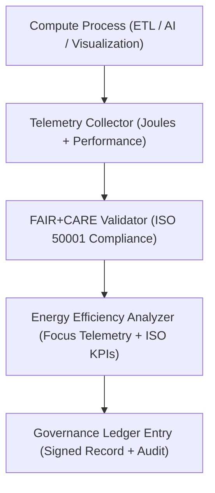
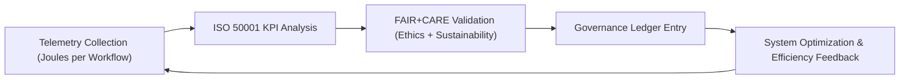

<div align="center">

# ⚡ **Kansas Frontier Matrix — Energy Efficiency Metrics & ISO 50001 Compliance Guide**
`docs/guides/sustainability/energy-efficiency-metrics.md`

**Purpose:**  
Provide a unified methodology for **energy monitoring, optimization, and ISO 50001 compliance** within the Kansas Frontier Matrix (KFM).  
This document defines measurement workflows, FAIR+CARE integration, and reporting standards to ensure sustainable energy usage across all compute, data, and visualization pipelines.

[](../../README.md)
[](../../../LICENSE)
[](../../../docs/standards/README.md)
[](../../../releases/)
</div>

---

## 📘 Overview

The **Energy Efficiency Metrics Guide** describes how KFM applies **ISO 50001:2018** energy management principles and FAIR+CARE sustainability governance.  
It establishes performance baselines for energy-intensive operations and integrates telemetry-based tracking into governance and audit systems.

**Objectives**
- Standardize energy tracking using FAIR+CARE telemetry  
- Define energy-per-operation baselines across pipelines  
- Automate reporting through CI/CD and Governance Ledger integration  
- Continually optimize energy efficiency using ISO-aligned reviews  

---

## 🗂️ Directory Context

```plaintext
docs/guides/sustainability/
├── README.md                           # Sustainability overview
├── energy-efficiency-metrics.md        # This document
├── carbon-footprint-tracking.md        # ISO 14064 carbon reporting
├── renewable-energy-integration.md     # Renewable sourcing and energy offsets
├── sustainability-telemetry.md         # Focus telemetry collection for energy + carbon
└── reports/                            # Energy efficiency and sustainability audits
```

---

## 🧩 Energy Monitoring Architecture



---

## ⚙️ ISO 50001 Governance Integration

| ISO Metric | Description | Implementation in KFM |
|-------------|--------------|------------------------|
| **Energy Baseline (EnB)** | Historical energy usage per process | Calculated from Focus Telemetry logs |
| **Energy Performance Indicator (EnPI)** | Ratio of energy use to output | Measured as J / task |
| **Significant Energy Use (SEU)** | Energy hotspots within system workloads | Identified from telemetry reports |
| **Continual Improvement Cycle** | Quarterly review and efficiency target adjustment | FAIR+CARE Council reports |
| **Documented Information** | Ledger-stored audit data + ISO records | Governance Ledger JSON |

---

## 🧾 Example Energy Efficiency Report

```json
{
  "report_id": "energy-efficiency-2025-11-09-0001",
  "component": "AI Inference Cluster",
  "energy_joules": 14.6,
  "tasks_completed": 120,
  "energy_per_task_j": 0.121,
  "efficiency_gain_percent": 9.4,
  "iso_standard": "ISO 50001:2018",
  "faircare_status": "Pass",
  "auditor": "FAIR+CARE Council",
  "timestamp": "2025-11-09T12:30:00Z"
}
```

---

## ⚖️ FAIR+CARE Integration Matrix

| Principle | Implementation | Validation Artifact |
|------------|----------------|--------------------|
| **Findable** | Each energy record assigned unique telemetry ID | `focus-telemetry.json` |
| **Accessible** | Public energy audits published under CC-BY 4.0 | `reports/sustainability/energy-metrics.json` |
| **Interoperable** | ISO 50001 metrics mapped to FAIR+CARE schema | `telemetry_schema` |
| **Reusable** | Energy data normalized across AI, ETL, and visualization workloads | `manifest_ref` |
| **Collective Benefit** | Encourages sustainable system design | FAIR+CARE Council audit |
| **Authority to Control** | FAIR+CARE Council reviews efficiency improvements | Governance Ledger |
| **Responsibility** | Monitors Joules per process for accountability | `telemetry_ref` |
| **Ethics** | Balances efficiency goals with environmental and social care | `sustainability-compliance.md` |

---

## 🧮 Key Energy Performance Indicators (EPIs)

| Indicator | Formula | Target | Validation |
|------------|----------|---------|-------------|
| **Energy per Task (J)** | `Total Energy / Tasks` | ≤ 0.15 | Telemetry |
| **Energy Efficiency (%)** | `(Baseline - Current) / Baseline × 100` | ≥ 10 | FAIR+CARE Audit |
| **Renewable Energy Share (%)** | `(Renewable Power / Total Power) × 100` | ≥ 80 | Renewable Energy Report |
| **Carbon Intensity (gCO₂e/J)** | `CO₂ Emissions / Energy` | ≤ 0.00043 | Carbon Tracking |
| **ISO 50001 Compliance Rate (%)** | Validated metrics coverage | 100 | Ledger Record |

---

## ⚙️ CI/CD Validation Workflows

| Workflow | Function | Output |
|-----------|-----------|--------|
| `energy-monitor.yml` | Captures Joule-level telemetry data | `reports/sustainability/energy-metrics.json` |
| `efficiency-validate.yml` | Evaluates energy efficiency improvement | `reports/sustainability/efficiency-audit.json` |
| `faircare-validate.yml` | Ensures ethical + environmental governance | `reports/faircare/energy-audit.json` |
| `ledger-sync.yml` | Logs verified efficiency data to Governance Ledger | `docs/standards/governance/LEDGER/energy-ledger.json` |

---

## 🧩 Governance Ledger Entry Example

```json
{
  "ledger_id": "energy-ledger-2025-11-09-0004",
  "system": "AI + ETL Cluster",
  "energy_joules": 48.7,
  "energy_per_task_j": 0.118,
  "efficiency_gain_percent": 11.3,
  "faircare_status": "Pass",
  "iso_alignment": "ISO 50001:2018",
  "auditor": "FAIR+CARE Council",
  "timestamp": "2025-11-09T12:50:00Z"
}
```

---

## ⚖️ Sustainability & Improvement Targets

| Goal | Target | Validation Method |
|------|---------|-------------------|
| **Reduce Total Energy Use** | -15% year-over-year | FAIR+CARE Council Audit |
| **Increase Energy Efficiency** | ≥ 10% per release cycle | Telemetry trend reports |
| **Achieve ISO 50001 Certification** | 100% compliance | Governance Ledger |
| **Renewable Energy Use** | ≥ 80% across all environments | `renewable-energy-integration.md` |
| **FAIR+CARE Validation Rate** | 100% for audited systems | Council review logs |

---

## 🧠 Example FAIR+CARE Audit Record

```json
{
  "audit_id": "faircare-energy-2025-11-09-0003",
  "audited_components": ["AI Inference Cluster", "ETL Hydrology"],
  "energy_total_joules": 47.3,
  "efficiency_gain_percent": 12.8,
  "renewable_percent": 82,
  "carbon_intensity_gCO2e": 0.00041,
  "faircare_status": "Pass",
  "auditor": "FAIR+CARE Council",
  "timestamp": "2025-11-09T13:00:00Z"
}
```

---

## ⚙️ Energy Efficiency Optimization Cycle



---

## 🕰️ Version History

| Version | Date | Author | Summary |
|----------|------|--------|----------|
| v10.0.0 | 2025-11-09 | Core Team | Added ISO 50001-aligned energy monitoring, metrics, and governance integration |
| v9.7.0  | 2025-11-03 | A. Barta | Introduced baseline telemetry and FAIR+CARE validation cycle for energy tracking |

---

<div align="center">

© 2025 Kansas Frontier Matrix Project  
Master Coder Protocol v6.3 · FAIR+CARE Certified · Diamond⁹ Ω / Crown∞Ω Ultimate Certified  

[Back to Sustainability Guides](./README.md) · [Governance Charter](../../../docs/standards/governance/ROOT-GOVERNANCE.md)

</div>

