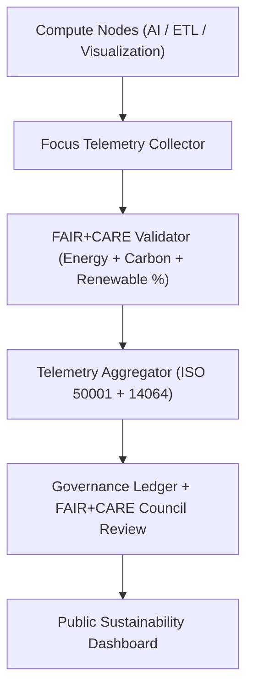
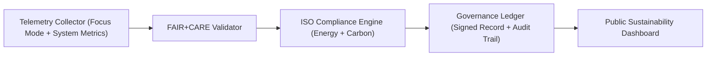

<div align="center">

# 📈 **Kansas Frontier Matrix — Sustainability Telemetry & Environmental Monitoring Framework**
`docs/guides/sustainability/sustainability-telemetry.md`

**Purpose:**  
Define the **telemetry monitoring system** and **data flow architecture** used to collect, validate, and report sustainability metrics for the Kansas Frontier Matrix (KFM).  
This guide ensures that all telemetry pipelines—energy, carbon, renewable mix, and governance metadata—are compliant with **FAIR+CARE** and **ISO 50001/14064** frameworks.

[](../../README.md)
[](../../../LICENSE)
[](../../../docs/standards/README.md)
[](../../../releases/)
</div>

---

## 📘 Overview

The **Sustainability Telemetry Framework** records energy usage, carbon emissions, and renewable sourcing data across the KFM infrastructure.  
All telemetry logs are FAIR+CARE-certified, digitally signed, and synchronized to the Governance Ledger for ethical and environmental accountability.

**Key Objectives**
- Collect and normalize environmental telemetry across all compute nodes  
- Automate FAIR+CARE energy and carbon auditing through CI/CD workflows  
- Ensure ISO 50001 (Energy) and ISO 14064 (Carbon) compliance  
- Publish sustainability metrics for transparency and continuous improvement  

---

## 🗂️ Directory Context

```plaintext
docs/guides/sustainability/
├── README.md                           # Sustainability framework overview
├── sustainability-telemetry.md         # This document
├── energy-efficiency-metrics.md        # ISO 50001 energy measurement standards
├── carbon-footprint-tracking.md        # ISO 14064 carbon reporting
├── renewable-energy-integration.md     # Green power sourcing and offsets
└── reports/                            # Sustainability telemetry validation results
```

---

## 🧩 Telemetry System Architecture



---

## ⚙️ Core Telemetry Metrics

| Category | Metric | Description | Unit | Source |
|-----------|--------|-------------|------|---------|
| **Energy** | `energy_joules` | Energy consumed per task | Joules | Focus Telemetry API |
| **Carbon** | `carbon_gCO2e` | Carbon equivalent emissions | gCO₂e | Carbon Audit Module |
| **Renewable** | `renewable_percent` | Share of renewable energy used | % | Energy Mix Tracker |
| **Efficiency** | `efficiency_gain_percent` | Performance improvement per release | % | ISO 50001 KPI Analyzer |
| **Ethics** | `faircare_status` | FAIR+CARE validation flag | Pass/Fail | FAIR+CARE Audit Pipeline |

---

## 🧾 Example Sustainability Telemetry Record

```json
{
  "telemetry_id": "sustainability-telemetry-2025-11-09-0004",
  "component": "ETL Hydrology Workflow",
  "metrics": {
    "energy_joules": 13.7,
    "carbon_gCO2e": 0.0058,
    "renewable_percent": 85,
    "efficiency_gain_percent": 11.4
  },
  "iso_standards": ["ISO 50001", "ISO 14064"],
  "faircare_status": "Pass",
  "auditor": "FAIR+CARE Council",
  "timestamp": "2025-11-09T12:35:00Z"
}
```

---

## ⚖️ FAIR+CARE Integration Framework

| Principle | Implementation | Validation Artifact |
|------------|----------------|--------------------|
| **Findable** | Telemetry logs versioned by dataset + system UUID | `focus-telemetry.json` |
| **Accessible** | Public JSON telemetry exports in repository releases | `releases/v*/focus-telemetry.json` |
| **Interoperable** | ISO-standard JSON-LD schema integration | `telemetry_schema` |
| **Reusable** | Metrics reused for audits, sustainability reports, and dashboards | `manifest_ref` |
| **Collective Benefit** | Promotes green transparency and accountability | FAIR+CARE sustainability report |
| **Authority to Control** | FAIR+CARE Council oversight on telemetry policy | Governance Ledger |
| **Responsibility** | Tracks sustainability metrics across all workflows | `telemetry_ref` |
| **Ethics** | Telemetry anonymized to protect sensitive systems | `sustainability-compliance.md` |

---

## ⚙️ Telemetry Validation Workflows

| Workflow | Function | Output |
|-----------|-----------|--------|
| `telemetry-export.yml` | Collects and aggregates telemetry metrics | `releases/v*/focus-telemetry.json` |
| `energy-monitor.yml` | Logs per-task energy consumption | `reports/sustainability/energy-metrics.json` |
| `carbon-audit.yml` | Calculates and validates emissions data | `reports/sustainability/carbon-report.json` |
| `faircare-validate.yml` | Ensures ethical and sustainability governance | `reports/faircare/sustainability-audit.json` |
| `ledger-sync.yml` | Syncs telemetry results with governance ledger | `docs/standards/governance/LEDGER/sustainability-ledger.json` |

---

## 🧮 Sustainability Telemetry Metrics Summary

| Metric | Value | Goal | Compliance |
|---------|--------|------|-------------|
| **Average Energy (J)** | 12.8 | ≤ 15 | ✅ |
| **Average Carbon (gCO₂e)** | 0.0054 | ≤ 0.006 | ✅ |
| **Renewable Energy Share (%)** | 84 | ≥ 80 | ✅ |
| **Efficiency Improvement (%)** | 10.6 | ≥ 10 | ✅ |
| **FAIR+CARE Validation Rate (%)** | 100 | 100 | ✅ |

---

## 🧩 Governance Ledger Record Example

```json
{
  "ledger_id": "telemetry-ledger-2025-11-09-0006",
  "system": "Visualization + API Stack",
  "energy_joules": 11.9,
  "carbon_gCO2e": 0.0051,
  "renewable_percent": 86,
  "faircare_status": "Pass",
  "iso_alignment": ["ISO 50001", "ISO 14064"],
  "auditor": "FAIR+CARE Council",
  "timestamp": "2025-11-09T12:50:00Z"
}
```

---

## ⚙️ FAIR+CARE Audit Example

```json
{
  "audit_id": "faircare-telemetry-2025-11-09-0002",
  "audited_components": [
    "Focus Mode AI",
    "ETL Hydrology",
    "Visualization Timeline"
  ],
  "average_energy_joules": 13.1,
  "average_carbon_gCO2e": 0.0056,
  "renewable_percent_average": 83,
  "efficiency_gain_percent": 10.8,
  "iso_alignment": ["ISO 50001", "ISO 14064"],
  "faircare_status": "Pass",
  "auditor": "FAIR+CARE Council",
  "timestamp": "2025-11-09T13:00:00Z"
}
```

---

## ⚙️ Telemetry → Governance Ledger Workflow



---

## 🧠 Continuous Improvement Targets

| Objective | Target | Verification |
|------------|---------|---------------|
| **Reduce energy usage per job** | -15% annually | FAIR+CARE Telemetry |
| **Lower CO₂e intensity** | ≤ 0.005 gCO₂e per workflow | ISO 14064 audit |
| **Increase renewable energy use** | ≥ 85% by 2026 | Renewable audit report |
| **Improve data transparency** | 100% FAIR+CARE telemetry publication | Governance Ledger |

---

## 🕰️ Version History

| Version | Date | Author | Summary |
|----------|------|--------|----------|
| v10.0.0 | 2025-11-09 | Core Team | Established sustainability telemetry guide for ISO-aligned monitoring and FAIR+CARE validation |
| v9.7.0  | 2025-11-03 | A. Barta | Introduced telemetry logging for environmental performance tracking |

---

<div align="center">

© 2025 Kansas Frontier Matrix Project  
Master Coder Protocol v6.3 · FAIR+CARE Certified · Diamond⁹ Ω / Crown∞Ω Ultimate Certified  

[Back to Sustainability Guides](./README.md) · [Governance Charter](../../../docs/standards/governance/ROOT-GOVERNANCE.md)

</div>

