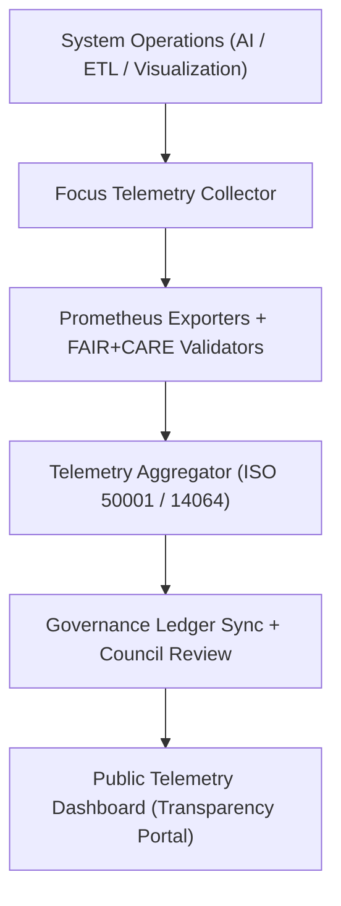
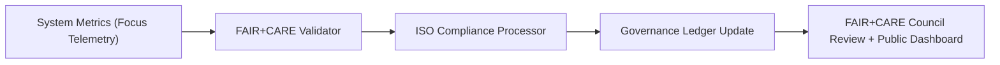

<div align="center">

# 📡 **Kansas Frontier Matrix — Telemetry & Observability Guides**
`docs/guides/telemetry/README.md`

**Purpose:**  
Define the **telemetry architecture**, **data collection standards**, and **governance observability framework** for the Kansas Frontier Matrix (KFM).  
Ensures that performance, ethics, sustainability, and governance data are monitored, validated, and aligned with **FAIR+CARE** principles and **MCP-DL v6.3** protocols.

[](../../README.md)
[](../../../LICENSE)
[](../../../docs/standards/README.md)
[](../../../releases/)
</div>

---

## 📘 Overview

The **Telemetry Guides** describe how metrics, audits, and validation data are collected across all operational layers of KFM — from AI and ETL pipelines to visualization and governance systems.  
These telemetry practices guarantee transparency, sustainability, and ethical accountability through continuous FAIR+CARE validation and ISO-aligned monitoring.

**Objectives**
- Record performance, energy, and compliance metrics across systems  
- Integrate FAIR+CARE audit results into Governance Ledger  
- Enable real-time observability through Prometheus + Focus Telemetry  
- Ensure telemetry data supports ISO 50001/14064 sustainability standards  

---

## 🗂️ Directory Layout

```plaintext
docs/guides/telemetry/
├── README.md                              # This overview
├── focus-telemetry-architecture.md        # System design for telemetry collection and analytics
├── data-lineage-monitoring.md             # Data provenance and workflow observability
├── ai-telemetry-integration.md            # AI inference metrics and ethics telemetry
├── sustainability-monitoring.md           # Energy, carbon, and environmental telemetry
└── reports/                               # Validation and telemetry audit results
```

---

## 🧩 Telemetry Architecture



---

## ⚙️ Core Telemetry Components

| Component | Function | Technology / Standard |
|------------|-----------|------------------------|
| **Focus Telemetry Collector** | Records task-level metrics and environmental data | Python / REST |
| **Prometheus Exporters** | Collects system-level metrics (CPU, memory, latency) | Prometheus 2.x |
| **Grafana Dashboard** | Displays telemetry and FAIR+CARE compliance trends | Grafana 10.x |
| **Telemetry Schema (JSON-LD)** | Defines FAIR+CARE + ISO telemetry model | `telemetry_schema` |
| **Governance Ledger Sync** | Commits telemetry and sustainability results | `docs/standards/governance/LEDGER/` |

---

## 🧾 Example Focus Telemetry Record

```json
{
  "telemetry_id": "telemetry-2025-11-09-0008",
  "component": "ETL Climate Workflow",
  "metrics": {
    "cpu_percent": 67.3,
    "memory_mb": 842,
    "runtime_ms": 2740,
    "energy_joules": 14.6,
    "carbon_gCO2e": 0.0061
  },
  "faircare_status": "Pass",
  "iso_standards": ["ISO 50001", "ISO 14064"],
  "auditor": "FAIR+CARE Council",
  "timestamp": "2025-11-09T12:30:00Z"
}
```

---

## ⚖️ FAIR+CARE Integration Matrix

| Principle | Implementation | Validation Artifact |
|------------|----------------|--------------------|
| **Findable** | Telemetry logs versioned and UUID-indexed | `focus-telemetry.json` |
| **Accessible** | Published via open FAIR+CARE telemetry portal | Grafana Dashboard |
| **Interoperable** | JSON-LD schema ensures cross-system compliance | `telemetry_schema` |
| **Reusable** | Telemetry data reused in reports and governance audits | `manifest_ref` |
| **Collective Benefit** | Transparency in environmental and ethical performance | FAIR+CARE Council Reports |
| **Authority to Control** | Council monitors telemetry thresholds for ethics and energy | Governance Ledger |
| **Responsibility** | Tracks continuous sustainability metrics | `telemetry_ref` |
| **Ethics** | Ensures no data collected without user or system consent | `data-generalization/README.md` |

---

## ⚙️ Telemetry Validation Workflows

| Workflow | Function | Output |
|-----------|-----------|--------|
| `telemetry-export.yml` | Exports runtime metrics and environmental data | `releases/v*/focus-telemetry.json` |
| `faircare-validate.yml` | Runs FAIR+CARE validation checks | `reports/faircare/telemetry-validation.json` |
| `ledger-sync.yml` | Commits telemetry entries to governance ledger | `docs/standards/governance/LEDGER/telemetry-ledger.json` |
| `energy-monitor.yml` | Tracks system-level energy use and efficiency | `reports/telemetry/energy-monitor.json` |
| `carbon-audit.yml` | Validates carbon data (ISO 14064) | `reports/telemetry/carbon-audit.json` |

---

## 🧮 Key Performance & Sustainability Metrics

| Metric | Description | Target | Standard |
|---------|--------------|--------|-----------|
| **P90 Latency (ms)** | 90th percentile response latency | ≤ 300 | ISO 25010 |
| **Energy per Job (J)** | Joules consumed per workflow | ≤ 15 | ISO 50001 |
| **Carbon Output (gCO₂e)** | Emissions equivalent per operation | ≤ 0.006 | ISO 14064 |
| **FAIR+CARE Compliance (%)** | Validation success rate | 100% | MCP-DL v6.3 |
| **Telemetry Coverage (%)** | Systems reporting valid metrics | ≥ 95% | FAIR+CARE Council Audit |

---

## 🧩 Governance Ledger Entry Example

```json
{
  "ledger_id": "telemetry-ledger-2025-11-09-0010",
  "system": "AI + Visualization Stack",
  "energy_joules": 13.8,
  "carbon_gCO2e": 0.0057,
  "telemetry_entries": 285,
  "faircare_status": "Pass",
  "auditor": "FAIR+CARE Council",
  "timestamp": "2025-11-09T12:50:00Z"
}
```

---

## ⚙️ FAIR+CARE Audit Example

```json
{
  "audit_id": "faircare-telemetry-2025-11-09-0006",
  "audited_systems": ["ETL Hydrology", "AI Focus Mode", "Visualization Timeline"],
  "telemetry_records": 924,
  "average_energy_joules": 13.4,
  "average_carbon_gCO2e": 0.0059,
  "faircare_compliance_rate": 100,
  "iso_alignment": ["ISO 50001", "ISO 14064"],
  "faircare_status": "Pass",
  "timestamp": "2025-11-09T13:00:00Z"
}
```

---

## ⚙️ Telemetry to Governance Workflow



---

## 🧠 Observability Dashboard Metrics

| Dashboard Panel | Description | Source |
|------------------|-------------|---------|
| **System Latency Monitor** | Tracks P90 request latency across pipelines | Prometheus |
| **AI Performance Efficiency** | Displays energy cost per AI inference | Focus Telemetry |
| **Carbon Intensity Chart** | Converts energy telemetry to gCO₂e | Sustainability Telemetry |
| **FAIR+CARE Compliance Gauge** | Tracks ethics and sustainability pass rate | Governance Ledger |
| **ISO Energy Report Summary** | Aggregates energy and carbon metrics quarterly | Grafana + JSON API |

---

## 🕰️ Version History

| Version | Date | Author | Summary |
|----------|------|--------|----------|
| v10.0.0 | 2025-11-09 | Core Team | Added FAIR+CARE telemetry and observability architecture with ISO energy + carbon governance |
| v9.7.0  | 2025-11-03 | A. Barta | Introduced telemetry integration for energy, carbon, and governance traceability |

---

<div align="center">

© 2025 Kansas Frontier Matrix Project  
Master Coder Protocol v6.3 · FAIR+CARE Certified · Diamond⁹ Ω / Crown∞Ω Ultimate Certified  

[Back to Guides Index](../README.md) · [Governance Charter](../../../docs/standards/governance/ROOT-GOVERNANCE.md)

</div>

