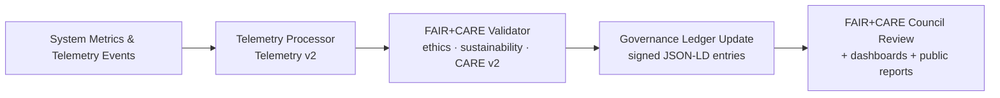

<div align="center">

# 📡 **Kansas Frontier Matrix — Telemetry & Observability Guides**  
`docs/guides/telemetry/README.md`

**Purpose**  
Define the **telemetry architecture**, **data collection standards**, and **governance observability framework**  
for the Kansas Frontier Matrix (KFM).  

These guides ensure that **performance**, **ethics**, **sustainability**, and **governance** data are monitored,  
validated, and aligned with **FAIR+CARE v2**, **Lineage v2**, **Telemetry v2**, and **MCP-DL v6.3** protocols.

</div>

---

# 📘 Overview

The **Telemetry Guides** describe how KFM collects and uses metrics and audit data from:

- AI pipelines (training, inference, explainability)  
- ETL & streaming pipelines  
- Web + MapLibre interfaces (UI performance, A11y)  
- Governance & validation workflows  

Telemetry v2 is:

- **Structured** (JSON / NDJSON with strict schema)  
- **Ethical** (FAIR+CARE v2 constraints baked into validators)  
- **Sustainable** (energy & CO₂e tracked for ISO 50001 / 14064 alignment)  
- **Governed** (records are tied to Governance Ledger & lineage)  

**Objectives**

- Record performance, energy, and compliance metrics across all critical systems  
- Integrate FAIR+CARE audit results into the Governance Ledger  
- Enable real-time observability via Focus Telemetry + Prometheus + Grafana  
- Provide machine-readable data for ISO-aligned sustainability audits  

---

# 🗂️ Directory Layout

~~~text
docs/guides/telemetry/
│
├── README.md                                # This overview (telemetry guides index)
├── focus-telemetry-architecture.md          # Focus Telemetry system design & governance
├── data-lineage-monitoring.md               # Provenance & lineage observability + Telemetry v2
├── ai-telemetry-integration.md              # AI inference, model, & explainability telemetry
├── sustainability-monitoring.md             # Energy, carbon, and environmental telemetry flows
└── reports/                                 # Telemetry + sustainability validation reports & audits
~~~

---

# 🧩 Telemetry Architecture (High-Level)

```mermaid
flowchart TD
A["System Operations<br/>AI · ETL · Web · Validation"] --> B["Focus Telemetry Collectors"]
B --> C["Prometheus + Exporters<br/>system-level metrics"]
C --> D["Telemetry Processor<br/>Telemetry v2 schema · ISO metrics"]
D --> E["FAIR+CARE Validators<br/>ethics · sovereignty · CARE v2"]
E --> F["Governance Ledger Sync<br/>immutable telemetry records"]
F --> G["Dashboards & Reports<br/>Grafana · FAIR+CARE Portal"]
````

---

# ⚙️ Core Telemetry Components

| Component                      | Function                                                   | Technology / Standard               |
| ------------------------------ | ---------------------------------------------------------- | ----------------------------------- |
| **Focus Telemetry Collectors** | Capture per-pipeline / per-component metrics               | Python / Node, agents, REST hooks   |
| **Prometheus Exporters**       | Collect system metrics (CPU, memory, latency, etc.)        | Prometheus 2.x                      |
| **Telemetry Processor**        | Normalize to Telemetry v2 schema; compute ISO metrics      | Python / Micromamba / JSON + NDJSON |
| **Grafana Dashboards**         | Visualize telemetry trends & FAIR+CARE compliance          | Grafana 10.x                        |
| **FAIR+CARE Validators**       | Check Telemetry v2 data against governance/ethics rules    | `faircare-validate.yml` workflows   |
| **Governance Ledger Sync**     | Append telemetry digests & signatures to Governance Ledger | JSON-LD + SHA-256 hashes            |

---

# 🧾 Example Telemetry v2 Record

```json
{
  "pipeline": "etl",
  "stage": "transform",
  "run_id": "etl-climate-2025-11-16-0008",
  "component": "ETL Climate Workflow",
  "status": "success",
  "metrics": {
    "cpu_percent": 67.3,
    "memory_mb": 842,
    "latency_ms": 2740,
    "energy_wh": 0.0146,
    "co2_g": 0.0061
  },
  "a11y": {
    "screen_reader_active": false,
    "high_contrast_enabled": false
  },
  "care_violations": 0,
  "faircare_status": "pass",
  "iso_alignment": ["ISO 50001", "ISO 14064"],
  "timestamp": "2025-11-16T12:30:00Z"
}
```

---

# ⚖️ FAIR+CARE v2 Integration Matrix

| Principle                | Implementation in Telemetry                                         | Validation Artifact              |
| ------------------------ | ------------------------------------------------------------------- | -------------------------------- |
| **Findable**             | Telemetry logs are UUID-indexed, release-tagged, & ledger-linked    | `pipeline-telemetry.json`        |
| **Accessible**           | Aggregated metrics available as CC-BY JSON + dashboards             | Grafana + telemetry exports      |
| **Interoperable**        | JSON Schema + JSON-LD for ISO + FAIR+CARE fields                    | `telemetry_schema`               |
| **Reusable**             | Telemetry reused for sustainability, performance, and ethics audits | `manifest_ref`                   |
| **Collective Benefit**   | Enables transparent assessment of KFM’s resource footprint          | FAIR+CARE Council public reports |
| **Authority to Control** | Council sets thresholds & gating policies for telemetry             | Governance Ledger entries        |
| **Responsibility**       | Continuous metrics for energy, CO₂e, fairness, sovereignty          | `telemetry_ref`                  |
| **Ethics**               | Ensures data is collected & used within consent + CARE boundaries   | FAIR+CARE validation workflows   |

---

# ⚙️ Telemetry Validation Workflows

| Workflow                 | Function                                               | Output                                                    |
| ------------------------ | ------------------------------------------------------ | --------------------------------------------------------- |
| `telemetry-export.yml`   | Export unified Telemetry v2 bundle for release         | `releases/v*/pipeline-telemetry.json`                     |
| `telemetry-validate.yml` | Validate Telemetry v2 schema & required metrics        | `docs/guides/telemetry/reports/telemetry-validation.json` |
| `faircare-validate.yml`  | Check ethics, CARE v2 & sustainability rules           | `docs/guides/telemetry/reports/telemetry-faircare.json`   |
| `energy-monitor.yml`     | Track energy metrics (Wh) per job/session              | `docs/guides/telemetry/reports/energy-monitor.json`       |
| `carbon-audit.yml`       | Compute & verify CO₂e using ISO methods                | `docs/guides/telemetry/reports/carbon-audit.json`         |
| `ledger-sync.yml`        | Append telemetry digests & hashes to Governance Ledger | `docs/reports/audit/data_provenance_ledger.jsonl`         |

All must pass for a release to be **telemetry-certified**.

---

# 🧮 Key Performance & Sustainability Metrics

| Metric                     | Description                                 | Target  | Standard         |
| -------------------------- | ------------------------------------------- | ------- | ---------------- |
| **p90_latency_ms**         | 90th percentile latency per pipeline        | ≤ 300   | ISO 25010        |
| **energy_wh_per_job**      | Energy per ETL/AI job                       | ≤ 0.02  | ISO 50001        |
| **co2_g_per_job**          | Carbon equivalent per job                   | ≤ 0.008 | ISO 14064        |
| **faircare_compliance**    | Percentage of telemetry runs passing checks | 100%    | MCP-DL v6.3      |
| **telemetry_coverage_pct** | % of critical systems with Telemetry v2     | ≥ 95%   | Governance audit |

---

# 🧩 Governance Ledger Entry Example (Telemetry)

```json
{
  "ledger_id": "telemetry-ledger-2025-11-16-0010",
  "stage": "telemetry-sync",
  "systems": [
    "AI Focus Mode",
    "ETL Hydrology",
    "MapLibre Timeline UI"
  ],
  "energy_wh_total": 0.0138,
  "co2_g_total": 0.0057,
  "telemetry_records": 285,
  "faircare_status": "pass",
  "iso_alignment": ["ISO 50001", "ISO 14064"],
  "telemetryRef": "releases/v10.4.2/pipeline-telemetry.json",
  "timestamp": "2025-11-16T12:50:00Z",
  "auditor": "FAIR+CARE Council"
}
```

---

# 🧠 FAIR+CARE Telemetry Audit Example

```json
{
  "audit_id": "faircare-telemetry-2025-11-16-0006",
  "audited_systems": [
    "ETL Hydrology",
    "AI Focus Mode",
    "Visualization Timeline"
  ],
  "telemetry_records": 924,
  "average_energy_wh": 0.0134,
  "average_co2_g": 0.0059,
  "faircare_compliance_rate": 100,
  "iso_alignment": ["ISO 50001", "ISO 14064"],
  "faircare_status": "pass",
  "timestamp": "2025-11-16T13:00:00Z"
}
```

---

# 🧭 Telemetry → Governance Flow



---

# ✅ Developer Checklist

Before shipping any new pipeline or major change:

* [ ] Telemetry v2 metrics are emitted (energy_wh, co2_g, latency, etc.).
* [ ] A11y and CARE v2 flags are represented in telemetry where applicable.
* [ ] CI telemetry workflows (`telemetry-export`, `telemetry-validate`, `faircare-validate`, `ledger-sync`) pass.
* [ ] Telemetry outputs are linked to Lineage v2 and governance records.
* [ ] Dashboards updated or verified to show relevant metrics.

---

# 🕰️ Version History

| Version | Date       | Author    | Summary                                                              |
| ------: | ---------- | --------- | -------------------------------------------------------------------- |
| v10.4.2 | 2025-11-16 | Core Team | Upgraded to Telemetry v2, FAIR+CARE v2; added inset directory layout |
| v10.0.0 | 2025-11-09 | Core Team | Initial telemetry & observability architecture with ISO governance   |
|  v9.7.0 | 2025-11-03 | A. Barta  | Introduced telemetry integration for energy, carbon, and governance  |

---

<div align="center">

**Kansas Frontier Matrix — Telemetry & Observability Guides (v10.4.2)**
Observability × FAIR+CARE v2 × ISO Sustainability × Immutable Governance

© 2025 Kansas Frontier Matrix — CC-BY 4.0 · Diamond⁹ Ω / Crown∞Ω Ultimate Certified

[Back to Docs Index](../README.md) ·
[Governance Charter](../../../docs/standards/governance/ROOT-GOVERNANCE.md)

</div>
