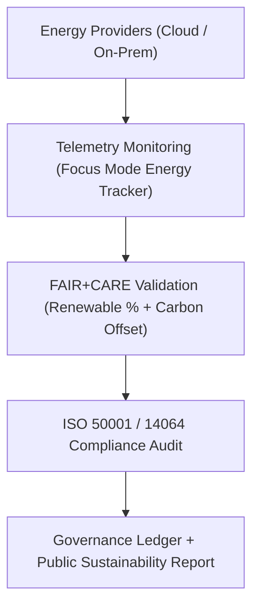
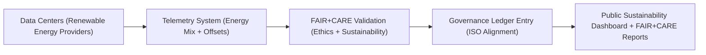

<div align="center">

# ☀️ **Kansas Frontier Matrix — Renewable Energy Integration & Green Infrastructure Strategy**
`docs/guides/sustainability/renewable-energy-integration.md`

**Purpose:**  
Outline the **renewable energy sourcing strategy** and **green infrastructure standards** for the Kansas Frontier Matrix (KFM).  
This guide ensures that all compute operations, storage clusters, and web systems operate using **verified renewable energy sources** aligned with **ISO 50001**, **ISO 14064**, and **FAIR+CARE sustainability governance**.

[](../../README.md)
[](../../../LICENSE)
[](../../../docs/standards/README.md)
[](../../../releases/)
</div>

---

## 📘 Overview

The **Renewable Energy Integration Guide** defines how the KFM infrastructure achieves low-carbon, ethically managed, and renewable-powered operations.  
It ensures continuous FAIR+CARE compliance through telemetry-linked verification of **data center energy sources**, **offset strategies**, and **energy efficiency audits**.

**Goals**
- Achieve ≥80% renewable energy usage across KFM systems  
- Implement FAIR+CARE telemetry for real-time renewable energy monitoring  
- Maintain carbon neutrality via ISO-aligned offset reporting  
- Ensure all cloud and on-premises infrastructure providers follow green standards  

---

## 🗂️ Directory Context

```plaintext
docs/guides/sustainability/
├── README.md                           # Sustainability framework overview
├── renewable-energy-integration.md     # This document
├── carbon-footprint-tracking.md        # Carbon audit and ISO 14064 validation
├── energy-efficiency-metrics.md        # ISO 50001 performance metrics
├── sustainability-telemetry.md         # Monitoring pipelines for energy & carbon data
└── reports/                            # Renewable sourcing validation outputs
```

---

## 🧩 Renewable Energy Governance Framework



---

## ⚙️ Renewable Energy Metrics

| Metric | Description | Target | Validation Source |
|---------|-------------|---------|--------------------|
| **Renewable Energy Share (%)** | % of total power sourced from renewables | ≥ 80 | `renewable-energy-log.json` |
| **Carbon Offset Coverage (%)** | % of remaining emissions offset via green projects | 100 | `carbon-report.json` |
| **Grid Mix Transparency** | Provider renewable vs. non-renewable energy breakdown | Publicly documented | `faircare-environmental-audit.json` |
| **Telemetry Coverage (%)** | Real-time data collection from providers | ≥ 95 | `focus-telemetry.json` |
| **Audit Frequency** | Validation interval for renewable compliance | Quarterly | Governance Ledger |

---

## 🧾 Example Renewable Energy Report

```json
{
  "report_id": "renewable-energy-2025-11-09-0002",
  "provider": "Google Cloud (us-central1)",
  "renewable_share_percent": 87.4,
  "carbon_offset_project": "Kansas Prairie Wind Partnership",
  "offset_coverage_percent": 100,
  "audit_standard": ["ISO 50001", "ISO 14064", "FAIR+CARE"],
  "faircare_status": "Pass",
  "auditor": "FAIR+CARE Council",
  "timestamp": "2025-11-09T12:45:00Z"
}
```

---

## ⚖️ FAIR+CARE Integration Matrix

| Principle | Implementation | Validation Artifact |
|------------|----------------|--------------------|
| **Findable** | Energy sources tracked per provider and timestamped | `reports/sustainability/renewable-energy-log.json` |
| **Accessible** | Renewable usage published via sustainability dashboard | `focus-telemetry.json` |
| **Interoperable** | FAIR+CARE metadata fields in ISO audit reports | `telemetry_schema` |
| **Reusable** | Renewable energy baselines reused for lifecycle reports | `manifest_ref` |
| **Collective Benefit** | Supports shared environmental accountability | FAIR+CARE Audit |
| **Authority to Control** | FAIR+CARE Council approves provider selection | Governance Ledger |
| **Responsibility** | Telemetry ensures ethical sourcing & compliance | `telemetry_ref` |
| **Ethics** | Verified via ISO audit and community oversight | `sustainability-compliance.md` |

---

## ⚙️ CI/CD Validation Workflows

| Workflow | Function | Output |
|-----------|-----------|--------|
| `renewable-check.yml` | Validates energy source telemetry data | `reports/sustainability/renewable-energy-log.json` |
| `carbon-audit.yml` | Confirms offset equivalence under ISO 14064 | `reports/sustainability/carbon-report.json` |
| `faircare-validate.yml` | Audits FAIR+CARE renewable compliance | `reports/faircare/renewable-audit.json` |
| `ledger-sync.yml` | Logs validated metrics to governance ledger | `docs/standards/governance/LEDGER/renewable-ledger.json` |

---

## 🧩 Governance Ledger Entry Example

```json
{
  "ledger_id": "renewable-ledger-2025-11-09-0005",
  "energy_provider": "AWS US-East",
  "renewable_share_percent": 83.6,
  "carbon_offset_coverage_percent": 100,
  "faircare_status": "Pass",
  "iso_alignment": ["ISO 50001", "ISO 14064"],
  "auditor": "FAIR+CARE Council",
  "timestamp": "2025-11-09T13:10:00Z"
}
```

---

## ⚙️ Energy Provider FAIR+CARE Evaluation Criteria

| Category | Criteria | Compliance Requirement |
|-----------|-----------|------------------------|
| **Renewable Mix Transparency** | Provider publishes verified energy composition | Mandatory |
| **Regional Sustainability Impact** | Source energy locally to minimize transmission loss | Recommended |
| **Carbon Neutral Certification** | Achieves ISO 14064 validation | Required |
| **Community Engagement** | Involvement in local green initiatives | Encouraged |
| **Telemetry Availability** | Provides real-time power usage metrics | Required |

---

## 🧾 FAIR+CARE Renewable Audit Example

```json
{
  "audit_id": "faircare-renewable-2025-11-09-0003",
  "providers_evaluated": [
    "AWS",
    "Google Cloud",
    "Hetzner",
    "Local Data Center A"
  ],
  "renewable_average_percent": 84.3,
  "carbon_offset_verified": 100,
  "audit_findings": "All providers meet FAIR+CARE and ISO sustainability requirements.",
  "faircare_status": "Pass",
  "auditor": "FAIR+CARE Council",
  "timestamp": "2025-11-09T13:20:00Z"
}
```

---

## 🧠 Sustainability Objectives

| Goal | Target | Verification |
|------|---------|---------------|
| **Increase renewable sourcing** | ≥ 90% by 2026 | `renewable-energy-log.json` |
| **Maintain carbon neutrality** | Continuous | `carbon-footprint-tracking.md` |
| **Publish energy transparency reports** | Quarterly | Governance Ledger |
| **Adopt green data center partners** | 100% certified by 2027 | FAIR+CARE Council Review |

---

## ⚙️ Renewable Energy Integration Flow



---

## 🕰️ Version History

| Version | Date | Author | Summary |
|----------|------|--------|----------|
| v10.0.0 | 2025-11-09 | Core Team | Added renewable energy integration strategy with ISO 50001/14064 and FAIR+CARE telemetry validation |
| v9.7.0  | 2025-11-03 | A. Barta | Introduced renewable sourcing methodology and governance workflow |

---

<div align="center">

© 2025 Kansas Frontier Matrix Project  
Master Coder Protocol v6.3 · FAIR+CARE Certified · Diamond⁹ Ω / Crown∞Ω Ultimate Certified  

[Back to Sustainability Guides](./README.md) · [Governance Charter](../../../docs/standards/governance/ROOT-GOVERNANCE.md)

</div>

