<div align="center">

# ☀️ **Kansas Frontier Matrix — Renewable Energy Integration & Green Infrastructure Strategy**  
`docs/guides/sustainability/renewable-energy-integration.md`

**Purpose**  
Outline the **renewable energy sourcing strategy** and **green infrastructure standards** for the Kansas Frontier Matrix (KFM).  
This guide defines how KFM computes, stores, and serves data using **verified renewable energy sources** and **sustainability-aware architectures**, aligned with **ISO 50001**, **ISO 14064**, and **FAIR+CARE v2** governance.

[](#)
[](#)
[](#)
[](#)

</div>

---

# 📘 Overview

The **Renewable Energy Integration Guide** specifies how KFM:

- Achieves a high share of **renewable electricity** for all major infrastructure  
- Uses **Telemetry v2** to record energy and CO₂e linked to pipelines, AI, and web workloads  
- Ensures compliance with **ISO 50001** (energy management) and **ISO 14064** (greenhouse gas accounting)  
- Aligns renewable strategy with **FAIR+CARE v2** principles: Responsibility, Authority to Control, and Collective Benefit  

**Primary goals:**

- Reach **≥ 80% renewable share** for all KFM compute by default; target **≥ 90%** by 2026  
- Maintain **carbon-neutral operations**, with ISO 14064–aligned offsets where necessary  
- Provide **transparent sustainability dashboards** backed by telemetry and Governance Ledger entries  

---

# 🗂️ Directory Context

~~~text
docs/guides/sustainability/
│
├── README.md                           # Sustainability framework overview
├── renewable-energy-integration.md     # ← THIS DOCUMENT
├── carbon-footprint-tracking.md        # Carbon audits & ISO 14064 validation
├── energy-efficiency-metrics.md        # ISO 50001 performance metrics
├── sustainability-monitoring.md        # Energy & carbon telemetry pipelines
└── reports/                            # Renewable sourcing & carbon validation outputs
~~~

---

# 🧩 Renewable Energy Governance Framework

```mermaid
flowchart TD
A["Energy Providers<br/>Cloud · On-Prem · Hybrid"] --> B["Telemetry System<br/>energy mix · usage · offsets"]
B --> C["FAIR+CARE v2 Validator<br/>renewable% · equity · ethics"]
C --> D["ISO 50001 / 14064 Compliance Engine<br/>energy & CO₂ accounting"]
D --> E["Governance Ledger Sync<br/>signed sustainability entries"]
E --> F["Sustainability Dashboards<br/>public + Council views"]
````

---

# ⚙️ Renewable Energy Metrics (Telemetry v2–Aligned)

| Metric                       | Description                                     | Target / Policy              | Validation Source                          |
| ---------------------------- | ----------------------------------------------- | ---------------------------- | ------------------------------------------ |
| `renewable_percent`          | % of electricity from renewable sources         | ≥ 80% (target ≥ 90% by 2026) | `renewable-energy-log.json`                |
| `offset_coverage_percent`    | Share of residual emissions offset              | 100% (carbon-neutral target) | `carbon-report.json`                       |
| `grid_mix_transparency`      | Provider publishes energy mix details           | Required                     | Provider documentation + FAIR+CARE audit   |
| `telemetry_coverage_percent` | Fraction of workloads with energy/CO₂ telemetry | ≥ 95%                        | `pipeline-telemetry.json`                  |
| `audit_frequency`            | How often renewable/compliance audits run       | Quarterly (min.)             | Governance Ledger + sustainability reports |

---

# 🧾 Example Renewable Energy Report

```json
{
  "report_id": "renewable-energy-2025-11-16-0002",
  "provider": "Google Cloud (us-central1)",
  "renewable_share_percent": 87.4,
  "grid_mix_details": {
    "solar": 52.1,
    "wind": 28.3,
    "hydro": 7.0,
    "other_renewables": 0.0,
    "non_renewable": 12.6
  },
  "carbon_offset_project": "Kansas Prairie Wind Partnership",
  "offset_coverage_percent": 100,
  "audit_standards": ["ISO 50001", "ISO 14064", "FAIR+CARE v2"],
  "faircare_status": "pass",
  "auditor": "FAIR+CARE Council",
  "timestamp": "2025-11-16T12:45:00Z"
}
```

---

# ⚖️ FAIR+CARE v2 Integration Matrix

| Principle                | Implementation                                                     | Validation Artifact                                       |
| ------------------------ | ------------------------------------------------------------------ | --------------------------------------------------------- |
| **Findable**             | Renewable metrics logged per provider, region, and timestamp       | `reports/sustainability/renewable-energy-log.json`        |
| **Accessible**           | Sustainability summaries published in CC-BY reports and dashboards | Telemetry + sustainability reports                        |
| **Interoperable**        | ISO + FAIR+CARE metadata inside JSON/JSON-LD reports               | `telemetry_schema`                                        |
| **Reusable**             | Renewable baselines reused for lifecycle & trend analyses          | `manifest_ref`                                            |
| **Collective Benefit**   | Shared environmental accountability and transparency               | FAIR+CARE Council audit summaries                         |
| **Authority to Control** | Council approves/denies energy providers & offsets                 | Governance Ledger entries                                 |
| **Responsibility**       | Telemetry v2 ties energy & CO₂ back to workloads & decisions       | `telemetry_ref`                                           |
| **Ethics**               | Community & stakeholder review for sustainability decisions        | Additional `sustainability-compliance.md` / council notes |

---

# 🧪 CI/CD Validation Workflows (Renewables)

| Workflow                   | Purpose                                            | Output Artifact                                    |
| -------------------------- | -------------------------------------------------- | -------------------------------------------------- |
| `renewable-check.yml`      | Validate provider energy mix telemetry             | `reports/sustainability/renewable-energy-log.json` |
| `carbon-audit.yml`         | Convert energy usage → CO₂e & verify offsets       | `reports/sustainability/carbon-report.json`        |
| `sustainability-audit.yml` | Combine energy, CO₂, renewables into audit summary | `reports/sustainability/sustainability-audit.json` |
| `faircare-validate.yml`    | Check FAIR+CARE v2 compliance of provider choices  | `reports/faircare/renewable-audit.json`            |
| `ledger-sync.yml`          | Append validated metrics to Governance Ledger      | `docs/reports/audit/data_provenance_ledger.jsonl`  |

All must pass for a release to be **sustainability-certified**.

---

# 🧩 Governance Ledger Entry Example

```json
{
  "ledger_id": "renewable-ledger-2025-11-16-0005",
  "stage": "renewable-energy-monitoring",
  "energy_provider": "AWS us-east-1",
  "renewable_share_percent": 83.6,
  "carbon_offset_coverage_percent": 100,
  "faircare_status": "pass",
  "iso_alignment": ["ISO 50001", "ISO 14064"],
  "telemetryRef": "releases/v10.4.2/pipeline-telemetry.json",
  "timestamp": "2025-11-16T13:10:00Z",
  "auditor": "FAIR+CARE Council"
}
```

---

# ⚙️ Energy Provider FAIR+CARE Evaluation Criteria

| Category                           | Criteria                                             | Requirement |
| ---------------------------------- | ---------------------------------------------------- | ----------- |
| **Renewable Mix Transparency**     | Provider publishes independently verified mix        | Mandatory   |
| **Regional Sustainability Impact** | Preference for local/ regional green sources         | Recommended |
| **Carbon Neutral Certification**   | ISO 14064-aligned or equivalent                      | Required    |
| **Community Engagement**           | Participation in local green initiatives             | Encouraged  |
| **Telemetry Availability**         | Energy & carbon metrics accessible in near real-time | Required    |

---

# 🧾 FAIR+CARE Renewable Audit Example

```json
{
  "audit_id": "faircare-renewable-2025-11-16-0003",
  "providers_evaluated": [
    "AWS",
    "Google Cloud",
    "Hetzner",
    "Local Data Center A"
  ],
  "renewable_average_percent": 84.3,
  "offset_coverage_percent": 100,
  "audit_findings": "All providers currently meet KFM's FAIR+CARE v2 and ISO-aligned sustainability requirements.",
  "faircare_status": "pass",
  "auditor": "FAIR+CARE Council",
  "timestamp": "2025-11-16T13:20:00Z"
}
```

---

# 🧠 Sustainability Objectives

| Goal                               | Target                                      | Verification                        |
| ---------------------------------- | ------------------------------------------- | ----------------------------------- |
| Increase renewable sourcing        | ≥ 90% of total energy by 2026               | `renewable-energy-log.json`         |
| Maintain carbon neutrality         | Continuous (100% offsets where needed)      | `carbon-footprint-tracking.md`      |
| Public sustainability transparency | Quarterly published sustainability report   | Governance Ledger & dashboards      |
| Green data center footprint        | 100% providers meet green standards by 2027 | FAIR+CARE reviews & provider audits |

---

# ⚙️ Renewable Energy Integration Flow

```mermaid
flowchart LR
A["Data Centers / Cloud Providers"] --> B["Telemetry Collection<br/>energy mix · usage"]
B --> C["Sustainability Processor<br/>ISO metrics · offsets"]
C --> D["FAIR+CARE v2 Validator<br/>ethics · equity · sovereignty"]
D --> E["Governance Ledger Entry<br/>sustainability record"]
E --> F["Public Sustainability Dashboard<br/>metrics · trends · audits"]
```



---

# ✅ Developer Checklist

Before declaring a deployment **renewable-compliant**:

* [ ] All major infrastructure providers documented with energy mix & certifications.
* [ ] Renewable % and CO₂e per provider measured and logged via Telemetry v2.
* [ ] Sustainability audit workflows pass in CI.
* [ ] Governance Ledger has an up-to-date renewable-energy entry.
* [ ] FAIR+CARE v2 Council (or delegated body) has reviewed key sourcing decisions.

---

# 🕰️ Version History

| Version | Date       | Author    | Summary                                                                                            |
| ------: | ---------- | --------- | -------------------------------------------------------------------------------------------------- |
| v10.4.2 | 2025-11-16 | Core Team | Upgraded to Telemetry v2, CARE v2; aligned with sustainability-monitoring and governance workflows |
| v10.0.0 | 2025-11-09 | Core Team | Initial renewable energy integration strategy with ISO 50001/14064 & FAIR+CARE telemetry           |
|  v9.7.0 | 2025-11-03 | A. Barta  | Introduced renewable sourcing methodology and basic governance workflow                            |

---

<div align="center">

**Kansas Frontier Matrix — Renewable Energy Integration (v10.4.2)**
Low-Carbon Infrastructure × FAIR+CARE v2 × ISO-Aligned Governance × Public Accountability

© 2025 Kansas Frontier Matrix — CC-BY 4.0 · Diamond⁹ Ω / Crown∞Ω Ultimate Certified

[Back to Sustainability Guides](./README.md) ·
[Governance Charter](../../../docs/standards/governance/ROOT-GOVERNANCE.md)

</div>
