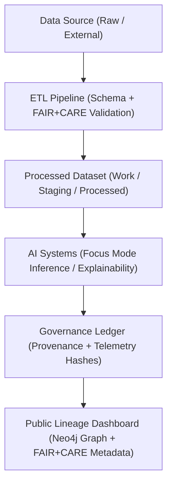
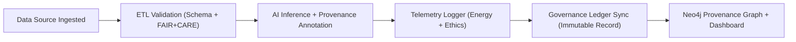

<div align="center">

# 🔍 **Kansas Frontier Matrix — Data Lineage Monitoring & Provenance Telemetry Framework**
`docs/guides/telemetry/data-lineage-monitoring.md`

**Purpose:**  
Define the framework for **data lineage tracking, provenance telemetry, and FAIR+CARE validation** across all Kansas Frontier Matrix (KFM) data pipelines.  
Ensures that every dataset, transformation, and AI output is traceable, auditable, and ethically governed under **MCP-DL v6.3** and **FAIR+CARE** principles.

[](../../README.md)
[](../../../LICENSE)
[](../../../docs/standards/README.md)
[](../../../releases/)
</div>

---

## 📘 Overview

The **Data Lineage Monitoring Guide** establishes standards for how data provenance is captured, verified, and visualized within KFM’s observability system.  
Using the **Focus Telemetry Framework** and **Neo4j provenance graph**, KFM tracks dataset origins, transformations, and lineage across all workflows — from ingestion to publication.

**Core Objectives**
- Automatically log provenance and transformation events via telemetry  
- Ensure FAIR+CARE-compliant traceability and reproducibility  
- Link lineage data to Governance Ledger for audit validation  
- Provide transparent provenance dashboards for Council and public access  

---

## 🗂️ Directory Context

```plaintext
docs/guides/telemetry/
├── README.md                         # Telemetry overview
├── data-lineage-monitoring.md         # This document
├── ai-telemetry-integration.md        # AI inference and explainability telemetry
├── focus-telemetry-architecture.md    # Core telemetry design
├── sustainability-monitoring.md       # Environmental and energy observability
└── reports/                           # Provenance and lineage validation logs
```

---

## 🧩 Lineage Telemetry Architecture



---

## ⚙️ Core Provenance Metadata Fields

| Field | Description | Example |
|--------|-------------|----------|
| `dataset_id` | Unique dataset identifier | `"kfm-hydrology-2025-001"` |
| `source_system` | Original data provider or acquisition system | `"USGS Hydrology Service"` |
| `etl_pipeline` | Workflow or script responsible for processing | `"src/pipelines/etl/hydrology/process_rasters.py"` |
| `derived_output` | Resulting file or dataset | `"data/processed/hydrology/watershed_stats.parquet"` |
| `governance_ledger_hash` | SHA256 hash from governance ledger | `"d29f8a43c7b1..."` |
| `faircare_status` | Ethical compliance state | `"Pass"` |
| `timestamp` | When lineage event was logged | `"2025-11-09T12:30:00Z"` |

---

## 🧾 Example Lineage Telemetry Record

```json
{
  "lineage_id": "lineage-2025-11-09-0007",
  "dataset_id": "kfm-hydrology-2025-001",
  "source_system": "NOAA + USGS",
  "etl_pipeline": "src/pipelines/etl/hydrology/hydro_clean.py",
  "derived_output": "data/processed/hydrology/watersheds.gpkg",
  "hash_sha256": "2b6fa91e3e2d...",
  "energy_joules": 9.2,
  "carbon_gCO2e": 0.0041,
  "faircare_status": "Pass",
  "auditor": "FAIR+CARE Council",
  "timestamp": "2025-11-09T12:32:00Z"
}
```

---

## ⚖️ FAIR+CARE Integration Matrix

| Principle | Implementation | Validation Artifact |
|------------|----------------|--------------------|
| **Findable** | Lineage entries UUID-tracked in Neo4j and Ledger | `reports/telemetry/lineage-validation.json` |
| **Accessible** | Public JSON-LD lineage files linked to datasets | `focus-telemetry.json` |
| **Interoperable** | Schema alignment with DCAT, STAC, and CIDOC CRM | `telemetry_schema` |
| **Reusable** | Provenance logs reused for FAIR+CARE audits | `manifest_ref` |
| **Collective Benefit** | Enables open, transparent historical accountability | FAIR+CARE audit |
| **Authority to Control** | CARE-aligned review of culturally sensitive data | `ethics-audit-protocols.md` |
| **Responsibility** | Continuous telemetry captures energy + ethics data | `telemetry_ref` |
| **Ethics** | All lineage validated and certified pre-publication | `governance-ledger-integration.md` |

---

## 🧠 Neo4j Lineage Graph Structure

| Node Type | Label | Description | Example |
|------------|--------|-------------|----------|
| **Source** | `E73_Information_Object` | Original dataset node | `"USGS Floodplain Map 1872"` |
| **Process** | `E7_Activity` | ETL or AI transformation | `"GDAL Raster Clean (Hydrology v2)"` |
| **Output** | `E73_Information_Object` | Derived dataset or visualization | `"watershed_vector_2025.gpkg"` |
| **Governance Record** | `Ledger` | Audit entry linking FAIR+CARE validation | `"ledger-2025-11-09-0042"` |

---

## ⚙️ Validation Workflows

| Workflow | Function | Output |
|-----------|-----------|--------|
| `lineage-validate.yml` | Validates dataset → ETL → AI → visualization linkage | `reports/telemetry/lineage-validation.json` |
| `neo4j-sync.yml` | Syncs lineage metadata into Neo4j knowledge graph | `reports/telemetry/neo4j-sync.json` |
| `faircare-validate.yml` | Confirms ethics & sustainability compliance | `reports/faircare/lineage-audit.json` |
| `ledger-sync.yml` | Commits verified lineage telemetry to governance ledger | `docs/standards/governance/LEDGER/lineage-ledger.json` |

---

## 🧩 Governance Ledger Record Example

```json
{
  "ledger_id": "lineage-ledger-2025-11-09-0008",
  "linked_entities": [
    "dataset:kfm-hydrology-2025-001",
    "etl:hydrology-clean-v2",
    "ai:focus-transformer-v2",
    "visualization:maplibre-hydrology"
  ],
  "chain_integrity": "Verified",
  "energy_joules": 9.2,
  "carbon_gCO2e": 0.0041,
  "faircare_status": "Pass",
  "auditor": "FAIR+CARE Council",
  "timestamp": "2025-11-09T12:40:00Z"
}
```

---

## ⚙️ FAIR+CARE Audit Example

```json
{
  "audit_id": "faircare-lineage-2025-11-09-0003",
  "audited_pipelines": [
    "Hydrology ETL Workflow",
    "AI Explainability Chain",
    "Visualization Export"
  ],
  "lineage_integrity_percent": 100,
  "schema_conformance": "Pass",
  "carbon_total_gCO2e": 0.012,
  "energy_total_joules": 27.6,
  "faircare_status": "Pass",
  "auditor": "FAIR+CARE Council",
  "timestamp": "2025-11-09T12:55:00Z"
}
```

---

## ⚖️ Data Lineage Governance Flow



---

## 🧮 Lineage Compliance Targets

| Metric | Description | Target |
|---------|--------------|---------|
| **Lineage Integrity (%)** | Verified linkage between data stages | 100 |
| **Governance Hash Validity (%)** | Checksums verified in Ledger | 100 |
| **Energy per Workflow (J)** | Energy used in transformation chain | ≤ 15 |
| **FAIR+CARE Compliance Rate (%)** | Lineage records validated | 100 |

---

## 🕰️ Version History

| Version | Date | Author | Summary |
|----------|------|--------|----------|
| v10.0.0 | 2025-11-09 | Core Team | Created FAIR+CARE-aligned data lineage telemetry and provenance governance framework |
| v9.7.0  | 2025-11-03 | A. Barta | Added Neo4j integration for data lineage observability |

---

<div align="center">

© 2025 Kansas Frontier Matrix Project  
Master Coder Protocol v6.3 · FAIR+CARE Certified · Diamond⁹ Ω / Crown∞Ω Ultimate Certified  

[Back to Telemetry Guides](./README.md) · [Governance Charter](../../../docs/standards/governance/ROOT-GOVERNANCE.md)

</div>

