<div align="center">

# 🔍 **Kansas Frontier Matrix — Data Lineage Monitoring & Provenance Telemetry Framework**  
`docs/guides/telemetry/data-lineage-monitoring.md`

**Purpose**  
Define the framework for **data lineage tracking, provenance telemetry, and FAIR+CARE v2 validation** across all Kansas Frontier Matrix (KFM) data pipelines.  
Ensures that every dataset, transformation, and AI output is **traceable, auditable, and ethically governed** under **MCP-DL v6.3**, **FAIR+CARE v2**, and **Lineage v2** standards.

</div>

---

# 🗂️ Directory Context

~~~text
docs/guides/telemetry/
│
├── README.md                                # Telemetry overview
├── focus-telemetry-architecture.md          # Core telemetry design
├── ai-telemetry-integration.md              # AI inference & model observability
├── data-lineage-monitoring.md               # ← THIS DOCUMENT
├── sustainability-monitoring.md             # Environmental & energy observability
└── reports/                                 # Lineage & telemetry validation logs
~~~

---

# 📘 Overview

The **Data Lineage Monitoring Guide** defines:

- How **lineage events** (ingest, transform, publish, AI inference) are recorded as telemetry  
- How KFM uses **Focus Telemetry** + **Neo4j** to build a **provenance graph**  
- How lineage telemetry is **validated**, **linked to governance**, and **exposed** via dashboards  
- How FAIR+CARE v2 policies shape acceptable data flows and transformations  

Core goals:

- Automate provenance logging for all critical steps  
- Guarantee dataset traceability (who, what, when, how, why)  
- Tie lineage to **energy & carbon footprints** for full accountability  
- Provide human-readable and machine-readable lineage views (JSON-LD + graph UI)  

---

# 🧩 Lineage Telemetry Architecture

```mermaid
flowchart TD
A["Data Source<br/>(Raw / External)"] --> B["ETL Pipeline<br/>Schema + FAIR+CARE Validation"]
B --> C["Processed Dataset<br/>Work · Staging · Processed"]
C --> D["AI Systems<br/>Focus Mode · Explainability"]
D --> E["Lineage Events → Telemetry v2<br/>provenance · energy · ethics"]
E --> F["Governance Ledger<br/>immutable records · hashes"]
F --> G["Lineage Dashboards<br/>Neo4j graph · FAIR+CARE metadata"]
````

---

# ⚙️ Core Provenance Metadata Fields

Each lineage telemetry event records both **technical** and **governance** attributes.

| Field                  | Description                             | Example                                        |
| ---------------------- | --------------------------------------- | ---------------------------------------------- |
| `lineage_id`           | Unique lineage record ID                | `"lineage-2025-11-16-0007"`                    |
| `dataset_id`           | ID of dataset being transformed         | `"kfm-hydrology-2025-001"`                     |
| `source_system`        | Original data provider/acquisition      | `"USGS + NOAA"`                                |
| `etl_pipeline`         | Pipeline or script responsible for step | `"src/pipelines/ingestion/hydrology/clean.py"` |
| `derived_output`       | Resulting file/dataset                  | `"data/processed/hydrology/watersheds.gpkg"`   |
| `hash_sha256`          | SHA-256 checksum of derived output      | `"2b6fa91e3e2d..."`                            |
| `energy_wh`            | Energy used for this step               | `0.0092`                                       |
| `co2_g`                | CO₂-equivalent emissions                | `0.0041`                                       |
| `faircare_status`      | FAIR+CARE v2 compliance result          | `"pass"`                                       |
| `governance_ledger_id` | ID of matching Governance Ledger entry  | `"lineage-ledger-2025-11-16-0008"`             |
| `timestamp`            | When lineage event was registered       | `"2025-11-16T12:32:00Z"`                       |

---

# 🧾 Example Lineage Telemetry Record (v2)

```json
{
  "lineage_id": "lineage-2025-11-16-0007",
  "dataset_id": "kfm-hydrology-2025-001",
  "source_system": "NOAA + USGS",
  "etl_pipeline": "src/pipelines/ingestion/hydrology/hydro_clean.py",
  "stage": "process",
  "derived_output": "data/processed/hydrology/watersheds.gpkg",
  "hash_sha256": "2b6fa91e3e2df1f8a6f3c8a4a2345af...",
  "energy_wh": 0.0092,
  "co2_g": 0.0041,
  "faircare_status": "pass",
  "governance_ledger_id": "lineage-ledger-2025-11-16-0008",
  "timestamp": "2025-11-16T12:32:00Z"
}
```

---

# ⚖️ FAIR+CARE v2 Integration Matrix

| Principle                | Implementation in Lineage Monitoring                       | Validation Artifact                                    |
| ------------------------ | ---------------------------------------------------------- | ------------------------------------------------------ |
| **Findable**             | Lineage records in Neo4j & JSON-LD, indexed by ID          | `reports/telemetry/lineage-validation.json`            |
| **Accessible**           | Public lineage JSON-LD linked from dataset metadata        | STAC/DCAT lineage links                                |
| **Interoperable**        | PROV-O + CIDOC + GeoSPARQL + DCAT/STAC integration         | `telemetry_schema`                                     |
| **Reusable**             | Reused for audits, Focus Mode explanations, Story Nodes    | `manifest_ref`                                         |
| **Collective Benefit**   | Maintains transparent historical/provenance accountability | FAIR+CARE Council reports                              |
| **Authority to Control** | CARE v2 rules & community review for sensitive lineages    | Ethics & governance workflows                          |
| **Responsibility**       | Energy/CO₂ metrics bound to provenance events              | `telemetry_ref`                                        |
| **Ethics**               | Lineage validated before public publishing                 | Governance Ledger records & lineage validation outputs |

---

# 🧠 Neo4j Lineage Graph Structure (CIDOC / PROV-O / GeoSPARQL)

Core node/relationship pattern:

| Node Type    | Label(s)                       | Description                    |
| ------------ | ------------------------------ | ------------------------------ |
| Source       | `E73_Information_Object`       | Original dataset/source        |
| Process      | `E7_Activity`, `prov:Activity` | ETL/AI transformation step     |
| Output       | `E73_Information_Object`       | Derived dataset/visualization  |
| Agent        | `E39_Actor`, `prov:Agent`      | System or human acting on data |
| Ledger Entry | `Ledger`                       | Governance record for lineage  |

Key edges:

* `(Process)-[:USED]->(Source)`
* `(Process)-[:GENERATED]->(Output)`
* `(Process)-[:WAS_ASSOCIATED_WITH]->(Agent)`
* `(Output)-[:HAS_LINEAGE_RECORD]->(Ledger)`
* Spatial: `geo:sfWithin`, `geo:sfIntersects` between features and AOIs

---

# ⚙️ Validation Workflows

| Workflow                | Function                                           | Output Artifact                                   |
| ----------------------- | -------------------------------------------------- | ------------------------------------------------- |
| `lineage-validate.yml`  | Validates structural lineage integrity             | `reports/telemetry/lineage-validation.json`       |
| `neo4j-sync.yml`        | Syncs lineage metadata into Neo4j provenance graph | `reports/telemetry/neo4j-sync.json`               |
| `faircare-validate.yml` | Ensures CARE v2 + ethical compliance for lineage   | `reports/faircare/lineage-audit.json`             |
| `ledger-sync.yml`       | Commits lineage telemetry to Governance Ledger     | `docs/reports/audit/data_provenance_ledger.jsonl` |

---

# 🧩 Governance Ledger Record Example (Lineage-Focused)

```json
{
  "ledger_id": "lineage-ledger-2025-11-16-0008",
  "linked_entities": [
    "dataset:kfm-hydrology-2025-001",
    "etl:hydrology-clean-v2",
    "ai:focus-transformer-v2",
    "visualization:maplibre-hydrology"
  ],
  "chain_integrity": "verified",
  "energy_wh": 0.0092,
  "co2_g": 0.0041,
  "faircare_status": "pass",
  "timestamp": "2025-11-16T12:40:00Z",
  "auditor": "FAIR+CARE Council"
}
```

---

# 🧠 FAIR+CARE Audit Example (Lineage)

```json
{
  "audit_id": "faircare-lineage-2025-11-16-0003",
  "audited_pipelines": [
    "Hydrology ETL Workflow",
    "AI Explainability Chain",
    "Visualization Export"
  ],
  "lineage_integrity_percent": 100,
  "schema_conformance": "pass",
  "carbon_total_g": 0.012,
  "energy_total_wh": 0.0276,
  "faircare_status": "pass",
  "auditor": "FAIR+CARE Council",
  "timestamp": "2025-11-16T12:55:00Z"
}
```

---

# 🧮 Lineage Compliance Targets

| Metric                        | Description                                  | Target  |
| ----------------------------- | -------------------------------------------- | ------- |
| **lineage_integrity_percent** | % of flows with verified provenance          | 100%    |
| **governance_hash_validity**  | % of records with valid SHA-256 + signatures | 100%    |
| **energy_wh_per_lineage**     | Energy used per lineage event chain          | ≤ 0.015 |
| **faircare_compliance_rate**  | % of lineage records passing audits          | 100%    |

---

# 🧭 Data Lineage Governance Flow

```mermaid
flowchart LR
SRC["Data Source Ingested"] --> ETL["ETL Validation<br/>Schema + CARE v2"]
ETL --> AI["AI Inference + Explainability<br/>Focus Mode v2.5"]
AI --> TEL["Telemetry Logger<br/>Lineage + energy · carbon · ethics"]
TEL --> LED["Governance Ledger<br/>Append-only provenance chain"]
LED --> NEO["Neo4j Provenance Graph<br/>Dashboards & Story Nodes"]
```



---

# ✅ Developer Checklist

Before declaring lineage monitoring **ready**:

* [ ] All ETL, AI, and publishing pipelines emit lineage telemetry events.
* [ ] Lineage v2 bundles are generated and validate via `lineage-validate.yml`.
* [ ] Neo4j graph contains expected provenance nodes and relationships.
* [ ] Governance Ledger entries reference lineage IDs & telemetry.
* [ ] FAIR+CARE v2 audits pass for all new or refactored pipelines.

---

# 🕰️ Version History

| Version | Date       | Author    | Summary                                                               |
| ------: | ---------- | --------- | --------------------------------------------------------------------- |
| v10.4.2 | 2025-11-16 | Core Team | Upgraded to Telemetry v2, FAIR+CARE v2, Lineage v2; inset directory   |
| v10.0.0 | 2025-11-09 | Core Team | Initial lineage telemetry & provenance governance framework           |
|  v9.7.0 | 2025-11-03 | A. Barta  | Introduced Neo4j lineage observability and base telemetry integration |

---

<div align="center">

**Kansas Frontier Matrix — Data Lineage Monitoring (v10.4.2)**
Provenance × FAIR+CARE v2 × Telemetry v2 × Immutable Governance

© 2025 Kansas Frontier Matrix — CC-BY 4.0 · Diamond⁹ Ω / Crown∞Ω Ultimate Certified

[Back to Telemetry Guides](./README.md) ·
[Governance Charter](../../../docs/standards/governance/ROOT-GOVERNANCE.md)

</div>
