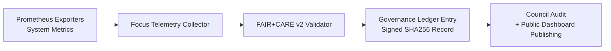

<div align="center">

# 🎯 **Kansas Frontier Matrix — Focus Telemetry Architecture & FAIR+CARE Observability Framework**  
`docs/guides/telemetry/focus-telemetry-architecture.md`

**Purpose**  
Define the **end-to-end architecture, components, instrumentation, and governance pipeline** for KFM’s Focus Telemetry system — the backbone of **FAIR+CARE v2–aligned observability**, energy & carbon tracking, latency monitoring, and ethical auditing across all KFM services.

[](#)
[](#)
[](#)
[](#)

</div>

---

# 🗂️ Directory Context

~~~text
docs/guides/telemetry/
│
├── README.md                                # Telemetry overview
├── focus-telemetry-architecture.md          # ← THIS DOCUMENT
├── ai-telemetry-integration.md              # AI inference + model telemetry
├── data-lineage-monitoring.md               # Provenance & lineage observability
├── sustainability-monitoring.md             # ISO 50001/14064 energy & carbon pipeline
└── reports/                                 # Telemetry validation & sustainability audits
~~~

---

# 📘 Overview

The **Focus Telemetry System** is the cross-cutting observability framework for the Kansas Frontier Matrix (KFM).  
It unifies:

- **System metrics** (CPU, memory, I/O) from ETL, AI, and web subsystems  
- **Energy + carbon instrumentation** (Telemetry v2)  
- **FAIR+CARE v2 ethical and cultural compliance signals**  
- **Performance telemetry** (latency, throughput, error rates)  
- **ISO 50001 / 14064–aligned sustainability metrics**  
- **Governance Ledger synchronization and Lineage v2 references**

This creates an **end-to-end telemetry pipeline** that is transparent, ethical, reproducible, and formally audited by the FAIR+CARE Council.

---

# 🧩 System Architecture

```mermaid
flowchart TD
A["System Events<br/>(ETL · AI · Visualization · Web)"] --> B["Focus Telemetry Collectors"]
B --> C["Telemetry Processor<br/>Prometheus + JSON Aggregator"]
C --> D["FAIR+CARE v2 Validator<br/>Ethics · Sovereignty · ISO metrics"]
D --> E["Governance Ledger Sync<br/>Signed JSON-LD Entries"]
E --> F["Dashboards & Reports<br/>Grafana · FAIR+CARE Portal"]
````

---

# ⚙️ Core Components

| Component                  | Function                                     | Technology / Standard         |
| -------------------------- | -------------------------------------------- | ----------------------------- |
| **Telemetry Collector**    | Captures real-time metrics per component     | Python/Node, Prometheus       |
| **Telemetry Processor**    | Normalizes, aggregates → Telemetry v2 schema | REST, Micromamba, JSON/NDJSON |
| **ISO Metrics Engine**     | Derives energy & CO₂e from telemetry         | ISO 50001, ISO 14064          |
| **FAIR+CARE Validator**    | Runs ethics, sovereignty, and CARE v2 checks | Governance ruleset            |
| **Governance Ledger Sync** | Writes immutable JSON-LD entries with hashes | SHA-256, append-only ledger   |
| **Dashboards**             | Public & internal telemetry exploration      | Grafana, KFM Portal           |

---

# 🧠 Focus Telemetry Data Model (Telemetry v2 Fields)

| Category        | Field               | Description                         | Unit   |
| --------------- | ------------------- | ----------------------------------- | ------ |
| **System**      | `cpu_usage_percent` | CPU utilization per event or window | %      |
| **System**      | `memory_mb`         | Memory footprint                    | MB     |
| **Performance** | `latency_ms`        | Request/operation latency           | ms     |
| **Energy**      | `energy_wh`         | Estimated energy consumed           | Wh     |
| **Carbon**      | `co2_g`             | CO₂e emissions                      | grams  |
| **Ethics**      | `care_violations`   | Number of CARE policy violations    | count  |
| **Ethics**      | `faircare_status`   | Overall ethics result               | enum   |
| **Metadata**    | `component`         | Pipeline / UI / AI module name      | string |
| **Metadata**    | `pipeline`          | Pipeline family                     | string |
| **Metadata**    | `stage`             | Stage (ingest/preprocess/runtime)   | string |

---

# 🧾 Example Focus Telemetry Entry (v2)

```json
{
  "pipeline": "ai",
  "stage": "inference",
  "run_id": "focus-telemetry-2025-11-16-0001",
  "component": "AI Focus Mode v2.5",
  "status": "success",
  "metrics": {
    "cpu_usage_percent": 64.3,
    "memory_mb": 842,
    "latency_ms": 238,
    "energy_wh": 0.00124,
    "co2_g": 0.00052
  },
  "care_violations": 0,
  "faircare_status": "pass",
  "iso_alignment": ["ISO 50001", "ISO 14064"],
  "timestamp": "2025-11-16T12:25:00Z"
}
```

---

# ⚖️ FAIR+CARE v2 Integration Framework

| Principle                | Implementation in Focus Telemetry                  | Evidence / Artifact                    |
| ------------------------ | -------------------------------------------------- | -------------------------------------- |
| **Findable**             | Telemetry indexed by `run_id` + ledger references  | `pipeline-telemetry.json`              |
| **Accessible**           | Release telemetry exported as CC-BY JSON/NDJSON    | `releases/v*/pipeline-telemetry.json`  |
| **Interoperable**        | JSON Schema + JSON-LD mapping with ISO + FAIR+CARE | `telemetry_schema`                     |
| **Reusable**             | Metrics reused in sustainability & AI audits       | `docs/guides/telemetry/reports/*.json` |
| **Collective Benefit**   | Allows external review of KFM’s resource usage     | FAIR+CARE Council reports              |
| **Authority to Control** | Council can tune thresholds and gating policies    | Governance Ledger entries              |
| **Responsibility**       | Continuous tracking of energy, carbon, ethics      | Telemetry v2 + lineage references      |
| **Ethics**               | Telemetry ensures harmful usage can be detected    | Ethics validator + FAIR+CARE workflows |

---

# 🧮 Telemetry Validation Metrics

| Metric                 | Recommended Threshold | Validation Source                            |
| ---------------------- | --------------------: | -------------------------------------------- |
| **energy_wh/run**      |                ≤ 0.02 | `energy-monitor.yml`                         |
| **co2_g/run**          |               ≤ 0.008 | `carbon-audit.yml`                           |
| **latency_ms_avg**     |                 ≤ 300 | `reports/telemetry/latency-performance.json` |
| **uptime_percent**     |                ≥ 99.5 | `reports/telemetry/system-health.json`       |
| **faircare_pass_rate** |                  100% | `faircare-validate.yml`                      |

---

# 🛠️ CI/CD Telemetry Workflows

```text
.github/workflows/
│
├── telemetry-export.yml                 # Export raw Telemetry v2 for all pipelines
├── faircare-validate.yml                # Ethics + sustainability validation
├── energy-monitor.yml                   # Joules/Wh tracking per job
├── carbon-audit.yml                     # CO₂e computations and thresholds
└── ledger-sync.yml                      # Append telemetry → Governance Ledger
```

All are required for **v10-compliant** deployments.

---

# 🧩 Governance Ledger Record Example

```json
{
  "ledger_id": "telemetry-ledger-2025-11-16-0005",
  "stage": "telemetry-sync",
  "linked_components": [
    "AI Inference Cluster",
    "ETL Hydrology Pipeline",
    "Timeline Visualization UI"
  ],
  "average_energy_wh": 0.0128,
  "average_co2_g": 0.0054,
  "faircare_status": "pass",
  "iso_alignment": ["ISO 50001", "ISO 14064"],
  "telemetryRef": "releases/v10.4.2/pipeline-telemetry.json",
  "timestamp": "2025-11-16T12:45:00Z",
  "auditor": "FAIR+CARE Council"
}
```

---

# 🧭 FAIR+CARE Audit Example

```json
{
  "audit_id": "faircare-focus-telemetry-2025-11-16-0002",
  "audited_components": [
    "AI Focus Mode",
    "ETL Climate Pipelines",
    "Visualization Stack"
  ],
  "telemetry_records": 286,
  "energy_wh_total": 0.0457,
  "co2_g_total": 0.0194,
  "efficiency_gain_percent": 11.2,
  "faircare_status": "pass",
  "iso_alignment": ["ISO 50001", "ISO 14064"],
  "auditor": "FAIR+CARE Council",
  "timestamp": "2025-11-16T13:00:00Z"
}
```

---

# 🌀 Focus Telemetry Governance Flow



---

# 🎯 Continuous Monitoring Targets

| Objective                  | Target                        | Verified By                   |
| -------------------------- | ----------------------------- | ----------------------------- |
| Reduce energy per workload | ≥ 10% improvement per release | Sustainability telemetry      |
| Lower average CO₂e         | ≤ 0.005 g per typical run     | Carbon audit workflows        |
| Increase renewable share   | ≥ 85% of power                | Sustainability monitoring     |
| FAIR+CARE audit pass rate  | 100% for telemetry workflows  | Governance ledger checks      |
| System uptime              | ≥ 99.5%                       | Grafana/monitoring dashboards |

---

# 🕰️ Version History

| Version | Date       | Author    | Summary                                                                  |
| ------: | ---------- | --------- | ------------------------------------------------------------------------ |
| v10.4.2 | 2025-11-16 | Core Team | Upgraded to Telemetry v2, FAIR+CARE v2, KFM-MDP v10.4.2, inset directory |
| v10.0.1 | 2025-11-09 | Core Team | Updated directory layout to KFM-lined inset format                       |
| v10.0.0 | 2025-11-09 | Core Team | Initial Focus Telemetry architecture & governance integration            |
|  v9.7.0 | 2025-11-03 | A. Barta  | Introduced telemetry data model and governance sync pipeline             |

---

<div align="center">

**Kansas Frontier Matrix — Focus Telemetry Architecture (v10.4.2)**
Observability × FAIR+CARE v2 × ISO-Aligned Sustainability × Immutable Governance

© 2025 Kansas Frontier Matrix — CC-BY 4.0 · Diamond⁹ Ω / Crown∞Ω Ultimate Certified

[Back to Telemetry Guides](./README.md) ·
[Governance Charter](../../../docs/standards/governance/ROOT-GOVERNANCE.md)

</div>
