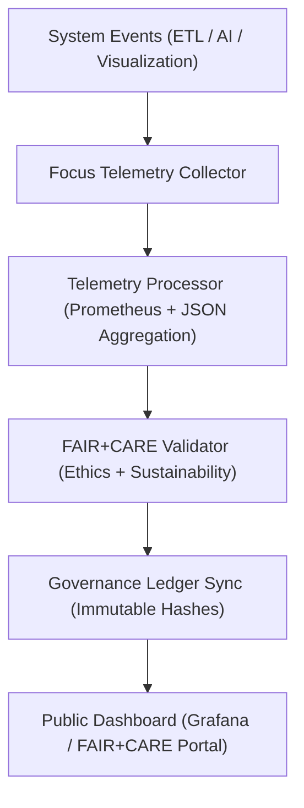
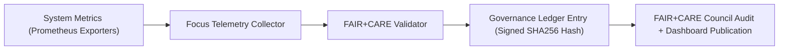

<div align="center">

# 🎯 **Kansas Frontier Matrix — Focus Telemetry Architecture & FAIR+CARE Observability Framework**
`docs/guides/telemetry/focus-telemetry-architecture.md`

**Purpose:**  
Define the **end-to-end architecture, components, and governance pipeline** for the Focus Telemetry system within the Kansas Frontier Matrix (KFM).  
This guide ensures continuous FAIR+CARE-compliant monitoring of energy, carbon, latency, and ethical metrics across all KFM services and infrastructure.

[](../../README.md)
[](../../../LICENSE)
[](../../../docs/standards/README.md)
[](../../../releases/)
</div>

---

## 📘 Overview

The **Focus Telemetry System** is KFM’s central observability and sustainability platform, integrating **Prometheus metrics**, **ISO energy standards**, and **FAIR+CARE ethical governance**.  
It captures real-time data from pipelines, AI workloads, and visualizations — enabling transparency, sustainability, and continuous compliance validation under **MCP-DL v6.3**.

**Core Functions**
- Collect task-level metrics (energy, carbon, performance, ethics)
- Process and aggregate telemetry via FAIR+CARE validators  
- Synchronize telemetry outputs with Governance Ledger  
- Publish dashboards for transparency and Council review  

---

## 🗂️ Directory Context

```plaintext
docs/guides/telemetry/
├── README.md                              # Telemetry overview
├── focus-telemetry-architecture.md        # This document
├── ai-telemetry-integration.md            # AI observability integration
├── data-lineage-monitoring.md             # Provenance & lineage telemetry
├── sustainability-monitoring.md           # Carbon & energy telemetry management
└── reports/                               # Telemetry validation reports
```

---

## 🧩 System Architecture



---

## ⚙️ Core Components

| Component | Function | Technology / Standard |
|------------|-----------|------------------------|
| **Telemetry Collector** | Captures real-time metrics across KFM | Python + Prometheus Exporters |
| **Telemetry Processor** | Aggregates data and converts to FAIR+CARE schema | Micromamba / REST API |
| **Validator Engine** | Checks compliance with ISO 50001 / 14064 | FAIR+CARE Validation Service |
| **Governance Sync** | Commits results to governance ledger | Signed JSON-LD Transactions |
| **FAIR+CARE Dashboard** | Displays performance, energy, and audit trends | Grafana + Focus Mode UI |

---

## 🧠 Focus Telemetry Data Model

| Category | Metric | Description | Unit |
|-----------|--------|-------------|------|
| **System** | `cpu_usage_percent` | CPU utilization per task | % |
| **Performance** | `latency_ms` | Average operation latency | ms |
| **Energy** | `energy_joules` | Power consumption per workflow | J |
| **Carbon** | `carbon_gCO2e` | Carbon equivalent emission | gCO₂e |
| **Ethics** | `faircare_status` | FAIR+CARE compliance result | Pass/Fail |

---

## 🧾 Example Focus Telemetry Entry

```json
{
  "telemetry_id": "focus-telemetry-2025-11-09-0001",
  "component": "AI Focus Mode Inference",
  "metrics": {
    "cpu_usage_percent": 64.3,
    "memory_mb": 842,
    "latency_ms": 238,
    "energy_joules": 1.24,
    "carbon_gCO2e": 0.00052
  },
  "faircare_status": "Pass",
  "iso_alignment": ["ISO 50001", "ISO 14064"],
  "auditor": "FAIR+CARE Council",
  "timestamp": "2025-11-09T12:25:00Z"
}
```

---

## ⚖️ FAIR+CARE Integration Framework

| Principle | Implementation | Validation Artifact |
|------------|----------------|--------------------|
| **Findable** | Telemetry indexed by component UUID and ledger hash | `focus-telemetry.json` |
| **Accessible** | FAIR+CARE telemetry data published as open JSON | `releases/v*/focus-telemetry.json` |
| **Interoperable** | JSON-LD schema aligns with ISO and FAIR+CARE | `telemetry_schema` |
| **Reusable** | Telemetry reused in dashboards and audit reports | `manifest_ref` |
| **Collective Benefit** | Enables transparent system performance benchmarking | FAIR+CARE audits |
| **Authority to Control** | Council reviews telemetry thresholds quarterly | Governance Ledger |
| **Responsibility** | Continuous tracking of sustainability and ethics data | `telemetry_ref` |
| **Ethics** | Verifies no non-consensual or culturally sensitive data used | `ethics-audit-protocols.md` |

---

## 🧮 Telemetry Validation Metrics

| Metric | Target | Validation Source |
|---------|---------|-------------------|
| **Energy (J)** | ≤ 15 per job | `reports/telemetry/energy-monitor.json` |
| **Carbon (gCO₂e)** | ≤ 0.006 per operation | `reports/telemetry/carbon-audit.json` |
| **Latency (ms)** | ≤ 300 average | `reports/telemetry/latency-performance.json` |
| **Uptime (%)** | ≥ 99.5 | `reports/telemetry/system-health.json` |
| **FAIR+CARE Pass Rate (%)** | 100 | `faircare-validate.yml` |

---

## ⚙️ CI/CD Telemetry Workflows

| Workflow | Function | Output |
|-----------|-----------|--------|
| `telemetry-export.yml` | Exports runtime telemetry | `releases/v*/focus-telemetry.json` |
| `faircare-validate.yml` | Validates energy + ethics compliance | `reports/faircare/telemetry-validation.json` |
| `energy-monitor.yml` | Logs system energy metrics | `reports/telemetry/energy-monitor.json` |
| `carbon-audit.yml` | Audits carbon footprint per operation | `reports/telemetry/carbon-audit.json` |
| `ledger-sync.yml` | Commits verified telemetry to Governance Ledger | `docs/standards/governance/LEDGER/telemetry-ledger.json` |

---

## 🧩 Governance Ledger Example Record

```json
{
  "ledger_id": "focus-telemetry-ledger-2025-11-09-0005",
  "linked_components": [
    "AI Inference Cluster",
    "ETL Hydrology Pipeline",
    "Visualization Timeline UI"
  ],
  "average_energy_joules": 12.8,
  "average_carbon_gCO2e": 0.0054,
  "faircare_status": "Pass",
  "auditor": "FAIR+CARE Council",
  "timestamp": "2025-11-09T12:45:00Z"
}
```

---

## ⚙️ FAIR+CARE Audit Example

```json
{
  "audit_id": "faircare-focus-telemetry-2025-11-09-0002",
  "audited_components": ["AI Focus Mode", "ETL Climate", "Visualization Stack"],
  "telemetry_records": 286,
  "energy_joules_total": 45.7,
  "carbon_gCO2e_total": 0.0194,
  "efficiency_gain_percent": 11.2,
  "faircare_status": "Pass",
  "iso_alignment": ["ISO 50001", "ISO 14064"],
  "auditor": "FAIR+CARE Council",
  "timestamp": "2025-11-09T13:00:00Z"
}
```

---

## ⚙️ Focus Telemetry Governance Flow



---

## ⚖️ Continuous Monitoring Targets

| Objective | Target | Verification Source |
|------------|---------|----------------------|
| **Reduce Average Energy (J)** | -10% per release | `focus-telemetry.json` |
| **Lower Carbon Output (gCO₂e)** | ≤ 0.005 average | `carbon-audit.yml` |
| **Increase Renewable Share (%)** | ≥ 85 | `sustainability-monitoring.md` |
| **FAIR+CARE Audit Pass Rate** | 100% | Governance Ledger |
| **System Uptime (%)** | ≥ 99.5 | Grafana Dashboard |

---

## 🕰️ Version History

| Version | Date | Author | Summary |
|----------|------|--------|----------|
| v10.0.0 | 2025-11-09 | Core Team | Added Focus Telemetry architecture with FAIR+CARE validation and ISO integration |
| v9.7.0  | 2025-11-03 | A. Barta | Introduced telemetry data model and governance synchronization pipeline |

---

<div align="center">

© 2025 Kansas Frontier Matrix Project  
Master Coder Protocol v6.3 · FAIR+CARE Certified · Diamond⁹ Ω / Crown∞Ω Ultimate Certified  

[Back to Telemetry Guides](./README.md) · [Governance Charter](../../../docs/standards/governance/ROOT-GOVERNANCE.md)

</div>

